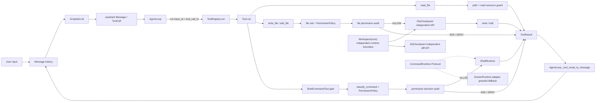
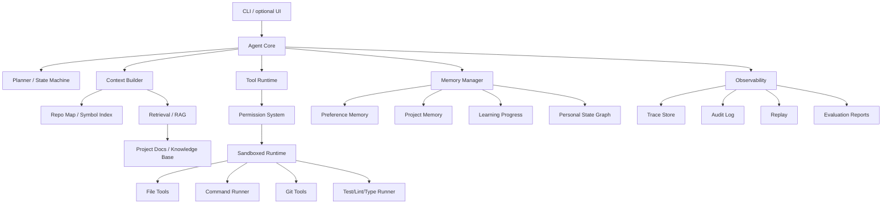
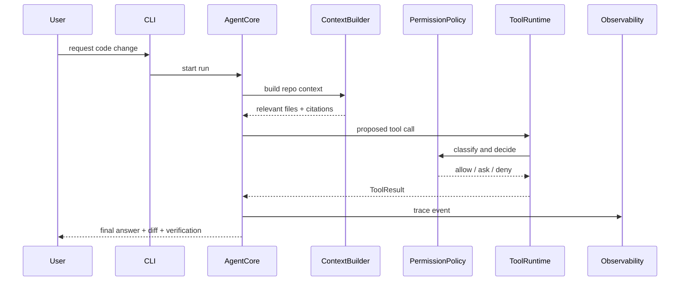
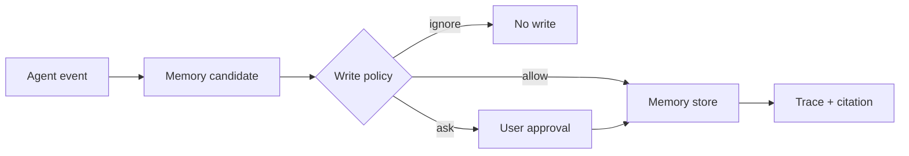

# Architecture

## 当前真实架构

当前代码已经实现 `core + tools` 的最小可运行主链，并接入 `permissions + runtime` 的部分能力：



模块级流程、源码与测试证据见 [`docs/18_IMPLEMENTED_MODULE_FLOWS.md`](docs/18_IMPLEMENTED_MODULE_FLOWS.md)。

真实已实现：

- `src/pca/core/messages.py`：`Message`、`ToolCall`
- `src/pca/core/mock_llm.py`：`ScriptedLLM`
- `src/pca/core/agent_loop.py`：`AgentLoop`、`AgentLoopResult`
- `src/pca/tools/base.py`：`Tool`、`ToolParameter`、`ToolResult`
- `src/pca/tools/registry.py`：`ToolRegistry`
- `src/pca/tools/file_tools.py`：`read_file`、`write_file`、`edit_file`
- `src/pca/runtime/shell_runtime.py`：`run_command`
- `src/pca/runtime/interface.py`：`CommandRuntime`
- `src/pca/runtime/docker_runtime.py`：`DockerRuntime`
- `src/pca/runtime/workspace.py`：`Workspace(root)`、`resolve_path(...)`、`contains(...)`
- `src/pca/runtime/checkpoints.py`：`FileCheckpoint.create(...)`、`FileCheckpoint.restore()`、`GitCheckpoint.create(...)`、`GitCheckpoint.restore()`
- `src/pca/permissions/risk.py`：`RiskLevel`、`RiskAssessment`、`classify_command(...)`
- `src/pca/permissions/policy.py`：`DecisionAction`、`PermissionDecision`、`PermissionPolicy.decide(...)`
- `src/pca/permissions/approval.py`：`ApprovalRequest`、`ApprovalDecision`
- `src/pca/permissions/file_risk.py`：`classify_file_change(...)`
- `src/pca/permissions/audit.py`：`PermissionAuditEvent`、`append_audit_event(...)`

当前部分实现及其接线边界：

- `src/pca/permissions`：风险分类和策略判断已接入 `ShellCommandTool` 执行前 gate；文件风险分类已接入 `WriteFileTool` / `EditFileTool` 写盘前 gate；shell/file gate 已在副作用前自动写入摘要 audit。审批对象尚未接入交互式批准与恢复；audit 仍缺 trace 关联、最终执行结果生命周期和查询能力。
- `src/pca/core` / `src/pca/tools`：`AgentLoop` 为每次 run 创建 `trace_id`，为每次工具调用创建 `tool_call_id`，并经 `ToolRegistry` 透传到成功或失败 `ToolResult`；尚未实现结构化日志、trace 查询、回放和 P99 等性能统计。
- `src/pca/runtime/workspace.py`：`Workspace(root)` 已实现为独立边界对象，但文件工具和 shell runtime 主链仍使用原有局部路径解析逻辑，迁移留到后续 checkpoint/rollback 加固。
- `src/pca/runtime/checkpoints.py`：`FileCheckpoint` 已实现为独立文件快照 API，且已接入 `WriteFileTool` / `EditFileTool` 在 permission 允许后的写盘失败恢复路径；`GitCheckpoint` 已实现为独立 git diff 快照 API，但尚未自动接入工具失败 rollback 链路。
- `src/pca/runtime/interface.py`：`CommandRuntime` 已实现为薄命令执行接口，`ShellCommandTool` 已依赖该接口注入执行器。
- `src/pca/runtime/docker_runtime.py`：`DockerRuntime` 已实现为最小 adapter；Docker CLI 或 daemon 不可用时返回 `fallback="docker_unavailable"` 和 `sandboxed=False`，不会静默回退到宿主机 shell；但尚未接入默认主链，也不是完整 Docker sandbox。

当前仍是占位：

- `src/pca/context`
- `src/pca/memory`
- `src/pca/mcp`
- `src/pca/observability`
- `src/pca/cli.py`

## 目标架构



## 模块边界

| 模块 | 职责 | 禁止承担 |
|---|---|---|
| `core` | 消息结构、Agent loop、stop reason、tool result injection、event emission | 不直接读写文件、不直接执行 shell、不硬编码工具 |
| `tools` | 工具接口、schema、registry、结果信封、工具元数据、在具体工具边界调用权限策略 | 不内置风险规则，不做 sandbox |
| `runtime` | 工作区、命令执行、资源限制、checkpoint、rollback、sandbox adapter | 不决定业务权限，不构造 LLM prompt |
| `permissions` | 风险分类、策略判断、审批、审计事件 | 不执行命令，不修改文件 |
| `coding` | repo scan、symbol index、file relevance、patch/diff、test/lint/type/git workflow | 不保存长期个人记忆 |
| `context` | context budget、prompt builder、repo context assembly、compression | 不直接修改仓库 |
| `retrieval` | loader、chunking、BM25、vector、rerank、citation、retrieval eval | 不决定最终行动 |
| `memory` | preference、project、task、learning progress、write policy | 不直接进入 prompt，必须经 context builder |
| `graph` | personal state graph、entity/relation/event、temporal facts | 不替代普通 key-value memory |
| `observability` | structured logs、trace、audit、replay、stats | 不做业务决策 |
| `evaluation` | unit/integration/E2E/golden/regression/safety/RAG/memory eval harness | 不修改生产逻辑 |
| `cli` | 命令入口、交互、配置加载、用户审批输入 | 不承载核心业务逻辑 |

## 关键运行链路

### Coding Task



### Memory Write



## 依赖方向

高层模块可以依赖低层抽象，但不能反向依赖：

```text
cli -> core -> tools -> runtime
core -> context -> retrieval
core -> memory
tools -> permissions
all modules -> observability interfaces
evaluation -> all public interfaces
```

## 配置和安全边界

- 配置入口：后续新增 `src/pca/config.py`，从文件、环境变量和 CLI 参数加载。
- 密钥：只从环境变量读取；不写入 message history、logs、memory 或 docs。
- 工具执行：默认 workspace scoped；`run_command` 已经过最小 shell gate，`DENY` / `ASK` 不进入真实 shell runtime；`ShellCommandTool` 已依赖 `CommandRuntime` 接口注入执行器；`DockerRuntime` 已有最小 graceful fallback adapter，但默认主链仍使用 `ShellRuntime`，完整 sandbox 尚未完成；覆盖写入和删除式编辑已经过文件风险 gate；shell/file gate 会自动记录决策摘要；`FileCheckpoint` 已接入文件工具允许执行后的失败恢复路径。人工审批恢复、audit 与 trace/最终结果关联、shell/Docker/Git rollback 主链接入和 sandbox 仍待补齐。
- 输出：stdout/stderr、文件内容、检索结果和 memory recall 都必须支持截断。
- Git：commit/push 默认需要用户确认；自动 commit 只能在显式配置下启用。

## 作品集架构表达

作品集不宣称“生产级 SaaS”。准确表述为：

> 一个本地优先、可测试的 Personal Coding Assistant Agent 教学工程。当前已实现 `core`、`tools` 的阶段能力，以及 `permissions`、`runtime` 的部分能力；`context`、长期记忆、MCP 和完整 observability 仍按路线实现，并明确列出尚未闭环的工业级能力。
