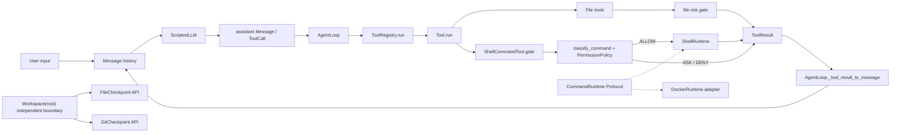
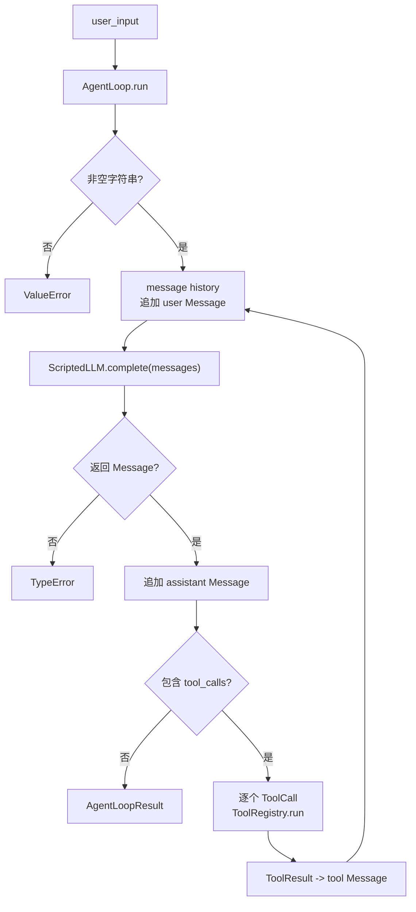
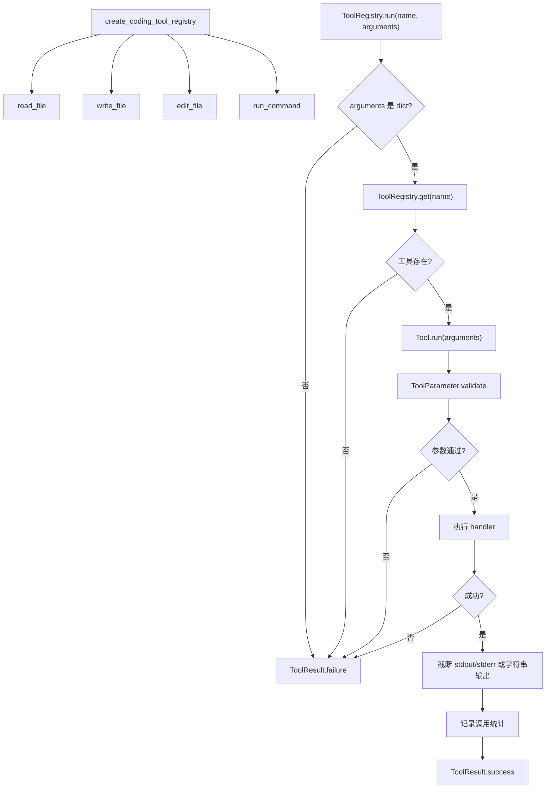
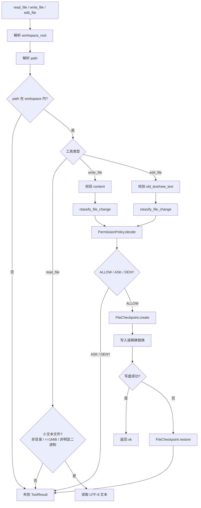
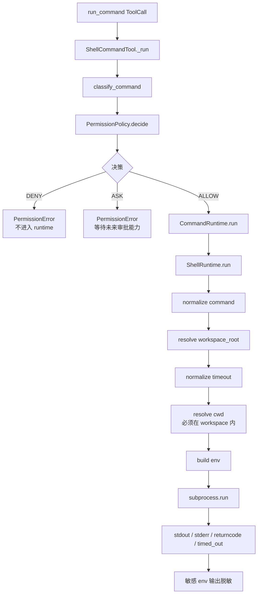
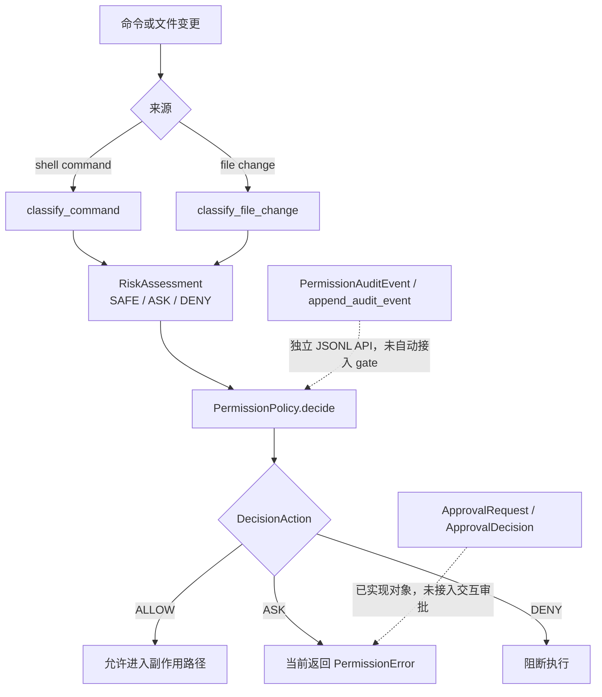
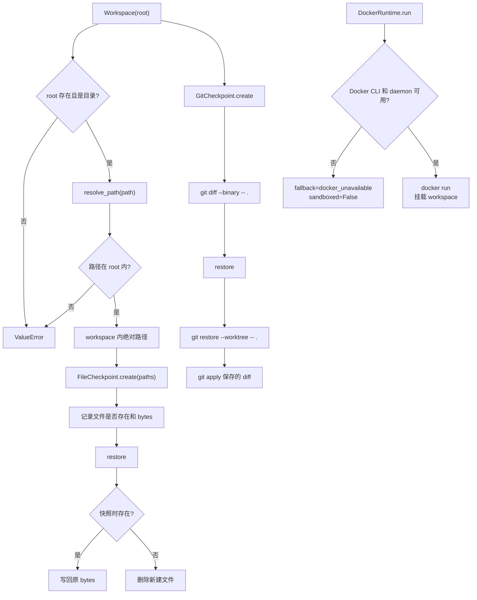
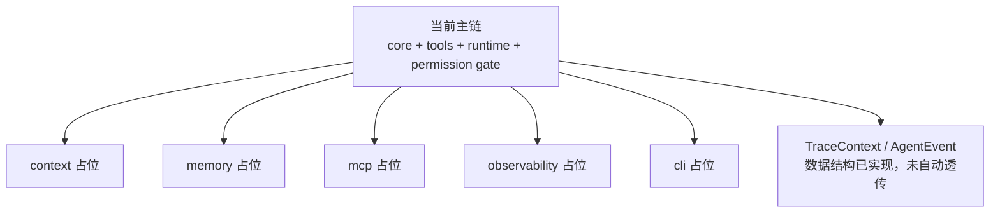

# Personal Coding Assistant

一个学习优先、工程实践驱动的工业级 **Personal Coding Assistant** 项目。

本项目目标不是写 demo，而是从零实现一个可作为作品集展示的本地优先 Agent：它能理解代码仓库、调用工具、修改代码、运行验证、控制权限、沉淀长期记忆，并用测试、评估和文档证明真实工程质量。

## 当前真实进度

当前状态、测试基线、阻塞项和下一步只维护在 `docs/09_NEXT_ACTIONS.md`。

已实现主线与工业级差距见 `docs/12_IMPLEMENTED_ARCHITECTURE_AND_INDUSTRIAL_GAPS.md`；当前架构与目标架构见 `ARCHITECTURE.md`。

截至 2026-07-09，项目处于 Week 6 Day 1：Tool Runtime 加固周现状评估已完成，等待用户回答面试题后归档。当前最新验证基线为 `E:\python\Scripts\pytest.exe -q` 通过 `168 passed, 1 skipped`，5 个示例脚本通过，`python -m compileall src examples -q` 无错误输出。

## 核心架构

当前真实主链：



## 当前模块流程图

### 1. Core：消息与 AgentLoop



### 2. Tools：工具抽象、参数 schema、注册表



### 3. File Tools：读写编辑、文件风险、失败回滚



### 4. Shell Runtime：命令权限 gate 与本地执行



### 5. Permission：风险分类、策略、审批对象、审计对象



### 6. Runtime：Workspace、Checkpoint、Docker adapter



### 7. 尚未接入主链的模块



## 项目结构

```text
.
├── AGENTS.md                     # AI 执行规则
├── DOC_RULES.md                  # 文档写入和反漂移规则
├── PROJECT_REQUIREMENTS.md       # 最终项目需求和验收定义
├── ARCHITECTURE.md               # 当前架构和目标架构
├── EVALUATION.md                 # 测试、评估和 CI 策略
├── docs/
│   ├── INDEX.md                  # 文档索引
│   ├── 01_LEARNING_ROADMAP.md    # 24 周路线总览
│   ├── 02_DAILY_TASKS.md         # 当前活跃每日任务
│   ├── 03_WEEKLY_SPRINTS.md      # 当前活跃 Sprint
│   ├── 06_ARCHITECTURE_DECISIONS.md
│   ├── 07_IMPLEMENTATION_LOG.md
│   ├── 09_NEXT_ACTIONS.md
│   ├── 13_REFERENCE_PROJECT_MAPPING.md
│   ├── 14_24_WEEK_PLAN.md
│   ├── 15_MEMORY_SYSTEM.md
│   ├── 16_TEACHING_WORKFLOW.md
│   └── 17_WEEK6_HARDENING_REPORT.md
├── examples/
├── src/pca/
├── tests/
└── pyproject.toml
```

## 运行测试

```powershell
python -m pytest -q
```

## 运行示例

```powershell
python examples\01_minimal_agent.py
python examples\02_tool_agent.py
```

## 24 周路线

完整计划见 `docs/14_24_WEEK_PLAN.md`。阶段如下：

| 阶段 | 周次 | 主题 |
|---|---:|---|
| A | 1-3 | Agent Core + Tool Runtime 基线与加固 |
| B | 4-6 | Permission + Sandbox + Git Safety |
| C | 7-10 | Coding Agent |
| D | 11-14 | Retrieval / RAG |
| E | 15-18 | Personal Assistant Memory |
| F | 19-20 | Planner / State Machine / Events |
| G | 21-22 | Evaluation / Observability / CI |
| H | 23-24 | Productization / Portfolio |

## 设计原则

- 学习优先：每个模块都要能解释直觉、原理、调用链和边界。
- 测试优先：核心模块必须配套单元测试、集成测试和回归测试。
- 本地优先：早期不依赖真实 API，使用 mock LLM 保持可重复。
- 安全优先：文件和命令执行必须限制在授权工作区内，并逐步接入权限审批。
- 工业级优先：每个阶段都要说明已覆盖边界和仍缺能力。
- 文档诚实：README 和架构图必须反映真实已实现状态。

## 仓库地址

GitHub: <https://github.com/nanhanq1/personal-coding-assistant.git>
