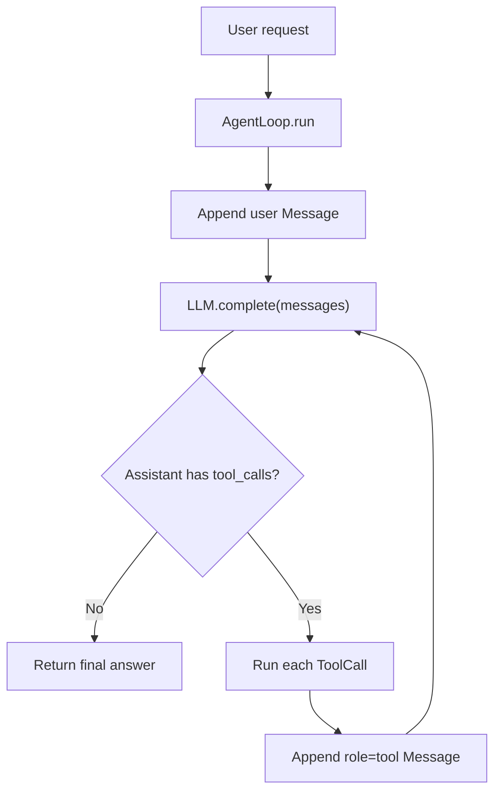
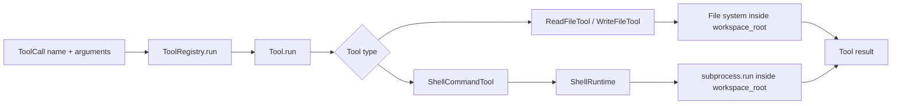
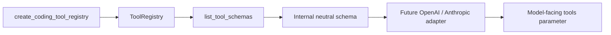
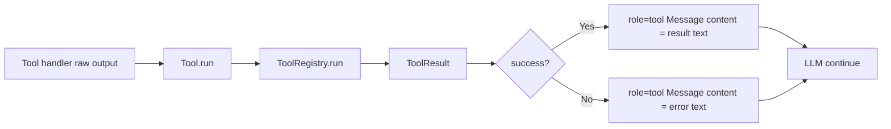

# Personal Coding Assistant

一个学习优先、工程实践驱动的 Personal Coding Assistant Agent 项目。

本项目的目标不是快速拼装 Demo，而是从零实现 Coding Agent 的核心机制，并逐步演进到可以放入作品集和面试讲解的工业级雏形。当前阶段优先使用 mock LLM，先把 Agent Loop、工具调用、文件工具、shell runtime、测试和安全边界打牢，再逐步接入真实模型、RAG、MCP、Memory、权限系统和可观测性。

## 当前进度

- 路线阶段：12 周学习路线，第 2 周 Day 4 已完成。
- 当前主题：Tool System 深化。
- 当前状态：已完成最小 Agent Loop、工具路由、文件工具、shell runtime、工具参数 schema、`edit_file` 局部编辑雏形、默认工具 schema 导出示例、内置工具描述质量优化，以及结构化 `ToolResult`。下一步进入第 2 周 Day 5：整合 schema + `edit_file` + result，让 `AgentLoop` 更明确地消费结构化工具结果。
- 已实现能力：
  - 标准 message schema：`Message`、`ToolCall`。
  - 可脚本化 mock LLM：`ScriptedLLM`。
  - 最小 Agent Loop：调用 LLM、执行工具、写回工具结果、继续循环。
  - 工具抽象：`Tool` 与 `ToolRegistry`。
  - 工具参数 schema：`ToolParameter`、`Tool.to_schema()`、`ToolRegistry.list_tool_schemas()`。
  - 文件工具：`read_file`、`write_file`、`edit_file`。
  - shell runtime：`run_command`，返回 `stdout`、`stderr`、`returncode`、`timed_out`、`duration_ms`。
  - 默认 coding 工具注册表：`create_coding_tool_registry()`。
  - 默认工具 schema 展示示例：`examples/02_tool_agent.py`。
  - 结构化工具结果：`ToolResult`，在 `ToolRegistry.run(...)` 边界统一表达成功、失败、错误和原始返回值。
  - 工作区路径边界校验、基础参数校验和工具错误回写。
  - 内置工具描述边界：只读、写入或覆盖、命令执行、workspace、timeout 和返回字段。
  - pytest 单元测试、集成测试和示例脚本。

下一步将继续深化 Tool System，优先让 `AgentLoop` 稳定消费结构化 `ToolResult`，并继续保持 mock LLM、测试和示例驱动的开发节奏。

## 核心架构

### Agent 执行闭环



这条链路回答的是：Agent 为什么不是只调用一次 LLM。模型先提出工具调用意图，程序执行真实工具，再把结果写回 `message history`，让模型基于新事实继续回答。

### 工具路由链路



这条链路回答的是：`AgentLoop` 为什么不直接 import 具体工具类。循环层只负责调度，注册表负责路由，工具层负责包装，runtime/handler 负责真实执行和安全边界。

### 工具 schema 导出链路



这条链路回答的是：真实 LLM adapter 后续应该从哪里拿工具列表。当前项目让 `ToolRegistry` 成为工具事实源，adapter 只负责把内部中立 schema 转成不同模型厂商需要的格式。

### 结构化工具结果链路



这条链路回答的是：工具执行结果为什么不能长期只用字符串表示。`ToolResult` 为后续错误分类、重试、权限审批、trace、replay 和真实 LLM adapter 留出结构化边界。

## 项目结构

```text
.
├── docs/                 # 学习路线、任务、架构决策、实现日志和面试题归档
├── examples/             # 可直接运行的示例脚本
├── src/pca/              # Personal Coding Assistant 核心源码
│   ├── core/             # Agent Loop、Message、Mock LLM
│   ├── runtime/          # shell runtime、workspace、checkpoint 等运行层能力
│   └── tools/            # Tool 抽象、注册表、文件工具、shell 工具
├── tests/                # pytest 单元测试
├── AGENTS.md             # 本项目 Codex 工作规则
├── pyproject.toml        # Python 项目配置
└── README.md
```

## 环境要求

- Python 3.11+
- Windows / PowerShell 优先验证
- pytest

安装测试依赖：

```powershell
python -m pip install pytest
```

## 运行测试

```powershell
python -m pytest -q
```

当前最近一次全量验证基线：

```text
89 passed, 1 skipped
```

## 运行示例

```powershell
python examples/01_minimal_agent.py
```

期望看到类似输出：

```text
user -> assistant -> tool:echo -> assistant
```

查看默认 coding 工具 schema：

```powershell
python examples/02_tool_agent.py
```

该示例会输出 `read_file`、`write_file` 和 `run_command` 的 schema JSON，供后续真实 LLM adapter 转换使用。
当前默认 schema 还包含 `edit_file`。

## 面试讲解要点

如果面试官问“你这个 Agent 当前实现了什么”，可以这样回答：

> 当前版本实现了一个最小 Coding Agent harness。它有标准 message history、mock LLM、AgentLoop、ToolRegistry、文件工具和 shell runtime。一次任务会从用户消息进入 `AgentLoop`，LLM 如果返回 `ToolCall`，循环会通过 `ToolRegistry` 找到对应工具执行，并把工具结果作为 `role=tool` 的消息写回 history，随后再次调用 LLM，直到得到没有工具调用的最终回答。

如果面试官问“工具 schema 在这个项目里解决什么问题”，可以这样回答：

> 当前工具系统已经支持 `ToolParameter` 和 `ToolRegistry.list_tool_schemas()`。schema 让工具名、描述、参数类型、必填字段和参数说明结构化，未来真实 LLM adapter 可以把这些内部中立 schema 转成 OpenAI、Anthropic 或其他模型需要的工具格式。schema 只负责结构契约和第一层参数校验，不能替代 `workspace_root`、危险命令审批、权限系统和 runtime 安全逻辑。

如果面试官问“为什么要引入结构化 ToolResult”，可以这样回答：

> 早期把工具结果当字符串写回 message history 能跑通最小闭环，但不利于区分成功、失败、异常类型和原始返回值。`ToolResult` 让工具执行边界更清晰：registry 统一把 handler 输出或异常包装成结构化结果，AgentLoop 仍可兼容旧的文本消息，同时为后续重试、错误恢复、权限审批、trace 和真实 LLM adapter 留出扩展点。

如果面试官问“你怎么考虑安全边界”，可以这样回答：

> 当前阶段最重要的安全边界是 `workspace_root`。文件工具和 shell runtime 都会把用户或 LLM 给出的路径解析到授权工作区内，拒绝越界路径；shell runtime 还限制超时时间，并结构化返回 stdout、stderr、退出码和超时状态。不过这还不是完整安全系统，后续仍要补权限审批、危险命令分类、审计日志、sandbox、checkpoint 和 rollback。

## 设计原则

- 学习优先：每个模块都要能解释直觉、原理、调用链和边界。
- 测试优先：核心模块必须配套单元测试。
- 本地优先：初期不依赖真实 API，使用 mock LLM 降低不确定性。
- 安全优先：文件和命令执行必须限制在 `workspace_root` 内。
- 可演进：先做最小闭环，再逐步扩展权限、上下文、MCP、Memory 和可观测性。
- 教学优先：讲到流程、调用链、状态流转、模块关系或架构关系时，必须配套 Mermaid 流程图或架构图。

## 学习路线

完整路线见：

- `docs/01_LEARNING_ROADMAP.md`
- `docs/02_DAILY_TASKS.md`
- `docs/05_LEARNING_NOTES.md`
- `docs/09_NEXT_ACTIONS.md`

当前 12 周主题包括：

1. Agent Loop
2. Tool System
3. Permission System
4. Planning / Todo
5. Context Engineering
6. Context Compression / RAG
7. Runtime / Sandbox
8. MCP
9. Memory
10. Graph / State Machine
11. Observability / Evaluation
12. Final Project

## 仓库地址

GitHub: <https://github.com/nanhanq1/personal-coding-assistant.git>
