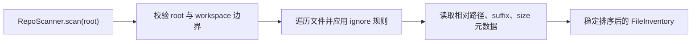

# Daily Tasks

本文件只保留当前活跃任务。历史任务归档在 `docs/archive/daily_tasks/`。完整 24 周每日计划见 `docs/14_24_WEEK_PLAN.md`。

## Week 7 Day 1：Repo Scanner 文件清单

日期：Week 6 收口（2026-07-10）后下一工作日
当前阶段：Week 7 Coding Agent
当前模块：Repo Scanner / Repo Map
预计用时：1-2 小时
执行状态：已完成 Week 6 收口，等待开始 Day 1 实现。

### 1. 学习目标

- 让 Agent 能扫描授权仓库并生成稳定的文件清单。
- 理解 ignore 规则、文件大小上限和 workspace 安全边界为什么必须在扫描入口处理。
- 为后续语言识别、文件摘要和 repo map 建立可测试的 `RepoScanner.scan(root)` 契约。

### 2. 前置知识

- Week 6 的 `Workspace(root)`、permission gate、audit、ToolResult 错误码和安全回归边界。
- Python `pathlib.Path`、目录遍历、相对路径规范化和 `gitignore` 基本语义。
- 当前边界：scanner 只读，不修改文件，不读取 workspace 外路径，不把 ignored 文件泄漏给上层。

### 3. 调用链与输入输出



- 输入：授权仓库根目录、可选 ignore 集合和文件大小限制。
- 输出：只包含相对路径和安全元数据的稳定文件清单。
- 错误：root 不存在、不是目录、越界或资源超限时返回明确失败，不继续扫描。
- 副作用：只读文件系统；不得写入仓库、执行 shell 或读取 ignored 文件内容。

### 4. 代码任务

- 新增 `src/pca/coding/repo_scanner.py`，定义最小 `RepoScanner` / `FileEntry` 模型。
- 先写测试，再实现：忽略 `.git`、`__pycache__`、`.venv`，稳定排序，拒绝 workspace 外 root，处理文件大小上限。
- 不提前实现 AST symbol index、patch、git workflow 或完整 repo map。

### 5. 阅读与资料

- Python pathlib：https://docs.python.org/3/library/pathlib.html
- Git ignore 规则：https://git-scm.com/docs/gitignore
- Aider Repo Map：https://aider.chat/docs/repomap.html
- MIT Missing Semester Version Control：https://missing.csail.mit.edu/2020/version-control/

### 6. 测试任务

```powershell
E:\python\Scripts\pytest.exe tests\test_repo_scanner.py -q
E:\python\Scripts\pytest.exe -q
```

### 7. 完成标准

- scanner 测试覆盖 ignore、稳定排序、大小限制、非法 root 和空仓库。
- 测试不依赖网络，不扫描真实用户目录，不读取 ignored 文件内容。
- 更新 `docs/07_IMPLEMENTATION_LOG.md`、`docs/09_NEXT_ACTIONS.md`；若新增架构决策，再更新 ADR。

### 用户下次应发送

```text
开始 Week 7 Day 1
```
