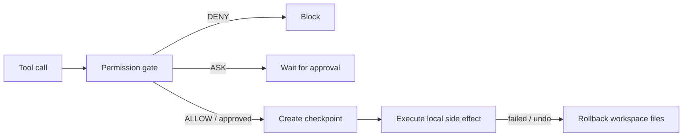

# Learning Notes

本文件只保留**当前模块**的学习笔记。历史记录已归档到 `docs/archive/learning_notes/`。

## 当前模块：Week 5 Workspace / Sandbox / Checkpoint

Week 5 的核心是把“副作用发生在哪里、发生前能否保存状态、失败后能否恢复”拆成清晰边界。Permission gate 回答“能不能执行”，workspace/checkpoint/rollback 回答“执行的范围在哪里，以及本地文件状态能否恢复”。

### Day 1：Workspace 抽象

当前文件工具和 shell runtime 都有自己的路径解析逻辑。Day 1 要抽象 `Workspace(root)`，把 root 校验、相对路径解析、越界拒绝这些规则放到统一对象里。

| 概念 | 作用 |
|---|---|
| `workspace_root` | 用户授权给 Agent 操作的目录边界 |
| `Workspace(root)` | 对 workspace 边界的结构化封装 |
| `resolve_path(...)` | 把相对路径或绝对路径解析为 workspace 内绝对路径 |
| 越界拒绝 | 防止 `..` 或外部绝对路径逃出授权目录 |

### 当前边界

- Day 1 不实现 checkpoint/rollback。
- Day 1 不接 Docker sandbox。
- Day 1 不大范围迁移文件工具和 shell runtime 主链，除非测试需要。
- 目标是先稳定 workspace API 和迁移计划。

### 当前边界

- 已实现：命令风险分类、策略判断、审批对象、shell gate、文件写盘前风险 gate、最小权限审计事件和 JSONL 写入。
- 仍未实现：交互式审批 UI、审批通过后恢复执行、audit 自动接入 shell/file gate、checkpoint/rollback、sandbox。
- 设计原则：具体工具负责最接近真实副作用的 gate；`ToolRegistry` 只负责路由、结果包装、统计和截断。
