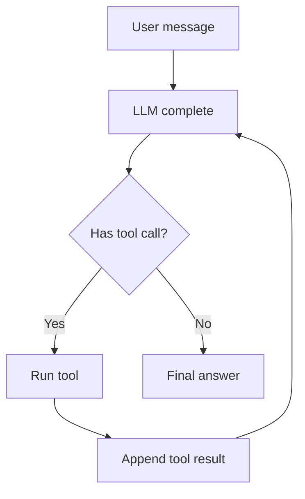
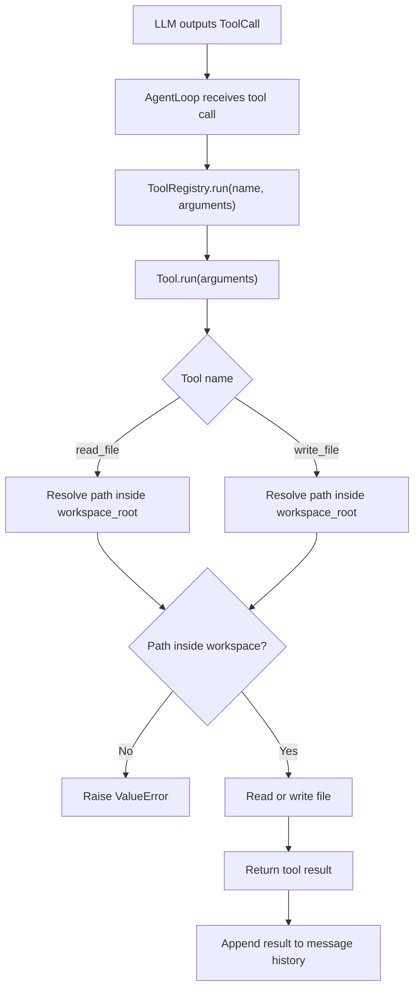

# Learning Notes

## Agent Loop：第 1 天

### 1. 直觉

Agent Loop 就是让模型不只“一次性回答”，而是能在回答过程中请求工具、读取工具结果，然后继续思考。

### 2. 一句话解释

Agent Loop 是 `LLM -> tool_call -> tool_result -> LLM` 的循环控制器。

### 3. 流程图



### 4. 技术原理

- 所有输入、助手输出、工具结果都进入同一个 message history。
- LLM 根据 history 决定下一步：直接回答或发起工具调用。
- Agent Loop 负责执行工具，并把结果作为 `role=tool` 的消息写回 history。
- 当 LLM 返回没有 tool call 的 assistant message 时，循环结束。

### 5. 核心调用链

```text
AgentLoop.run(user_input)
  -> append user Message
  -> llm.complete(messages)
  -> append assistant Message
  -> execute assistant.tool_calls
  -> append tool Message
  -> llm.complete(messages)
  -> final assistant Message
```

### 6. 工业级增强方向

- 工具 schema 和参数校验。
- 多工具调用并发和顺序控制。
- 最大轮数、超时、重试和错误恢复。
- tool call trace、日志、成本统计。
- 权限系统和危险命令审批。

## 文件工具：第 3 天

### 1. 直觉

LLM 本身只能生成文本，不能直接改变磁盘上的代码文件。Coding Agent 要真正修改代码库，必须把 LLM 的文本决策交给文件工具执行。

文件工具是 Agent 从“会调用函数”走向“能操作代码库”的第一步：

- `read_file` 让 Agent 读取真实文件内容，而不是凭记忆或猜测回答。
- `write_file` 让 Agent 把生成的内容写回文件系统。
- `workspace_root` 限制工具只能在授权工作区内读写，避免影响其他目录。

### 2. 一句话解释

文件工具把 `ToolCall.arguments` 中的路径和内容转换成受控的文件系统读写操作。

### 3. 核心调用链

```text
LLM 生成 ToolCall
  -> AgentLoop 读取 tool_call.name 和 tool_call.arguments
  -> ToolRegistry.run(name, arguments)
  -> Tool.run(arguments)
  -> read_file(arguments) / write_file(arguments)
  -> 文件系统读写
  -> 返回工具结果
  -> AgentLoop 把结果写回 message history
```

### 4. 流程图



### 5. 技术原理

- `path` 来自工具参数，不能默认可信。
- `workspace_root` 是当前允许读写的工作区边界。
- 相对路径要拼到 `workspace_root` 后再解析。
- 绝对路径也必须位于 `workspace_root` 内。
- 路径越界属于非法请求，应该抛 `ValueError`。
- 文件不存在是环境事实，应该保留 `FileNotFoundError`。
- 空字符串是合法文件内容，不应该被当成缺少内容。
- 文件读写显式使用 `encoding="utf-8"`，减少跨平台编码差异。

### 6. 当前代码位置

- 实现：`src/pca/tools/file_tools.py`
- 测试：`tests/test_file_tools.py`
- 架构决策：`docs/06_ARCHITECTURE_DECISIONS.md` 中的 ADR-0003

### 7. 当前测试覆盖

- 读取文件内容。
- 读取不存在文件时抛 `FileNotFoundError`。
- 写入文件内容。
- 允许写入空字符串。
- 拒绝空路径。
- 拒绝工作区外路径。
- 缺少 `content` 时暴露工具调用错误。
- 文件工具可以注册进 `ToolRegistry` 并通过 `registry.run(...)` 执行。

### 8. 检查问题

1. 为什么 LLM 不能直接修改文件，而需要 `write_file`？
2. `read_file` 的返回值为什么要写回 message history？
3. `workspace_root` 防止了哪些风险？
4. 路径越界为什么应该抛 `ValueError`，而不是 `FileNotFoundError`？
5. 空字符串为什么是合法文件内容？
6. `ToolCall` 和真正执行 `read_file(arguments)` 有什么区别？

### 9. 工业级增强方向

- 增加 JSON Schema 或 Pydantic 参数校验。
- 增加文件大小限制，避免一次读入过大文件。
- 增加二进制文件检测。
- 增加 `edit_file`，用补丁或 diff 修改局部内容，而不是整文件覆盖。
- 增加权限审批，写文件前让用户确认高风险操作。
- 增加 audit log，记录工具名、参数、结果、错误、耗时和 trace id。
- 增加 checkpoint 或 git diff，用于真正回滚文件状态。
