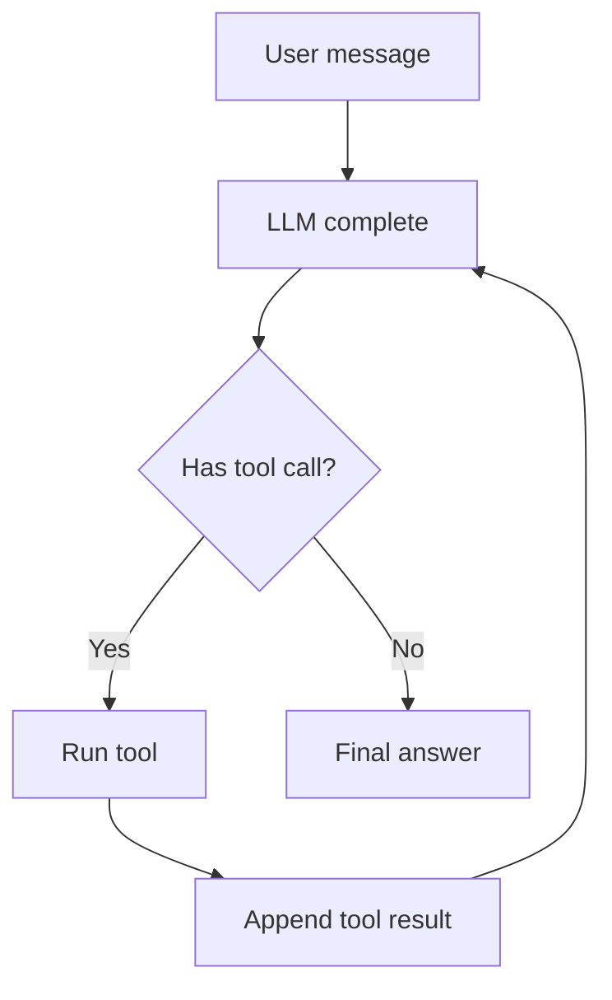

# Learning Notes

## Agent Loop：第 1 天

### 1. 直觉

Agent Loop 就是让模型不只“一次性回答”，而是能在回答过程中请求工具、读取工具结果，然后继续思考。

### 2. 一句话解释

Agent Loop 是 `LLM -> tool_call -> tool_result -> LLM` 的循环控制器。

### 3. 流程图



### 4. 技术原理

- 所有输入、助手输出、工具结果都进入同一个 message history。
- LLM 根据 history 决定下一步：直接回答或发起工具调用。
- Agent Loop 负责执行工具，并把结果作为 `role=tool` 的消息写回 history。
- 当 LLM 返回没有 tool call 的 assistant message 时，循环结束。

### 5. 核心调用链

```text
AgentLoop.run(user_input)
  -> append user Message
  -> llm.complete(messages)
  -> append assistant Message
  -> execute assistant.tool_calls
  -> append tool Message
  -> llm.complete(messages)
  -> final assistant Message
```

### 6. 工业级增强方向

- 工具 schema 和参数校验。
- 多工具调用并发和顺序控制。
- 最大轮数、超时、重试和错误恢复。
- tool call trace、日志、成本统计。
- 权限系统和危险命令审批。

