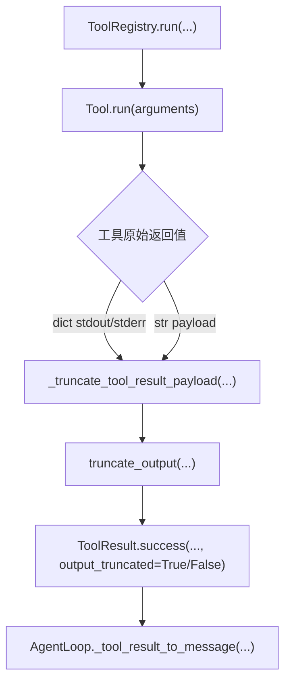
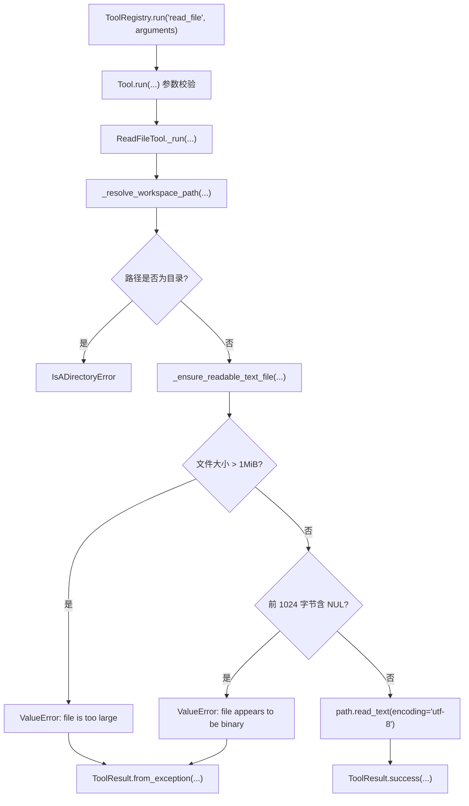

# Learning Notes

本文件只保留**当前模块**的学习笔记。历史记录已归档到 `docs/archive/learning_notes/`。

## 当前模块：Week 3 Agent Core + Tool Runtime 工业级加固

### 核心概念

| 概念 | 一句话解释 | 当前状态或目标位置 |
|---|---|---|
| 结构化日志 | 用结构化事件记录操作，不是散落的 `print` | 目标位置：`src/pca/observability/logger.py`，当前仍是占位 |
| trace_id | 贯穿一次 Agent 运行或工具调用链的唯一标识 | 已有最小结构：`src/pca/core/events.py` 的 `TraceContext` |
| AgentEvent | 描述 Agent loop、工具调用、工具结果等运行事件 | 已有最小结构：`src/pca/core/events.py` 的 `AgentEvent`，尚未接入主链 |
| ToolResult 元数据 | 把 trace、tool call 和截断状态挂到工具结果信封上 | 已实现：`ToolResult.trace_id`、`tool_call_id`、`output_truncated`，但尚未由主链自动传入 |
| 输出截断 | 防止大量 stdout、stderr 或文件内容撑爆 message history | 已实现：`truncate_output(...)` + `ToolRegistry` 结果边界截断 |
| 调用统计 | 记录每个工具的调用次数、成功次数、失败次数和累计耗时 | 已实现：`src/pca/tools/registry.py` 的 `ToolRegistry.get_stats()` |
| 文件资源边界 | 限制文件大小并识别二进制文件，避免误读不可处理内容 | 已实现：`ReadFileTool` 读取前检查 1MiB 上限和 NUL 字节二进制信号 |

### 九个工业级维度（精简版）

详细标准见 `docs/INDUSTRIAL_STANDARDS.md`。

1. **可观测性**：trace_id + 结构化日志 + 调用统计
2. **健壮性**：输入校验 + 错误分级 + 重试 + 超时
3. **安全性**：权限控制 + 审计日志 + 脱敏 + 资源限制
4. **性能**：基准测试 + 截断机制 + 资源上限
5. **可测试性**：覆盖率 ≥ 90% + 集成测试 + 回归测试
6. **接口清晰性**：完整文档 + 稳定接口 + 有意义错误信息
7. **可扩展性**：职责单一 + 依赖注入 + 预留扩展点
8. **代码质量**：中文注释 + 有意义命名 + 短小函数 + DRY
9. **真实验证**：用真实代码库验证，不只是单元测试

### 当前边界

- 已实现主链仍是 `AgentLoop`、`ToolRegistry`、`ToolResult`、文件工具和 `ShellRuntime`。
- `src/pca/observability/` 当前是占位目录，不能宣传为已接入主链。
- Week 3 Day 2 已实现轻量 trace 数据结构。
- Week 3 Day 3 已让 `ToolResult` 支持 trace 元数据，但 `AgentLoop` 尚未自动创建 trace，也没有把 trace 透传到 `ToolRegistry`。
- Week 3 Day 4 已让 `ToolRegistry` 记录最小调用统计，但尚未接入 logger hook、持久化 metrics 或 trace 聚合。
- Week 3 Day 5 已让 shell stdout/stderr 和字符串 payload 在进入 `ToolResult` 前截断；直接调用底层 `ShellRuntime` 仍保留 raw stdout/stderr，方便低层测试和后续 runtime 边界继续演进。
- Week 3 Day 6 已让 `ReadFileTool` 在读取前拒绝超过 1MiB 的文件和含 NUL 字节的明显二进制文件；这是读取前资源拒绝，不等同于 Day 5 的读取后输出截断。

### 输出截断边界

| 层级 | 职责 |
|---|---|
| `truncate_output(...)` | 纯文本截断函数，短文本原样返回，长文本保留前缀并追加可见标记 |
| `_truncate_tool_result_payload(...)` | 识别 `stdout`、`stderr` 和字符串 payload，决定是否设置 `output_truncated` |
| `ToolResult.output_truncated` | 结构化告诉后续链路：LLM 看到的内容不是完整输出 |
| `ShellRuntime` | 仍负责真实命令执行、timeout、cwd、env 和脱敏，不负责 ToolResult 元数据 |

### 文件资源边界

| 边界 | 作用 |
|---|---|
| 文件大小上限 | 在读取前拒绝不适合放入文本工具上下文的资源，避免把大文件先读进内存再截断 |
| NUL 字节检测 | 识别最明显的二进制文件信号，避免不可控字节进入 LLM 观察 |
| `ToolRegistry.run(...)` | 捕获拒绝异常并包装成结构化失败 `ToolResult`，保持 AgentLoop 错误回写兼容 |
| Day 5 输出截断 | 控制已经产生的工具输出长度；不能替代 Day 6 的读取前资源拒绝 |

### stats / trace / log 边界

| 类型 | 解决的问题 | 当前实现边界 |
|---|---|---|
| stats | 从聚合视角回答“调用了多少次、成功多少次、失败多少次、累计耗时多少” | `ToolRegistry.get_stats()` 返回内存快照 |
| trace | 从单次请求视角串起 Agent、LLM、工具调用和工具结果 | 只有 `TraceContext` / `AgentEvent` 数据结构，尚未接入主链 |
| log | 记录可审计的运行事件，供排障和回放 | `src/pca/observability/` 仍是占位 |

### 加固执行流程

现状评估 -> 状态纠偏 -> trace 数据结构 -> ToolResult 元数据 -> Registry stats -> 输出截断 -> 文件资源边界 -> 集成验证 -> 真实验证 -> 文档更新 -> 验收签字
