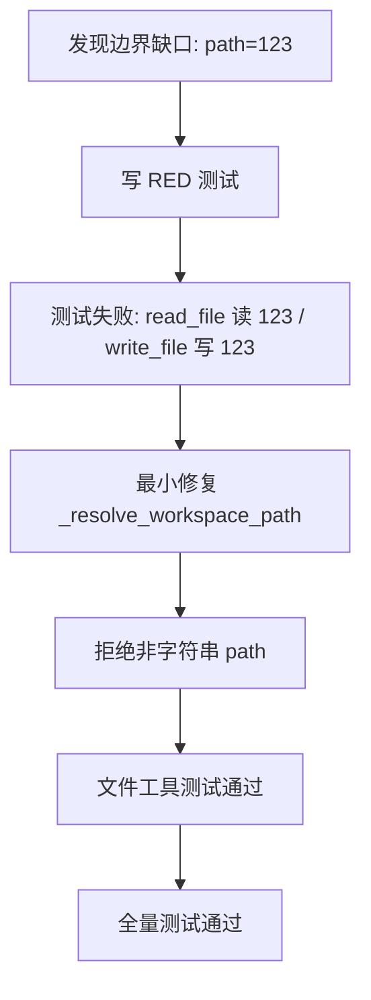
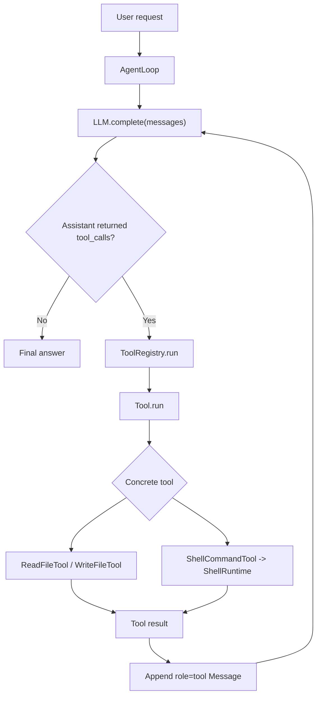
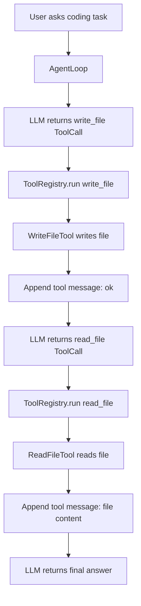
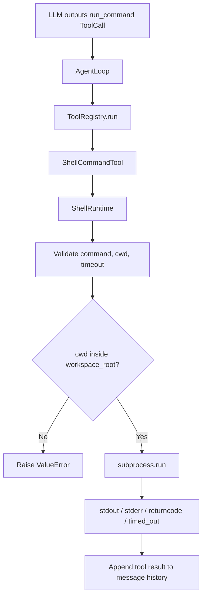
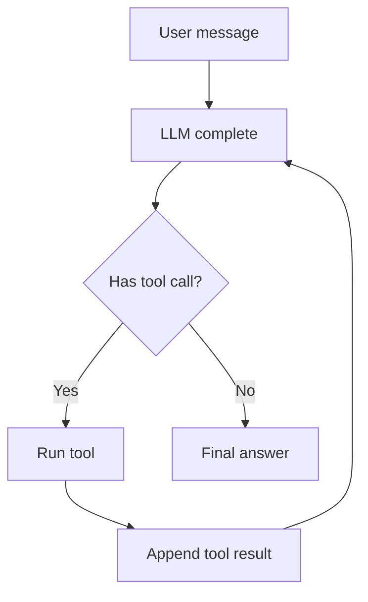
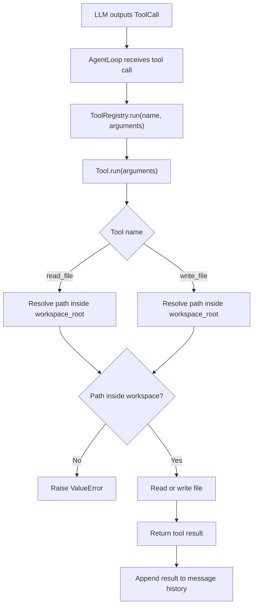

# Learning Notes

## 周复盘和小重构：第 7 天

### 1. 直觉

Day 7 的核心不是“再堆功能”，而是把第 1 周已经做出来的 Agent harness 收口。一个可继续扩展的 Coding Agent，首先要保证最小闭环稳定、边界清楚、测试能抓住真实风险，文档和代码讲的是同一件事。

本日小重构选择了文件工具的 `path` 参数边界，因为它刚好体现 Agent 工程里的一个常见问题：LLM 给出的结构化参数不能默认可信。`path=123` 看起来只是类型不对，但如果程序把它静默转成 `"123"`，读文件会报错到错误层级，写文件甚至会创建意外文件。

### 2. 一句话解释

Day 7 是用周复盘确认第 1 周 Agent Loop 和工具路由闭环已经稳定，并用 TDD 修掉一个工具参数边界缺口。

### 3. 第 1 周完整调用链

```text
user input
  -> AgentLoop.run(...)
  -> append user Message
  -> llm.complete(messages)
  -> assistant Message(tool_calls=[...])
  -> ToolRegistry.run(tool_call.name, tool_call.arguments)
  -> Tool.run(arguments)
  -> ReadFileTool / WriteFileTool / ShellCommandTool
  -> handler or ShellRuntime
  -> append role="tool" Message
  -> llm.complete(messages)
  -> final assistant Message
```

### 4. Day 7 小重构流程



### 5. 当前代码位置

- 主循环：`src/pca/core/agent_loop.py`
- 工具调用结构：`src/pca/core/messages.py`
- 工具注册表：`src/pca/tools/registry.py`
- 文件工具边界：`src/pca/tools/file_tools.py`
- shell runtime：`src/pca/runtime/shell_runtime.py`
- Day 7 新增测试：`tests/test_file_tools.py`

### 6. 当前项目阶段定位

当前代码处在第 1 周结束位置：最小 Agent Loop、工具抽象、文件工具、shell runtime、默认 coding 工具注册表、README、架构图和面试讲解稿都已经有了。

它仍然不是完整 Coding Agent 产品，而是后续 11 周能力的骨架层。第 2 周可以继续深化 Tool System，优先处理工具参数 schema、`edit_file`、结构化 tool result 和更清晰的工具元数据。

### 7. 当前仍存在的问题

- 工具参数还没有 JSON Schema 或 Pydantic schema。
- 文件工具还没有 `edit_file`、diff、二进制检测、文件大小限制和写入审批。
- shell runtime 还缺危险命令分类、权限审批、sandbox、输出大小限制和进程树清理。
- message history 还没有持久化 trace、压缩、检索和长期记忆。
- 复杂任务还没有 planner / todo 状态机。
- Day 6 和 Day 7 面试题的用户回答仍待补充。

### 8. 检查问题

1. 为什么 Day 7 不应该做大重构？
2. 为什么 `path=123` 不能被文件工具静默转成 `"123"`？
3. RED 测试在这次小重构里证明了什么？
4. 第 1 周的 Agent 执行闭环和工具路由链路分别是什么？
5. 第 2 周继续深化 Tool System 时，最应该优先补哪些能力？

## 文档和架构图：第 6 天

### 1. 直觉

Day 6 不继续新增工具，而是把第 1 周已经实现的能力讲清楚。一个 Coding Agent 项目要能放进作品集，不能只说“我写了几个类”，而要能解释完整闭环、核心调用链、设计取舍、安全边界和当前不足。

本日重点是把代码变成可展示的工程叙事：

- README 让外部读者快速知道项目是什么、现在能做什么、怎么运行。
- 架构图让读者一眼看懂 `user -> LLM -> tool_call -> tool_result -> final_answer`。
- 面试讲解稿让自己能用 30 秒、2 分钟和追问回答三种粒度讲清项目。

### 2. 一句话解释

Day 6 是把第 1 周的 Agent Loop 和 Tool Routing 闭环沉淀成项目文档、架构图和面试讲解材料。

### 3. 核心调用链复盘

```text
user input
  -> AgentLoop.run(...)
  -> append user Message
  -> llm.complete(messages)
  -> assistant Message(tool_calls=[...])
  -> ToolRegistry.run(tool_call.name, tool_call.arguments)
  -> Tool.run(arguments)
  -> concrete handler or ShellRuntime
  -> append role="tool" Message
  -> llm.complete(messages)
  -> final assistant Message
```

这条链路里有两个必须分清的层次：

1. Agent 执行闭环：`user -> LLM -> tool_call -> tool_result -> LLM -> final_answer`。
2. 工具路由闭环：`AgentLoop -> ToolRegistry -> Tool -> handler/runtime`。

### 4. 架构图



### 5. 当前代码位置

- README 总览：`README.md`
- 面试讲解稿：`docs/10_WEEK1_INTERVIEW_SCRIPT.md`
- Agent 主循环：`src/pca/core/agent_loop.py`
- Message / ToolCall：`src/pca/core/messages.py`
- Mock LLM：`src/pca/core/mock_llm.py`
- 默认工具注册表：`src/pca/tools/__init__.py`
- 工具抽象：`src/pca/tools/base.py`
- 工具注册表：`src/pca/tools/registry.py`
- 文件工具：`src/pca/tools/file_tools.py`
- shell runtime：`src/pca/runtime/shell_runtime.py`

### 6. 当前项目阶段定位

当前代码处在 12 周路线的第 1 周末尾：已经完成最小 Agent Loop 和基础工具路由雏形。

它在整体架构里的位置是“Agent harness 骨架层”，不是完整 Coding Agent 产品。后续所有复杂能力，例如权限系统、planner、上下文工程、RAG、MCP、Memory、状态机和可观测性，都会接在这条骨架链路之上。

### 7. 当前仍不是完整工业级的地方

- 真实 LLM adapter 尚未接入，当前仍依赖 `ScriptedLLM`。
- 工具参数还没有 JSON Schema / Pydantic schema。
- shell runtime 尚未接入危险命令分类、人工审批、sandbox 和进程树清理。
- 文件工具还没有 `edit_file`、diff、写入审批、文件大小限制和二进制检测。
- message history 仍是内存列表，还没有压缩、检索、持久化 trace 和长期记忆。
- 复杂任务还没有 planner / todo 状态机。

### 8. 检查问题

1. 为什么 Day 6 不是继续写新工具，而是整理 README 和架构图？
2. `user -> LLM -> tool_call -> tool_result -> LLM -> final_answer` 这条链路每一步分别是谁负责？
3. `AgentLoop -> ToolRegistry -> Tool -> handler/runtime` 和上一条链路有什么区别？
4. 面试时如何解释 `ToolCall` 只是调用意图，而不是工具执行本身？
5. 当前项目如果要进入工业级，下一步最应该补哪些安全和工程能力？

## Loop + Tools 整合：第 5 天

### 1. 直觉

前几天分别完成了 Agent 循环、工具注册表、文件工具和 shell runtime。Day 5 的重点不是继续新增工具，而是确认这些能力能被同一个 `AgentLoop` 串起来。

也就是说，Agent 不应该只会调用一个示例 `echo`，而应该能通过同一个路由入口调用不同工具，例如先写文件，再读文件，最后根据工具结果继续回答。

### 2. 一句话解释

`create_coding_tool_registry()` 是内置 coding 工具的组合入口，负责把 `read_file`、`write_file` 和 `run_command` 注册到同一个 `ToolRegistry`。

### 3. 核心调用链

```text
user input
  -> AgentLoop.run(...)
  -> llm.complete(messages)
  -> assistant Message(tool_calls=[ToolCall(...)])
  -> ToolRegistry.run(tool_call.name, tool_call.arguments)
  -> Tool.run(arguments)
  -> ReadFileTool / WriteFileTool / ShellCommandTool
  -> 返回工具结果
  -> AgentLoop 追加 role="tool" 的 Message
  -> llm.complete(messages)
  -> final assistant answer
```

### 4. 流程图



### 5. 当前代码位置

- 默认工具注册入口：`src/pca/tools/__init__.py`
- Agent 主循环：`src/pca/core/agent_loop.py`
- 文件工具：`src/pca/tools/file_tools.py`
- shell 工具：`src/pca/tools/shell_tools.py`
- 集成测试：`tests/test_loop_tools_integration.py`

### 6. 当前测试覆盖

- `create_coding_tool_registry()` 可以创建包含内置 coding 工具的 `ToolRegistry`。
- `AgentLoop` 可以通过默认工具注册表连续调用 `write_file` 和 `read_file`。
- `write_file` 的 `"ok"` 结果会写回 `message history`。
- `read_file` 的文件内容会写回 `message history`。
- 最终 assistant 可以基于工具结果结束循环。

### 7. 当前仍不是完整工业级的地方

- 当前 LLM 仍是脚本化 mock，还不会根据自然语言自主选择工具。
- 工具参数仍由测试脚本直接构造，还没有 JSON Schema / Pydantic 参数层。
- `run_command` 已注册进默认工具表，但本轮集成测试重点先放在文件工具链路。
- 还没有权限审批、风险分类、planner、长期记忆和可观测 trace。

### 8. 检查问题

1. 为什么 Day 5 不直接重写 `AgentLoop`？
2. `create_coding_tool_registry()` 解决了什么问题？
3. 为什么 `AgentLoop` 不应该直接 import 并调用 `ReadFileTool`？
4. `write_file` 和 `read_file` 的工具结果为什么都要写回 `message history`？
5. 如果 `read_file` 失败，为什么应该把错误写回工具消息，而不是直接丢掉轨迹？

## 工业级代码审查：2026-06-06

### 1. 直觉

“代码能跑”只说明 happy path 成立；“工业级代码”还要回答坏输入、工具失败、目录错误、超时、密钥泄露和后续恢复怎么办。

### 2. 本次审查出的关键问题

- 早期实验脚本在源码中硬编码 API key，这是高风险凭据泄露问题。
- 实验脚本导入时就创建真实 OpenAI client，会让包导入依赖网络配置和第三方 SDK。
- `Tool`、`ToolRegistry`、`Message` 和 `ToolCall` 没有在边界处拒绝坏数据。
- `AgentLoop` 直接抛出工具异常，导致 LLM 看不到失败原因，也无法恢复。
- 文件工具读目录时依赖 Windows 的 `PermissionError`，错误语义不稳定。
- shell runtime 对不存在的工作区、无效 `cwd`、超大超时值和空环境变量名缺少前置校验。

### 3. 加固后的调用链

```text
user_input
  -> AgentLoop 校验输入和 max_turns
  -> LLM.complete(messages) 必须返回 Message
  -> Message / ToolCall 校验消息结构
  -> ToolRegistry 校验工具名和 arguments
  -> Tool.run 校验 arguments 是 dict
  -> FileTool / ShellRuntime 做工作区、目录、超时、环境变量边界校验
  -> 成功结果或工具错误写回 message history
  -> LLM 可以继续恢复或给出最终回答
```

### 4. 本次保留的对比材料

- 修改前代码快照：`docs/code_reviews/2026-06-06-before-industrial-refactor/`
- 安全说明：快照中的旧版 API key 已替换为 `<REDACTED_API_KEY>`。
- 当前正式源码已新增测试，防止 `src/` 再出现硬编码 key。

### 5. 当前仍不是完整工业级的地方

- shell runtime 仍使用本机 shell，同步执行，还没有权限审批、命令风险分类、sandbox 和进程树清理。
- 文件工具还没有 diff 编辑、文件大小上限、二进制检测和写入前审批。
- Responses API 实验脚本仍只是学习材料，不是正式 LLM adapter。
- 错误回写目前是字符串形式，后续应升级为结构化 tool result 和可观测日志。

## Shell Runtime：第 4 天

### 1. 直觉

shell runtime 是 Coding Agent 真正“动手执行命令”的地方。文件工具只影响文件内容，shell 命令可以运行测试、启动进程、读取环境变量、卡住进程，甚至执行破坏性操作，所以必须先有清晰边界。

### 2. 一句话解释

`ShellRuntime` 负责受控执行命令，`ShellCommandTool` 负责把 Agent 的工具调用转发给 runtime。

### 3. 核心调用链

```text
LLM 生成 ToolCall
  -> AgentLoop 读取 tool_call.name 和 tool_call.arguments
  -> ToolRegistry.run(name, arguments)
  -> ShellCommandTool.run(arguments)
  -> ShellRuntime.run(arguments)
  -> subprocess.run(...)
  -> 返回 stdout / stderr / returncode / timed_out
  -> AgentLoop 把结果写回 message history
```

### 4. 流程图



### 5. 技术原理

- `command` 可以是非空字符串，也可以是非空字符串列表。
- 字符串命令为了兼容早期用法仍通过 `shell=True` 执行。
- 列表命令通过 `shell=False` 执行，是更推荐的形式。
- 列表命令把可执行程序和每个参数拆成独立元素，例如 `[sys.executable, "-c", "print('hello')"]`。
- 列表形式避免手写 shell 引号和转义，能稳定传递包含空格的参数，并减少 shell 注入风险。
- 相对 `cwd` 必须以 `workspace_root` 为基准解析。
- 解析后的 `cwd` 必须位于 `workspace_root` 内。
- `timeout_seconds` 要先规范化成正浮点数，再传给 `subprocess.run(...)`。
- 命令自身失败要保留 `returncode`，参数错误要直接抛 `ValueError`。
- `stdout` 给 Agent 看正常输出，`stderr` 给 Agent 判断错误原因，`returncode` 判断命令是否成功，`timed_out` 判断是否需要停止或重试。

### 6. 当前代码位置

- runtime：`src/pca/runtime/shell_runtime.py`
- tool：`src/pca/tools/shell_tools.py`
- 测试：`tests/test_shell_runtime.py`
- 架构决策：`docs/06_ARCHITECTURE_DECISIONS.md` 中的 ADR-0004

### 7. 工业级增强方向

- 接入权限系统，执行危险命令前请求用户确认。
- 增加命令 allowlist / denylist 和风险分类。
- 增加审计日志，记录命令、工作目录、退出码、耗时和 trace id。
- 增加进程树清理，避免超时后留下子进程。
- 增加 sandbox / docker runtime，减少宿主机风险。

## Agent Loop：第 1 天

### 1. 直觉

Agent Loop 就是让模型不只“一次性回答”，而是能在回答过程中请求工具、读取工具结果，然后继续思考。

### 2. 一句话解释

Agent Loop 是 `LLM -> tool_call -> tool_result -> LLM` 的循环控制器。

### 3. 流程图



### 4. 技术原理

- 所有输入、助手输出、工具结果都进入同一个 message history。
- LLM 根据 history 决定下一步：直接回答或发起工具调用。
- Agent Loop 负责执行工具，并把结果作为 `role=tool` 的消息写回 history。
- 当 LLM 返回没有 tool call 的 assistant message 时，循环结束。

### 5. 核心调用链

```text
AgentLoop.run(user_input)
  -> append user Message
  -> llm.complete(messages)
  -> append assistant Message
  -> execute assistant.tool_calls
  -> append tool Message
  -> llm.complete(messages)
  -> final assistant Message
```

### 6. 工业级增强方向

- 工具 schema 和参数校验。
- 多工具调用并发和顺序控制。
- 最大轮数、超时、重试和错误恢复。
- tool call trace、日志、成本统计。
- 权限系统和危险命令审批。

## 文件工具：第 3 天

### 1. 直觉

LLM 本身只能生成文本，不能直接改变磁盘上的代码文件。Coding Agent 要真正修改代码库，必须把 LLM 的文本决策交给文件工具执行。

文件工具是 Agent 从“会调用函数”走向“能操作代码库”的第一步：

- `read_file` 让 Agent 读取真实文件内容，而不是凭记忆或猜测回答。
- `write_file` 让 Agent 把生成的内容写回文件系统。
- `workspace_root` 限制工具只能在授权工作区内读写，避免影响其他目录。

### 2. 一句话解释

文件工具把 `ToolCall.arguments` 中的路径和内容转换成受控的文件系统读写操作。

### 3. 核心调用链

```text
LLM 生成 ToolCall
  -> AgentLoop 读取 tool_call.name 和 tool_call.arguments
  -> ToolRegistry.run(name, arguments)
  -> Tool.run(arguments)
  -> read_file(arguments) / write_file(arguments)
  -> 文件系统读写
  -> 返回工具结果
  -> AgentLoop 把结果写回 message history
```

### 4. 流程图



### 5. 技术原理

- `path` 来自工具参数，不能默认可信。
- `workspace_root` 是当前允许读写的工作区边界。
- 相对路径要拼到 `workspace_root` 后再解析。
- 绝对路径也必须位于 `workspace_root` 内。
- 路径越界属于非法请求，应该抛 `ValueError`。
- 文件不存在是环境事实，应该保留 `FileNotFoundError`。
- 空字符串是合法文件内容，不应该被当成缺少内容。
- 文件读写显式使用 `encoding="utf-8"`，减少跨平台编码差异。

### 6. 当前代码位置

- 实现：`src/pca/tools/file_tools.py`
- 测试：`tests/test_file_tools.py`
- 架构决策：`docs/06_ARCHITECTURE_DECISIONS.md` 中的 ADR-0003

### 7. 当前测试覆盖

- 读取文件内容。
- 读取不存在文件时抛 `FileNotFoundError`。
- 写入文件内容。
- 允许写入空字符串。
- 拒绝空路径。
- 拒绝工作区外路径。
- 缺少 `content` 时暴露工具调用错误。
- 文件工具可以注册进 `ToolRegistry` 并通过 `registry.run(...)` 执行。

### 8. 检查问题

1. 为什么 LLM 不能直接修改文件，而需要 `write_file`？
2. `read_file` 的返回值为什么要写回 message history？
3. `workspace_root` 防止了哪些风险？
4. 路径越界为什么应该抛 `ValueError`，而不是 `FileNotFoundError`？
5. 空字符串为什么是合法文件内容？
6. `ToolCall` 和真正执行 `read_file(arguments)` 有什么区别？

### 9. 工业级增强方向

- 增加 JSON Schema 或 Pydantic 参数校验。
- 增加文件大小限制，避免一次读入过大文件。
- 增加二进制文件检测。
- 增加 `edit_file`，用补丁或 diff 修改局部内容，而不是整文件覆盖。
- 增加权限审批，写文件前让用户确认高风险操作。
- 增加 audit log，记录工具名、参数、结果、错误、耗时和 trace id。
- 增加 checkpoint 或 git diff，用于真正回滚文件状态。
