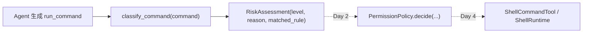

# Learning Notes

本文件只保留**当前模块**的学习笔记。历史记录已归档到 `docs/archive/learning_notes/`。

## 当前模块：Week 4 Permission System

### Day 1：风险分类

权限系统解决的是工具执行前控制，不是执行后错误包装、输出截断或密钥脱敏。Day 1 只建立风险分类 API，让后续 policy、approval、audit 和 shell gate 可以复用同一份判断结果。

### 核心概念

| 概念 | 一句话解释 | 当前实现 |
|---|---|---|
| `RiskLevel.SAFE` | 默认可直接运行的低风险命令 | `git status`、`pytest -q`、`python -m compileall ...` |
| `RiskLevel.ASK` | 需要用户确认的中风险命令 | `curl`、`Invoke-WebRequest`、`python -c`、shell 管道/重定向 |
| `RiskLevel.DENY` | 当前策略下应直接拒绝的高风险命令 | `rm -rf`、`del /s /q`、`Remove-Item -Recurse/-Force`、`format` |
| `RiskAssessment` | 分类结果信封 | 保存 `level`、`reason`、`matched_rule` |
| `classify_command(...)` | 最小分类入口 | 支持 `str` 和 `list[str]`，不负责执行拦截 |

### 当前边界

- 已实现：`src/pca/permissions/risk.py` 的风险等级、分类结果和最小命令分类。
- 未实现：`PermissionPolicy.decide(...)`、审批对象、审计事件、shell gate、文件写入风险分类。
- 未接入：`ShellRuntime`、`ShellCommandTool`、`ToolRegistry`、`AgentLoop`。
- 当前分类是启发式字符串规则，会有误判；后续需要策略层、审计和真实验证补强。

### 分类和拦截的区别

| 问题 | 风险分类 | 权限拦截 |
|---|---|---|
| 回答什么 | 这条命令看起来多危险 | 这次工具调用是否允许执行 |
| 输出 | `RiskAssessment` | allow / ask / deny 决策 |
| 所在阶段 | Week 4 Day 1 | Week 4 Day 2-Day 4 |
| 是否阻止执行 | 否 | 是 |

### 设计提醒

- 风险规则必须先匹配 `DENY`，再匹配 `ASK`，最后才默认 `SAFE`。
- `SAFE` 只是当前启发式下的低风险，不等于绝对安全。
- `list[str]` 比 shell 字符串更清晰，但仍可能执行危险程序，所以仍要分类。
- Day 1 不把分类器接到 runtime，是为了先稳定 API，再接策略和 gate。
