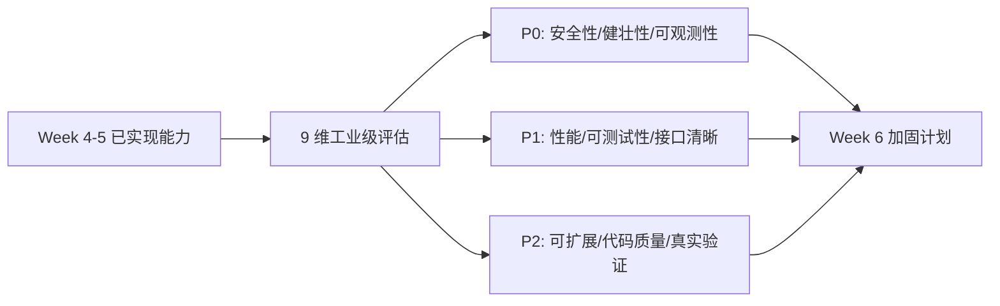
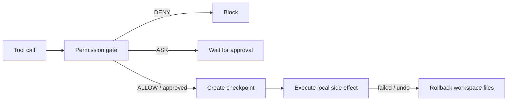

# Learning Notes

本文件只保留**当前模块**的学习笔记。历史记录已归档到 `docs/archive/learning_notes/`。

## 当前模块：Week 6 Tool Runtime 加固周

Week 6 的核心不是新增大模块，而是把 Week 4-5 已经实现的 permission、workspace、checkpoint、runtime 和 rollback 按工业级 9 维标准做差距评估与加固。Day 1 只做现状评估：先列清楚哪些已经部分达标，哪些仍是 P0 缺口，再决定后续 Day 2-Day 7 的加固顺序。

## Week 6 Day 1：现状评估重点

- 不写新功能，不扩展新模块。
- 对已有 permission/runtime/checkpoint/rollback 做 9 维差距表。
- 优先识别 P0：安全性、健壮性、可观测性缺口。
- 输出加固报告初版，后续每一天围绕报告中的高优先级缺口推进。

## 上一模块：Week 5 Workspace / Sandbox / Checkpoint

Week 5 的核心是把“副作用发生在哪里、发生前能否保存状态、失败后能否恢复”拆成清晰边界。Permission gate 回答“能不能执行”，workspace/checkpoint/rollback 回答“执行范围在哪里，以及本地文件状态能否恢复”。

## 已完成切片

| Day | 能力 | 当前边界 |
|---|---|---|
| 1 | `Workspace(root)` | 独立路径边界事实源；尚未迁移文件工具和 shell runtime 主链 |
| 2 | `FileCheckpoint` | 显式文件列表的 bytes 快照与恢复；不恢复外部副作用 |
| 3 | `GitCheckpoint` | tracked working tree diff 快照；不处理 untracked、staged、stash、commit |
| 4 | `CommandRuntime` | 薄命令执行接口；不包含 permission、checkpoint、audit 或 sandbox 策略 |
| 5 | `DockerRuntime` | 最小 adapter 与 graceful fallback；不等于完整 Docker sandbox |
| 6 | 文件工具 rollback 集成 | `ALLOW` 后写盘失败恢复本地文件状态；`ASK` / `DENY` 不创建 checkpoint |
| 7 | rollback 验收示例 | `examples/05_checkpoint_rollback.py` 证明本地文件可恢复，同时明确不可恢复边界 |

## Day 7：rollback 示例验收

- Day 7 不新增底层 runtime 能力，而是用可运行示例验证 Week 5 的已实现边界。
- `examples/05_checkpoint_rollback.py` 在临时 workspace 内创建文件、创建 `FileCheckpoint`、模拟失败修改，再调用 `restore()` 恢复文件内容。
- 示例输出 `restored=true`，证明显式跟踪的本地文件内容可以恢复。
- 示例同时输出不可恢复边界：网络/API、包安装、后台进程、workspace 外副作用、shell/Docker/Git 自动 rollback 都没有被承诺。
- 这个示例的价值在于防止“checkpoint 能恢复文件”被误讲成“Agent 具备完整事务系统”。

## Day 6：permission allowed 后的文件 rollback

- permission gate 先判断是否允许进入副作用路径。
- `DENY` 和未审批 `ASK` 在写盘前停止，不创建 checkpoint。
- `ALLOW` 后才创建 `FileCheckpoint`，然后执行真实文件修改。
- 写盘中途失败时调用 `checkpoint.restore()`，恢复本地 workspace 文件状态。
- 当前只覆盖 `WriteFileTool` / `EditFileTool` 的本地文件写盘失败，不覆盖 shell、Docker、网络/API、包安装、后台进程或 workspace 外副作用。

## Day 5：DockerRuntime graceful fallback

Day 5 的目标不是“已经拥有完整 Docker sandbox”，而是让 Docker adapter 作为 `CommandRuntime` 的可替换实现出现，并且在 Docker 不可用时给出稳定、可测试、可解释的 fallback。

当前实现位于 `src/pca/runtime/docker_runtime.py`：

- `DockerRuntime` 满足 `CommandRuntime.run(arguments)` 接口。
- 复用当前命令 runtime 的基础参数语义：`command`、`workspace_root`、`cwd`、`timeout_seconds` 和 `env`。
- 先用 `shutil.which("docker")` 检查 Docker CLI，再用 `docker version --format "{{.Server.Version}}"` 检查 daemon 可用性。
- Docker CLI 缺失时返回 `returncode=127`、`sandboxed=False`、`fallback="docker_unavailable"`。
- Docker daemon 不可用时返回 `returncode=125`、`sandboxed=False`、`fallback="docker_unavailable"`。
- Docker 确认可用后才构造 `docker run --rm -v <workspace>:/workspace -w <cwd> <image> ...`。
- 不可用时不会回退到 `ShellRuntime`，避免用户误以为命令在 sandbox 中执行。

## 关键判断

graceful fallback 不是“假装执行成功”，也不是“偷偷在宿主机执行”。它应该让调用方和用户清楚知道 sandbox 不可用，本次命令没有在隔离环境中运行。

Day 5 仍不迁移整个主链，不接自动 rollback，不承诺容器隔离已经覆盖所有副作用。Docker 只能帮助隔离一部分进程和文件系统副作用，不能替代 permission gate、checkpoint、audit 和资源治理。
