# Learning Notes

## 文档和面试表达：第 2 周 Day 6

### 1. 直觉

Day 6 不是继续堆功能，而是把第 2 周已经实现的工具系统能力讲清楚。能跑通测试说明实现成立，能画出链路、写进 README、回答面试追问，才说明架构边界真正理解了。

### 2. 一句话解释

Day 6 把第 2 周的工具系统整理成对外 README 和面试讲解稿，证明 schema、`edit_file`、`ToolResult` 和 AgentLoop 消费边界是一条完整工具链路。

### 3. 第 2 周总调用链

```text
ToolParameter / Tool.to_schema()
  -> ToolRegistry.list_tool_schemas()
  -> future LLM adapter exposes tools
  -> LLM returns ToolCall
  -> AgentLoop.run(...)
  -> ToolRegistry.run(...)
  -> Tool.run(...) validates arguments
  -> concrete tool / runtime executes
  -> ToolResult
  -> AgentLoop._tool_result_to_message(...)
  -> role="tool" Message
  -> LLM continues or final answer
```

### 4. 架构图

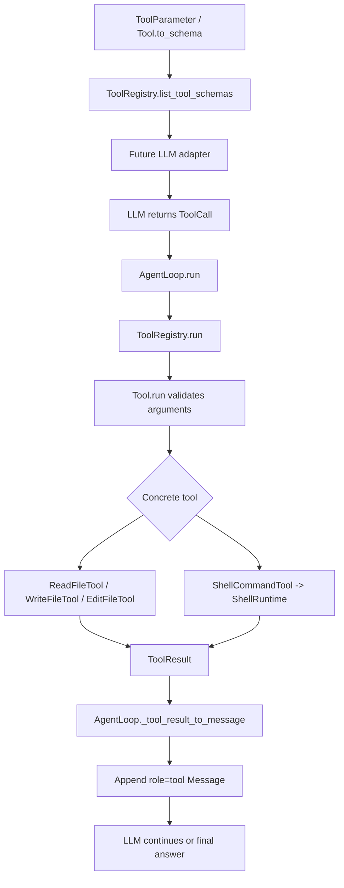

### 5. 本次实现

- 更新 `README.md`，把当前状态同步到第 2 周 Day 6，并补充第 2 周工具系统总链路。
- 新增 `docs/11_WEEK2_INTERVIEW_SCRIPT.md`，沉淀第 2 周 Tool System 的 30 秒版本、2 分钟版本、架构图和追问回答。
- 更新资源库、每日任务、实现日志、下一步行动和面试题归档。

### 6. 当前代码阶段定位

当前代码处在第 2 周 Tool System 深化的尾声：已经有工具 schema、默认工具导出、局部编辑、结构化结果和 AgentLoop 消费结果的最小闭环。

它仍不是完整工业级 Coding Agent。还缺权限系统、危险命令分类、人工审批、审计日志、trace id、checkpoint/rollback、sandbox、真实 LLM adapter 和上下文工程。

### 7. 检查问题

1. 为什么 Day 6 要更新 README 和面试讲解稿，而不是继续写新工具？
2. 第 2 周工具系统总链路的每一层分别解决什么问题？
3. 面试时如何区分“schema 契约”和“具体工具安全校验”？
4. 为什么 `ToolResult` 和 `tool Message` 不是同一个层次？
5. 第 2 周结束后，进入权限系统前最值得修补的边界缺口是什么？

## 整合 schema + edit_file + result：第 2 周 Day 5

### 1. 直觉

Day 1 到 Day 4 分别做了工具 schema、默认工具展示、`edit_file` 和结构化 `ToolResult`。Day 5 的目标不是新增一个大功能，而是证明这些能力可以被 `AgentLoop` 串成完整工具链路。

直觉上，schema 是工具调用前的说明书，`edit_file` 是真实执行能力，`ToolResult` 是执行后的结果信封，`AgentLoop` 是把三者串起来的控制器。

### 2. 一句话解释

Day 5 让 `AgentLoop` 明确消费 `ToolResult`，并用 `edit_file` 成功/失败集成测试证明 schema、工具执行和结果回写能稳定协作。

### 3. 核心调用链

```text
create_coding_tool_registry()
  -> ToolRegistry.list_tool_schemas()
  -> LLM 知道 edit_file 的 path / old_text / new_text
  -> LLM 输出 ToolCall(name="edit_file", arguments={...})
  -> AgentLoop.run(...)
  -> ToolRegistry.run(...)
  -> Tool.run(...) 做 schema 基础校验
  -> EditFileTool._run(...) 做 workspace_root 和 old_text 唯一性校验
  -> ToolResult.success(...) 或 ToolResult.failure(...)
  -> AgentLoop._tool_result_to_message(...)
  -> role="tool" Message
  -> LLM 继续生成最终回答
```

### 4. 流程图

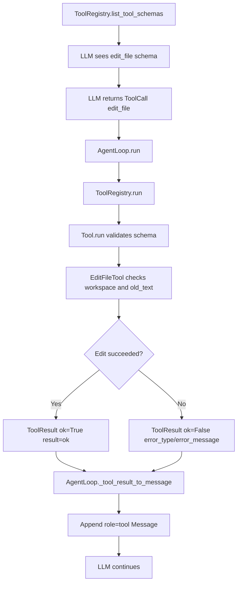

### 5. 本次测试设计

- 成功链路：先创建一个包含 `status: draft` 的文件，mock LLM 调用 `edit_file` 改成 `status: verified`，再调用 `read_file` 验证文件内容，最后生成最终回答。
- 失败链路：mock LLM 调用 `edit_file` 修改不存在的 `old_text`，AgentLoop 不崩溃，而是写回 `Tool execution failed: ValueError: old_text was not found`。
- schema 链路：默认 registry 的 schema 必须包含 `edit_file`，且 required 参数为 `path`、`old_text`、`new_text`。
- 边界链路：`AgentLoop` 必须显式提供 `_tool_result_to_message(...)`，避免结构化结果只靠 `str(...)` 偶然散落在循环内部。

### 6. 本次实现

- 在 `tests/test_loop_tools_integration.py` 中新增 `EditThenReadLLM`，验证 `edit_file -> read_file -> final answer`。
- 在 `tests/test_loop_tools_integration.py` 中新增 `FailingEditLLM`，验证失败的 `ToolResult` 会稳定写回 tool message。
- 在 `src/pca/core/agent_loop.py` 中新增 `AgentLoop._tool_result_to_message(tool_name, tool_result)`。
- 将 AgentLoop 的异常兜底改为 `ToolResult.from_exception(...)`，让进入 message history 的工具执行观察都先经过结构化结果边界。

### 7. 安全边界

- Day 5 不新增权限系统，不判断命令是否危险。
- Day 5 不新增真实 LLM adapter，仍使用 mock LLM 和测试证明控制流。
- Day 5 不把 `edit_file` 升级为 diff/patch，不做模糊匹配。
- `ToolResult` 只表达执行结果，不替代 `workspace_root`、参数 schema、`edit_file` 唯一匹配策略和后续 sandbox。

### 8. 当前代码阶段定位

当前代码处在第 2 周 Tool System 深化的后半段：工具系统已经具备轻量 schema、默认工具导出、局部编辑、结构化结果和 AgentLoop 消费结构化结果的最小闭环。

它仍不是工业级 Coding Agent。后续还需要补第 2 周 Day 6 文档和面试表达，然后 Day 7 修补一个真实边界缺口；第 3 周才进入权限系统、危险命令分类和人工审批。

### 9. 检查问题

1. Day 5 为什么不是重新设计 `ToolResult`，而是让 `AgentLoop` 明确消费它？
2. schema、`edit_file` 和 `ToolResult` 在同一条工具链路中分别解决什么问题？
3. 为什么 `edit_file` 失败时要写回 tool message，而不是直接让 AgentLoop 抛异常结束？
4. `_tool_result_to_message(...)` 这个小方法为什么是一个有价值的边界？
5. Day 5 完成后，工具系统距离权限系统还差哪些能力？

## 结构化 tool result：第 2 周 Day 4

### 1. 直觉

现在工具返回值有三种混在一起的表达方式：成功时可能是字符串 `"ok"`，shell 工具可能返回 dict，失败时可能抛异常，再由 `AgentLoop` 拼成 `"Tool execution failed: ..."` 字符串。

这能跑通最小闭环，但后续会越来越难维护：LLM adapter 不知道哪个字段表示成功，测试只能匹配字符串，可观测日志也很难稳定统计错误类型和耗时。

`ToolResult` 的直觉是：先在程序内部把一次工具执行结果统一成结构化对象，再决定如何写回 `message history`。

### 2. 一句话解释

`ToolResult` 是工具执行的内部结果信封：它把成功状态、结果内容、错误类型、错误消息和耗时放到同一个稳定结构里。

### 3. 目标调用链

```text
AgentLoop
  -> ToolRegistry.run(tool_call.name, tool_call.arguments)
  -> Tool.run(arguments)
  -> handler/runtime(arguments)
  -> ToolRegistry.run(...) 包装为 ToolResult(ok/result/error_type/error_message/duration_ms)
  -> AgentLoop 把 ToolResult 序列化为 role="tool" Message
  -> LLM 根据结构化观察继续决策
```

### 4. 流程图

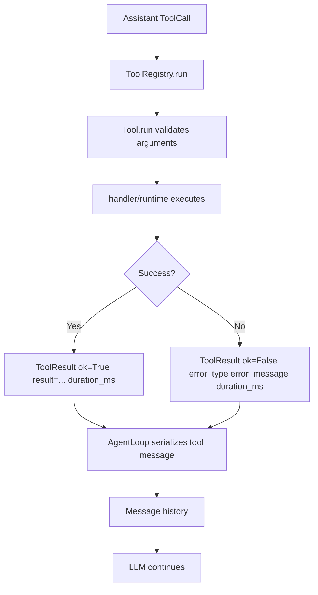

### 5. 测试设计

- `ToolResult.success(...)` 或等价构造方式能保存 `ok=True`、`result` 和 `duration_ms`。
- `ToolResult.failure(...)` 或等价构造方式能保存 `ok=False`、`error_type`、`error_message` 和 `duration_ms`。
- `ToolRegistry.run(...)` 成功执行普通 handler 时返回结构化结果，而不是裸字符串。
- handler 抛出异常时，`ToolRegistry.run(...)` 返回结构化失败结果，保留异常类型和消息。
- 参数校验失败、未知工具和 handler/runtime 异常都会在 registry 边界变成失败 `ToolResult`。
- `Tool.run(...)` 暂时保持低层原始返回/异常语义，方便具体工具单元测试继续直接验证真实行为。
- 初期保持 AgentLoop 的 `Message.content` 兼容字符串，避免一次性破坏既有示例和测试。

### 6. 安全边界

- `ToolResult` 不是权限系统，不判断命令是否危险。
- `ToolResult` 不替代 `workspace_root`、参数 schema、路径越界和 shell 超时校验。
- `ToolResult` 不直接做重试、回滚、审批或 sandbox。
- `ToolResult` 只负责把已经发生的一次工具执行结果稳定表达出来，供 AgentLoop、测试、日志和未来 adapter 使用。

### 7. 当前代码位置

- 预期实现入口：`src/pca/tools/base.py` 或 `src/pca/tools/result.py`
- 工具路由入口：`src/pca/tools/registry.py`
- Agent 消息回写：`src/pca/core/agent_loop.py`
- 目标测试入口：`tests/test_tools.py`，必要时补充 `tests/test_agent_loop.py`

### 8. 当前限制

- 已实现最小 `ToolResult`，当前放在 `src/pca/tools/base.py`。
- 当前最终序列化格式仍是兼容旧行为的纯文本：`AgentLoop` 通过 `str(tool_result)` 写回 `Message.content`。
- 尚未接入 trace id、审计日志、权限审批、重试策略和真实 LLM adapter。

### 9. 本次实现

- 在 `tests/test_tools.py` 中新增结构化结果测试，并先观察 RED：`ImportError: cannot import name 'ToolResult'`。
- 在 `src/pca/tools/base.py` 中实现 `ToolResult`。
- 在 `src/pca/tools/registry.py` 中用 `time.perf_counter()` 统计执行耗时，并把成功/失败都包装成 `ToolResult`。
- 在 `src/pca/tools/__init__.py` 中导出 `ToolResult`。
- 为降低迁移风险，`ToolResult` 提供三层兼容：
  - `str(result)`：成功时是原始结果文本，失败时是 `Tool execution failed: ...`。
  - `result == 原始值`：成功结果可和旧测试中的原始返回值比较。
  - `result["field"]`：成功结果为 dict 时可继续按旧方式访问字段。

### 10. 当前代码阶段定位

当前代码处在第 2 周 Tool System 深化的中段：已经有工具参数 schema、默认工具 schema 展示、`edit_file` 局部编辑和最小结构化工具结果。

它仍不是完整工业级工具系统。下一步还需要把 `ToolResult` 更正式地接入 AgentLoop 的 tool message 序列化、增加 trace id、明确错误分类枚举，并在后续 Permission System 中加入风险评估和人工审批。

## `edit_file` 局部编辑雏形：第 2 周 Day 3

### 1. 直觉

Coding Agent 改代码时，不应该每次都把整个文件重写一遍。整文件覆盖的风险很高：模型可能漏掉原文件里的 import、注释、格式、边界逻辑或用户刚改过的内容。

`edit_file` 的直觉是：让 Agent 明确指出“我要把这段旧文本替换成这段新文本”。这比整文件覆盖更窄，也更容易测试和审计。

### 2. 一句话解释

`edit_file` 是一个受 `workspace_root` 限制的局部编辑工具：它只在已有文件中替换一次唯一匹配的 `old_text`。

### 3. 核心调用链

```text
AgentLoop
  -> ToolRegistry.run("edit_file", arguments)
  -> Tool.run(arguments)
  -> EditFileTool._run(arguments)
  -> _resolve_workspace_path(arguments)
  -> path.read_text(...)
  -> 校验 old_text 非空且唯一出现
  -> path.write_text(...)
```

### 4. 流程图

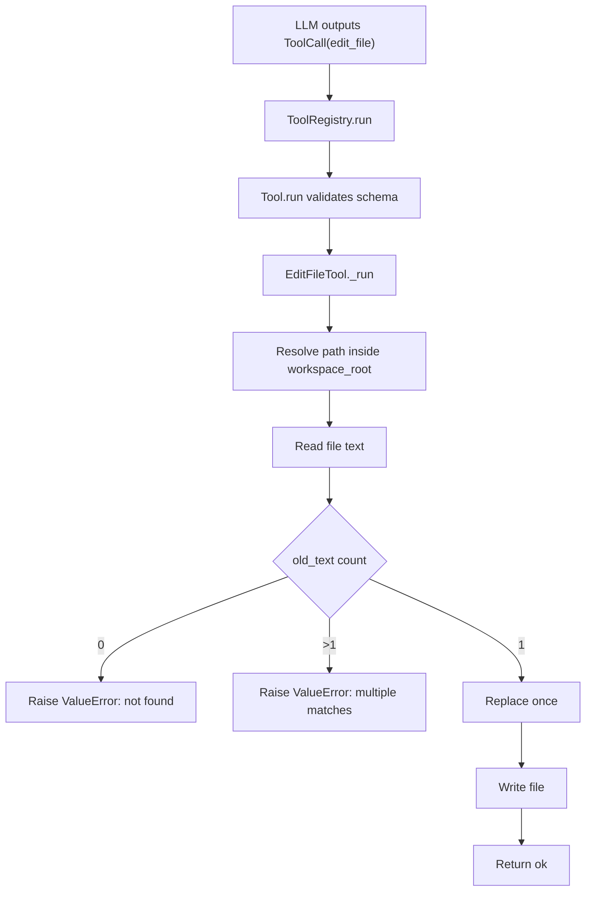

### 5. 技术原理

- `old_text` 为空必须拒绝，因为空字符串会匹配到每个字符之间的位置。
- `old_text` 出现 0 次表示 LLM 的上下文已经过期，不能静默成功。
- `old_text` 出现多次表示编辑意图不够精确，不能替模型猜要改哪一处。
- `new_text` 可以为空字符串，这允许删除一段明确文本。
- 路径解析继续复用 `_resolve_workspace_path(...)`，所以绝对路径和相对路径都必须落在 `workspace_root` 内。

### 6. 当前代码位置

- 实现：`src/pca/tools/file_tools.py`
- 默认注册表：`src/pca/tools/__init__.py`
- 行为测试：`tests/test_file_tools.py`
- schema 测试：`tests/test_tools.py`
- 示例 schema 测试：`tests/test_examples.py`

### 7. 当前测试覆盖

- 成功替换一个唯一文本片段。
- 目标文本不存在时拒绝写入。
- 目标文本出现多次时拒绝写入。
- 空 `old_text` 被拒绝。
- 非字符串 `new_text` 被拒绝。
- 工作区外路径被拒绝。
- 函数形式 `edit_file(...)` 可用。
- 默认 coding 工具注册表可以运行 `edit_file`。
- 默认工具 schema 和示例输出包含 `edit_file`。

### 8. 当前限制

- 还不支持 unified diff / patch。
- 还不支持模糊匹配或基于行号的编辑。
- 还没有结构化 tool result，失败仍然主要依赖异常。
- 还没有权限审批、文件变更预览、自动 git diff 或 checkpoint / rollback。

### 9. 检查问题

1. 为什么 `edit_file` 要求 `old_text` 只能出现一次？
2. 为什么 `new_text` 可以为空字符串，但 `old_text` 不能为空？
3. 如果 `old_text` 不存在，应该让工具静默不写入、自动追加，还是明确失败？为什么？
4. `edit_file` 和 `write_file` 的安全风险分别是什么？
5. 后续要把 `edit_file` 升级到工业级 patch 工具，还缺哪些能力？

## 工具 schema 如何服务真实 LLM adapter：第 2 周 Day 2

### 1. 直觉

Day 1 做出的 `Tool.to_schema()` 和 `ToolRegistry.list_tool_schemas()`，不是为了让测试里多一个字典断言，而是为了让未来真实 LLM adapter 能稳定知道“当前 Agent 有哪些工具可以用，以及每个工具该怎么调用”。

如果没有这个出口，adapter 只能手写工具列表，工具注册表和模型看到的工具清单就会逐渐不一致。工业级 Agent 里，这种不一致很危险：程序明明注册了工具，但模型不知道；或者模型以为能调用某个参数，程序侧却不接受。

### 2. 一句话解释

`ToolRegistry.list_tool_schemas()` 是内部工具系统通向真实 LLM adapter 的边界；adapter 负责把项目内部 schema 转换成具体模型 API 要求的外部格式。

### 3. Day 2 目标调用链

```text
create_coding_tool_registry()
  -> ToolRegistry.register(ReadFileTool / WriteFileTool / ShellCommandTool)
  -> ToolRegistry.list_tool_schemas()
  -> adapter 把内部 schema 转成模型 API 的 tools 参数
  -> 模型根据 name / description / parameters 选择工具
  -> 模型返回 ToolCall(name, arguments)
  -> AgentLoop -> ToolRegistry.run(...) -> Tool.run(...)
```

### 4. 流程图

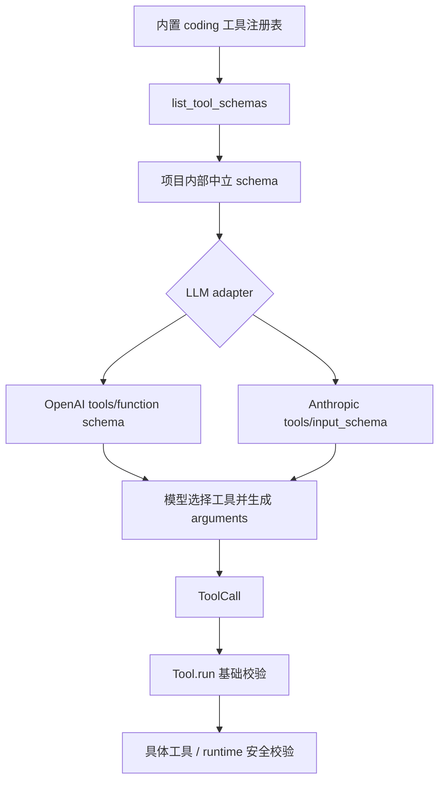

### 5. 当前代码位置

- 内部 schema 定义：`src/pca/tools/base.py`
- schema 列表导出：`src/pca/tools/registry.py`
- 默认工具注册表：`src/pca/tools/__init__.py`
- 内置工具 schema：`src/pca/tools/file_tools.py`、`src/pca/tools/shell_tools.py`
- 当前测试入口：`tests/test_tools.py`

### 6. Day 1 审查发现的问题

本次审查发现代码和 ADR-0006 出现漂移：`Tool.to_schema()` 导出了 `additionalProperties: False`，但 ADR-0006 明确写着 Day 1 暂不关闭 `additionalProperties`。

这里的工程含义是：

- 如果关闭 `additionalProperties`，就表示 schema 是闭合对象，未知字段不应出现。
- 但当前项目还没有实现完整 JSON Schema 校验器，也没有让 `Tool.run(...)` 拒绝额外字段。
- 因此 Day 1 更诚实的状态是：schema 先声明基础字段和类型，严格模式留给后续 adapter/schema hardening。

### 7. Day 2 要补的能力

- 用测试或示例展示 `create_coding_tool_registry().list_tool_schemas()` 的真实输出。
- 讲清 adapter 会如何消费这份 schema，而不是让具体 adapter 手写工具定义。
- 检查内置工具描述是否足够帮助模型区分 `read_file`、`write_file` 和 `run_command`。
- 暂不接真实 API，仍用 mock 和测试证明 schema 边界。

### 8. Day 2 本次实现

本次选择先补一个可运行示例，而不是直接写 OpenAI adapter：

- `examples/02_tool_agent.py` 创建默认 coding 工具注册表。
- 调用 `registry.list_tool_schemas()` 取得内部中立 schema。
- 用 JSON 打印出来，模拟未来 adapter 会拿到的输入。
- `tests/test_examples.py` 通过子进程运行示例，解析 stdout 并验证 `read_file`、`write_file`、`run_command` 的关键 schema。

这一步的价值是先固定内部工具系统到 adapter 之间的边界。等后续真正写 OpenAI / Anthropic adapter 时，它们应该消费这个出口，而不是在 adapter 里重新手写工具定义。

### 9. 工具描述质量优化

Day 2 后半段继续优化内置工具 schema 的描述质量。原因是：真实 LLM 选择工具时，不只看工具名，还会看工具描述和参数描述。

本次把三个内置工具的描述补到更接近“模型可决策”的程度：

- `read_file`：明确“只读取、不修改文件、返回文件文本”，避免模型把它误当成编辑工具。
- `write_file`：明确“写入或覆盖、自动创建父目录、返回 ok”，让模型知道它有副作用。
- `run_command`：明确“在 workspace_root 边界内执行命令、需要 timeout_seconds、返回 stdout/stderr/returncode/timed_out”，让模型知道它用于执行外部命令和观察结果。

同时增强了参数描述：

- `path` 说明相对路径会基于 `workspace_root` 解析。
- `content` 说明是完整文本内容。
- `command` 说明推荐使用 `list[str]`。
- `cwd` 说明默认使用 `workspace_root`。
- `timeout_seconds` 说明必须是正数。

这仍然不是权限系统。描述质量只能帮助模型少犯错，不能替代 `Tool.run(...)` 的参数校验、具体工具的 `workspace_root` 边界、shell runtime 的超时和后续 Permission System。

### 10. 检查问题

1. 为什么 `list_tool_schemas()` 应该从 `ToolRegistry` 导出，而不是在 OpenAI adapter 里手写？
2. 为什么内部 schema 最好保持中立格式，而不是一开始绑定某一家模型 API？
3. `additionalProperties: True` 和 OpenAI strict mode 的 `additionalProperties: false` 有什么差别？
4. 工具描述太短会如何影响模型选工具？
5. Day 2 为什么仍然不应该直接接真实 LLM API？

## 周复盘和小重构：第 7 天

### 1. 直觉

Day 7 的核心不是“再堆功能”，而是把第 1 周已经做出来的 Agent harness 收口。一个可继续扩展的 Coding Agent，首先要保证最小闭环稳定、边界清楚、测试能抓住真实风险，文档和代码讲的是同一件事。

本日小重构选择了文件工具的 `path` 参数边界，因为它刚好体现 Agent 工程里的一个常见问题：LLM 给出的结构化参数不能默认可信。`path=123` 看起来只是类型不对，但如果程序把它静默转成 `"123"`，读文件会报错到错误层级，写文件甚至会创建意外文件。

### 2. 一句话解释

Day 7 是用周复盘确认第 1 周 Agent Loop 和工具路由闭环已经稳定，并用 TDD 修掉一个工具参数边界缺口。

### 3. 第 1 周完整调用链

```text
user input
  -> AgentLoop.run(...)
  -> append user Message
  -> llm.complete(messages)
  -> assistant Message(tool_calls=[...])
  -> ToolRegistry.run(tool_call.name, tool_call.arguments)
  -> Tool.run(arguments)
  -> ReadFileTool / WriteFileTool / ShellCommandTool
  -> handler or ShellRuntime
  -> append role="tool" Message
  -> llm.complete(messages)
  -> final assistant Message
```

### 4. Day 7 小重构流程

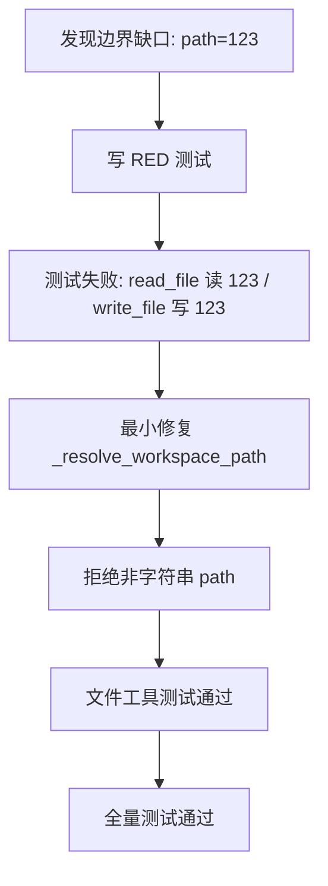

### 5. 当前代码位置

- 主循环：`src/pca/core/agent_loop.py`
- 工具调用结构：`src/pca/core/messages.py`
- 工具注册表：`src/pca/tools/registry.py`
- 文件工具边界：`src/pca/tools/file_tools.py`
- shell runtime：`src/pca/runtime/shell_runtime.py`
- Day 7 新增测试：`tests/test_file_tools.py`

### 6. 当前项目阶段定位

当前代码处在第 1 周结束位置：最小 Agent Loop、工具抽象、文件工具、shell runtime、默认 coding 工具注册表、README、架构图和面试讲解稿都已经有了。

它仍然不是完整 Coding Agent 产品，而是后续 11 周能力的骨架层。第 2 周可以继续深化 Tool System，优先处理工具参数 schema、`edit_file`、结构化 tool result 和更清晰的工具元数据。

### 7. 当前仍存在的问题

- 工具参数还没有 JSON Schema 或 Pydantic schema。
- 文件工具还没有 `edit_file`、diff、二进制检测、文件大小限制和写入审批。
- shell runtime 还缺危险命令分类、权限审批、sandbox、输出大小限制和进程树清理。
- message history 还没有持久化 trace、压缩、检索和长期记忆。
- 复杂任务还没有 planner / todo 状态机。
- Day 6 和 Day 7 面试题的用户回答仍待补充。

### 8. 检查问题

1. 为什么 Day 7 不应该做大重构？
2. 为什么 `path=123` 不能被文件工具静默转成 `"123"`？
3. RED 测试在这次小重构里证明了什么？
4. 第 1 周的 Agent 执行闭环和工具路由链路分别是什么？
5. 第 2 周继续深化 Tool System 时，最应该优先补哪些能力？

## 文档和架构图：第 6 天

### 1. 直觉

Day 6 不继续新增工具，而是把第 1 周已经实现的能力讲清楚。一个 Coding Agent 项目要能放进作品集，不能只说“我写了几个类”，而要能解释完整闭环、核心调用链、设计取舍、安全边界和当前不足。

本日重点是把代码变成可展示的工程叙事：

- README 让外部读者快速知道项目是什么、现在能做什么、怎么运行。
- 架构图让读者一眼看懂 `user -> LLM -> tool_call -> tool_result -> final_answer`。
- 面试讲解稿让自己能用 30 秒、2 分钟和追问回答三种粒度讲清项目。

### 2. 一句话解释

Day 6 是把第 1 周的 Agent Loop 和 Tool Routing 闭环沉淀成项目文档、架构图和面试讲解材料。

### 3. 核心调用链复盘

```text
user input
  -> AgentLoop.run(...)
  -> append user Message
  -> llm.complete(messages)
  -> assistant Message(tool_calls=[...])
  -> ToolRegistry.run(tool_call.name, tool_call.arguments)
  -> Tool.run(arguments)
  -> concrete handler or ShellRuntime
  -> append role="tool" Message
  -> llm.complete(messages)
  -> final assistant Message
```

这条链路里有两个必须分清的层次：

1. Agent 执行闭环：`user -> LLM -> tool_call -> tool_result -> LLM -> final_answer`。
2. 工具路由闭环：`AgentLoop -> ToolRegistry -> Tool -> handler/runtime`。

### 4. 架构图

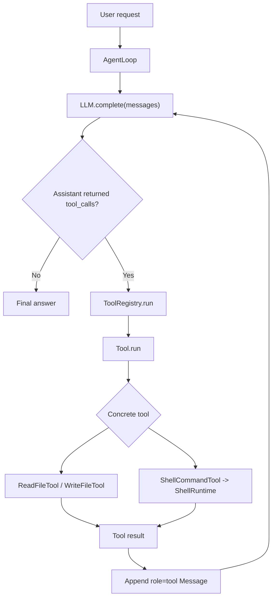

### 5. 当前代码位置

- README 总览：`README.md`
- 面试讲解稿：`docs/10_WEEK1_INTERVIEW_SCRIPT.md`
- Agent 主循环：`src/pca/core/agent_loop.py`
- Message / ToolCall：`src/pca/core/messages.py`
- Mock LLM：`src/pca/core/mock_llm.py`
- 默认工具注册表：`src/pca/tools/__init__.py`
- 工具抽象：`src/pca/tools/base.py`
- 工具注册表：`src/pca/tools/registry.py`
- 文件工具：`src/pca/tools/file_tools.py`
- shell runtime：`src/pca/runtime/shell_runtime.py`

### 6. 当前项目阶段定位

当前代码处在 12 周路线的第 1 周末尾：已经完成最小 Agent Loop 和基础工具路由雏形。

它在整体架构里的位置是“Agent harness 骨架层”，不是完整 Coding Agent 产品。后续所有复杂能力，例如权限系统、planner、上下文工程、RAG、MCP、Memory、状态机和可观测性，都会接在这条骨架链路之上。

### 7. 当前仍不是完整工业级的地方

- 真实 LLM adapter 尚未接入，当前仍依赖 `ScriptedLLM`。
- 工具参数还没有 JSON Schema / Pydantic schema。
- shell runtime 尚未接入危险命令分类、人工审批、sandbox 和进程树清理。
- 文件工具还没有 `edit_file`、diff、写入审批、文件大小限制和二进制检测。
- message history 仍是内存列表，还没有压缩、检索、持久化 trace 和长期记忆。
- 复杂任务还没有 planner / todo 状态机。

### 8. 检查问题

1. 为什么 Day 6 不是继续写新工具，而是整理 README 和架构图？
2. `user -> LLM -> tool_call -> tool_result -> LLM -> final_answer` 这条链路每一步分别是谁负责？
3. `AgentLoop -> ToolRegistry -> Tool -> handler/runtime` 和上一条链路有什么区别？
4. 面试时如何解释 `ToolCall` 只是调用意图，而不是工具执行本身？
5. 当前项目如果要进入工业级，下一步最应该补哪些安全和工程能力？

## Loop + Tools 整合：第 5 天

### 1. 直觉

前几天分别完成了 Agent 循环、工具注册表、文件工具和 shell runtime。Day 5 的重点不是继续新增工具，而是确认这些能力能被同一个 `AgentLoop` 串起来。

也就是说，Agent 不应该只会调用一个示例 `echo`，而应该能通过同一个路由入口调用不同工具，例如先写文件，再读文件，最后根据工具结果继续回答。

### 2. 一句话解释

`create_coding_tool_registry()` 是内置 coding 工具的组合入口，负责把 `read_file`、`write_file` 和 `run_command` 注册到同一个 `ToolRegistry`。

### 3. 核心调用链

```text
user input
  -> AgentLoop.run(...)
  -> llm.complete(messages)
  -> assistant Message(tool_calls=[ToolCall(...)])
  -> ToolRegistry.run(tool_call.name, tool_call.arguments)
  -> Tool.run(arguments)
  -> ReadFileTool / WriteFileTool / ShellCommandTool
  -> 返回工具结果
  -> AgentLoop 追加 role="tool" 的 Message
  -> llm.complete(messages)
  -> final assistant answer
```

### 4. 流程图

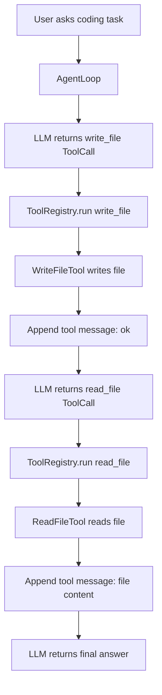

### 5. 当前代码位置

- 默认工具注册入口：`src/pca/tools/__init__.py`
- Agent 主循环：`src/pca/core/agent_loop.py`
- 文件工具：`src/pca/tools/file_tools.py`
- shell 工具：`src/pca/tools/shell_tools.py`
- 集成测试：`tests/test_loop_tools_integration.py`

### 6. 当前测试覆盖

- `create_coding_tool_registry()` 可以创建包含内置 coding 工具的 `ToolRegistry`。
- `AgentLoop` 可以通过默认工具注册表连续调用 `write_file` 和 `read_file`。
- `write_file` 的 `"ok"` 结果会写回 `message history`。
- `read_file` 的文件内容会写回 `message history`。
- 最终 assistant 可以基于工具结果结束循环。

### 7. 当前仍不是完整工业级的地方

- 当前 LLM 仍是脚本化 mock，还不会根据自然语言自主选择工具。
- 工具参数仍由测试脚本直接构造，还没有 JSON Schema / Pydantic 参数层。
- `run_command` 已注册进默认工具表，但本轮集成测试重点先放在文件工具链路。
- 还没有权限审批、风险分类、planner、长期记忆和可观测 trace。

### 8. 检查问题

1. 为什么 Day 5 不直接重写 `AgentLoop`？
2. `create_coding_tool_registry()` 解决了什么问题？
3. 为什么 `AgentLoop` 不应该直接 import 并调用 `ReadFileTool`？
4. `write_file` 和 `read_file` 的工具结果为什么都要写回 `message history`？
5. 如果 `read_file` 失败，为什么应该把错误写回工具消息，而不是直接丢掉轨迹？

## 工业级代码审查：2026-06-06

### 1. 直觉

“代码能跑”只说明 happy path 成立；“工业级代码”还要回答坏输入、工具失败、目录错误、超时、密钥泄露和后续恢复怎么办。

### 2. 本次审查出的关键问题

- 早期实验脚本在源码中硬编码 API key，这是高风险凭据泄露问题。
- 实验脚本导入时就创建真实 OpenAI client，会让包导入依赖网络配置和第三方 SDK。
- `Tool`、`ToolRegistry`、`Message` 和 `ToolCall` 没有在边界处拒绝坏数据。
- `AgentLoop` 直接抛出工具异常，导致 LLM 看不到失败原因，也无法恢复。
- 文件工具读目录时依赖 Windows 的 `PermissionError`，错误语义不稳定。
- shell runtime 对不存在的工作区、无效 `cwd`、超大超时值和空环境变量名缺少前置校验。

### 3. 加固后的调用链

```text
user_input
  -> AgentLoop 校验输入和 max_turns
  -> LLM.complete(messages) 必须返回 Message
  -> Message / ToolCall 校验消息结构
  -> ToolRegistry 校验工具名和 arguments
  -> Tool.run 校验 arguments 是 dict
  -> FileTool / ShellRuntime 做工作区、目录、超时、环境变量边界校验
  -> 成功结果或工具错误写回 message history
  -> LLM 可以继续恢复或给出最终回答
```

### 4. 本次保留的对比材料

- 修改前代码快照：`docs/code_reviews/2026-06-06-before-industrial-refactor/`
- 安全说明：快照中的旧版 API key 已替换为 `<REDACTED_API_KEY>`。
- 当前正式源码已新增测试，防止 `src/` 再出现硬编码 key。

### 5. 当前仍不是完整工业级的地方

- shell runtime 仍使用本机 shell，同步执行，还没有权限审批、命令风险分类、sandbox 和进程树清理。
- 文件工具还没有 diff 编辑、文件大小上限、二进制检测和写入前审批。
- Responses API 实验脚本仍只是学习材料，不是正式 LLM adapter。
- 错误回写目前是字符串形式，后续应升级为结构化 tool result 和可观测日志。

## Shell Runtime：第 4 天

### 1. 直觉

shell runtime 是 Coding Agent 真正“动手执行命令”的地方。文件工具只影响文件内容，shell 命令可以运行测试、启动进程、读取环境变量、卡住进程，甚至执行破坏性操作，所以必须先有清晰边界。

### 2. 一句话解释

`ShellRuntime` 负责受控执行命令，`ShellCommandTool` 负责把 Agent 的工具调用转发给 runtime。

### 3. 核心调用链

```text
LLM 生成 ToolCall
  -> AgentLoop 读取 tool_call.name 和 tool_call.arguments
  -> ToolRegistry.run(name, arguments)
  -> ShellCommandTool.run(arguments)
  -> ShellRuntime.run(arguments)
  -> subprocess.run(...)
  -> 返回 stdout / stderr / returncode / timed_out
  -> AgentLoop 把结果写回 message history
```

### 4. 流程图

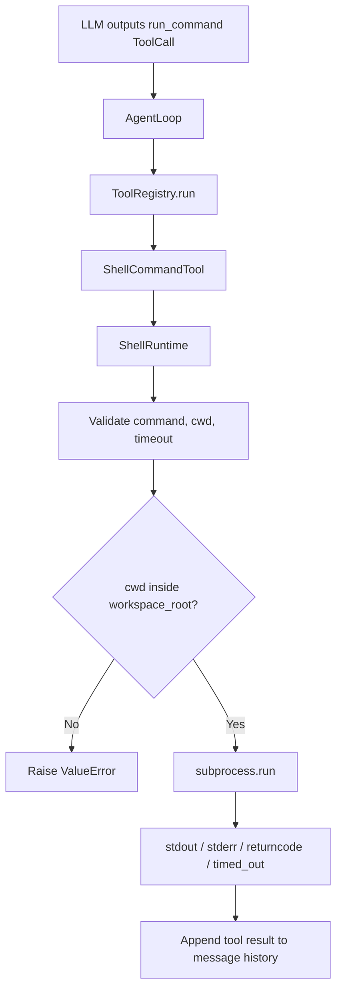

### 5. 技术原理

- `command` 可以是非空字符串，也可以是非空字符串列表。
- 字符串命令为了兼容早期用法仍通过 `shell=True` 执行。
- 列表命令通过 `shell=False` 执行，是更推荐的形式。
- 列表命令把可执行程序和每个参数拆成独立元素，例如 `[sys.executable, "-c", "print('hello')"]`。
- 列表形式避免手写 shell 引号和转义，能稳定传递包含空格的参数，并减少 shell 注入风险。
- 相对 `cwd` 必须以 `workspace_root` 为基准解析。
- 解析后的 `cwd` 必须位于 `workspace_root` 内。
- `timeout_seconds` 要先规范化成正浮点数，再传给 `subprocess.run(...)`。
- 命令自身失败要保留 `returncode`，参数错误要直接抛 `ValueError`。
- `stdout` 给 Agent 看正常输出，`stderr` 给 Agent 判断错误原因，`returncode` 判断命令是否成功，`timed_out` 判断是否需要停止或重试。

### 6. 当前代码位置

- runtime：`src/pca/runtime/shell_runtime.py`
- tool：`src/pca/tools/shell_tools.py`
- 测试：`tests/test_shell_runtime.py`
- 架构决策：`docs/06_ARCHITECTURE_DECISIONS.md` 中的 ADR-0004

### 7. 工业级增强方向

- 接入权限系统，执行危险命令前请求用户确认。
- 增加命令 allowlist / denylist 和风险分类。
- 增加审计日志，记录命令、工作目录、退出码、耗时和 trace id。
- 增加进程树清理，避免超时后留下子进程。
- 增加 sandbox / docker runtime，减少宿主机风险。

## Agent Loop：第 1 天

### 1. 直觉

Agent Loop 就是让模型不只“一次性回答”，而是能在回答过程中请求工具、读取工具结果，然后继续思考。

### 2. 一句话解释

Agent Loop 是 `LLM -> tool_call -> tool_result -> LLM` 的循环控制器。

### 3. 流程图

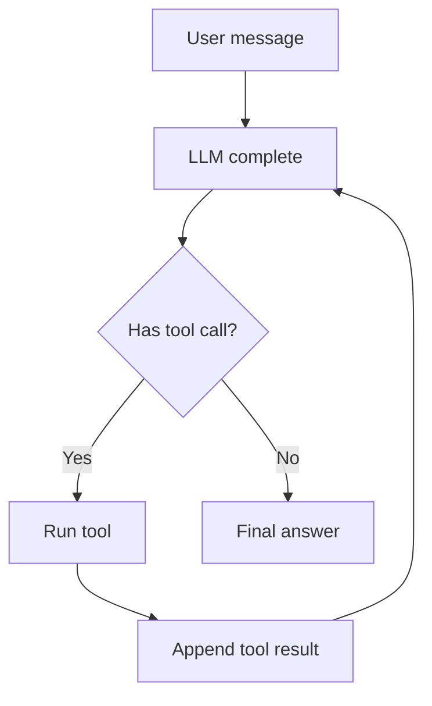

### 4. 技术原理

- 所有输入、助手输出、工具结果都进入同一个 message history。
- LLM 根据 history 决定下一步：直接回答或发起工具调用。
- Agent Loop 负责执行工具，并把结果作为 `role=tool` 的消息写回 history。
- 当 LLM 返回没有 tool call 的 assistant message 时，循环结束。

### 5. 核心调用链

```text
AgentLoop.run(user_input)
  -> append user Message
  -> llm.complete(messages)
  -> append assistant Message
  -> execute assistant.tool_calls
  -> append tool Message
  -> llm.complete(messages)
  -> final assistant Message
```

### 6. 工业级增强方向

- 工具 schema 和参数校验。
- 多工具调用并发和顺序控制。
- 最大轮数、超时、重试和错误恢复。
- tool call trace、日志、成本统计。
- 权限系统和危险命令审批。

## 文件工具：第 3 天

### 1. 直觉

LLM 本身只能生成文本，不能直接改变磁盘上的代码文件。Coding Agent 要真正修改代码库，必须把 LLM 的文本决策交给文件工具执行。

文件工具是 Agent 从“会调用函数”走向“能操作代码库”的第一步：

- `read_file` 让 Agent 读取真实文件内容，而不是凭记忆或猜测回答。
- `write_file` 让 Agent 把生成的内容写回文件系统。
- `workspace_root` 限制工具只能在授权工作区内读写，避免影响其他目录。

### 2. 一句话解释

文件工具把 `ToolCall.arguments` 中的路径和内容转换成受控的文件系统读写操作。

### 3. 核心调用链

```text
LLM 生成 ToolCall
  -> AgentLoop 读取 tool_call.name 和 tool_call.arguments
  -> ToolRegistry.run(name, arguments)
  -> Tool.run(arguments)
  -> read_file(arguments) / write_file(arguments)
  -> 文件系统读写
  -> 返回工具结果
  -> AgentLoop 把结果写回 message history
```

### 4. 流程图

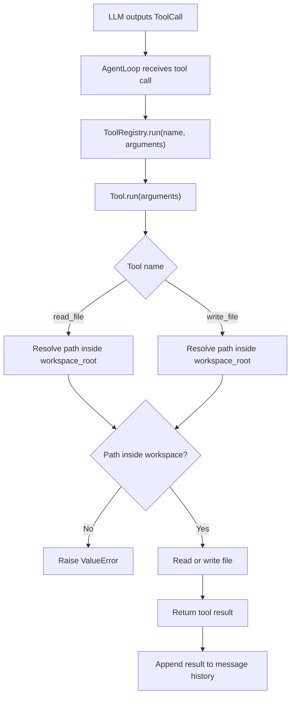

### 5. 技术原理

- `path` 来自工具参数，不能默认可信。
- `workspace_root` 是当前允许读写的工作区边界。
- 相对路径要拼到 `workspace_root` 后再解析。
- 绝对路径也必须位于 `workspace_root` 内。
- 路径越界属于非法请求，应该抛 `ValueError`。
- 文件不存在是环境事实，应该保留 `FileNotFoundError`。
- 空字符串是合法文件内容，不应该被当成缺少内容。
- 文件读写显式使用 `encoding="utf-8"`，减少跨平台编码差异。

### 6. 当前代码位置

- 实现：`src/pca/tools/file_tools.py`
- 测试：`tests/test_file_tools.py`
- 架构决策：`docs/06_ARCHITECTURE_DECISIONS.md` 中的 ADR-0003

### 7. 当前测试覆盖

- 读取文件内容。
- 读取不存在文件时抛 `FileNotFoundError`。
- 写入文件内容。
- 允许写入空字符串。
- 拒绝空路径。
- 拒绝工作区外路径。
- 缺少 `content` 时暴露工具调用错误。
- 文件工具可以注册进 `ToolRegistry` 并通过 `registry.run(...)` 执行。

### 8. 检查问题

1. 为什么 LLM 不能直接修改文件，而需要 `write_file`？
2. `read_file` 的返回值为什么要写回 message history？
3. `workspace_root` 防止了哪些风险？
4. 路径越界为什么应该抛 `ValueError`，而不是 `FileNotFoundError`？
5. 空字符串为什么是合法文件内容？
6. `ToolCall` 和真正执行 `read_file(arguments)` 有什么区别？

### 9. 工业级增强方向

- 增加 JSON Schema 或 Pydantic 参数校验。
- 增加文件大小限制，避免一次读入过大文件。
- 增加二进制文件检测。
- 增加 `edit_file`，用补丁或 diff 修改局部内容，而不是整文件覆盖。
- 增加权限审批，写文件前让用户确认高风险操作。
- 增加 audit log，记录工具名、参数、结果、错误、耗时和 trace id。
- 增加 checkpoint 或 git diff，用于真正回滚文件状态。

## 工具 schema：第 2 周 Day 1

### 1. 直觉

第 1 周的工具已经能执行，但 LLM 还没有一个稳定的“工具说明书”。如果没有 schema，模型只能从自然语言描述里猜参数名、参数类型和必填字段；程序也只能等参数进入具体工具后才发现错误。

工具 schema 的作用是把工具调用契约结构化：

- 这个工具叫什么。
- 这个工具做什么。
- 这个工具需要哪些参数。
- 每个参数大致是什么 JSON 类型。
- 哪些参数必须提供。

### 2. 一句话解释

工具 schema 是 LLM 和程序之间的工具调用合同；它能做基础参数约束，但不能替代具体工具的安全逻辑。

### 3. 核心调用链

```text
ToolParameter
  -> Tool(parameters=...)
  -> Tool.to_schema()
  -> ToolRegistry.list_tool_schemas()
  -> 未来 LLM adapter 把 schema 提供给模型
  -> LLM 生成 tool_call.arguments
  -> Tool.run(...) 先做基础参数校验
  -> handler(arguments) 执行业务逻辑和安全校验
```

### 4. 流程图

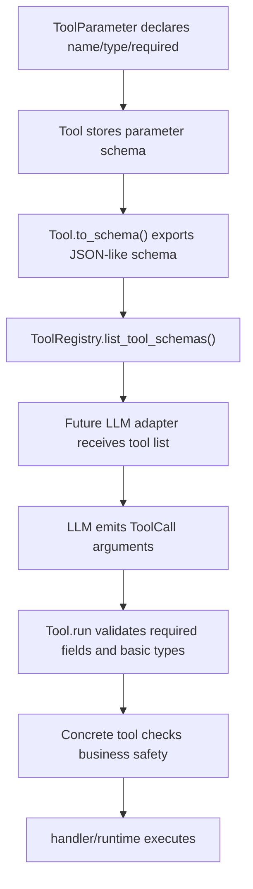

### 5. 技术原理

- `ToolParameter` 是单个参数的元数据对象。
- `Tool.parameters` 是工具的参数声明集合。
- `Tool.to_schema()` 把 Python 内部结构转换为接近 JSON Schema 的字典。
- `Tool.run(...)` 先统一检查参数是否是 dict，再根据 `ToolParameter` 检查必填字段和基础类型。
- `ToolRegistry.list_tool_schemas()` 让未来真实 LLM adapter 可以一次性获得所有工具说明。

### 6. 当前代码位置

- 实现：`src/pca/tools/base.py`
- 注册表导出：`src/pca/tools/registry.py`
- 内置工具 schema：`src/pca/tools/file_tools.py`、`src/pca/tools/shell_tools.py`
- 测试：`tests/test_tools.py`
- 架构决策：`docs/06_ARCHITECTURE_DECISIONS.md` 中的 ADR-0006

### 7. 当前测试覆盖

- 工具能导出包含 `name`、`description`、`parameters` 的 schema。
- 必填参数缺失时，`Tool.run(...)` 在进入 handler 前失败。
- 参数基础类型错误时，`Tool.run(...)` 在进入 handler 前失败。
- `bool` 不会被误当作 JSON number / integer。
- `ToolRegistry` 能导出已注册工具的 schema 列表。
- 内置 `read_file`、`write_file`、`run_command` 都有参数 schema。

### 8. 和安全校验的边界

schema 只能解决第一层问题：参数结构是否像工具期望的样子。它不能判断路径是否越界、命令是否危险、是否允许覆盖文件、是否需要用户审批。

因此当前设计是双层校验：

- `Tool.run(...)`：统一做基础参数校验。
- 具体工具 / runtime：继续做业务语义和安全边界校验。

### 9. 检查问题

1. `Tool schema` 和 `Tool handler` 的职责分别是什么？
2. 为什么 schema 不能替代 `workspace_root` 检查？
3. 为什么必填参数缺失要在 handler 执行前失败？
4. 为什么 Python 里的 `bool` 不能直接当作 JSON number / integer？
5. 未来真实 LLM adapter 会怎么使用 `ToolRegistry.list_tool_schemas()`？
