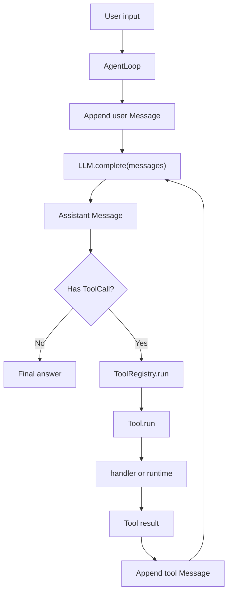

# Week 1 Interview Script

本文件是第 1 周 Day 6 产出的面试讲解稿初稿，用来把当前代码讲成一个完整的 Personal Coding Assistant Agent 雏形，而不是零散功能点。

## 1. 30 秒版本

这个项目当前实现的是一个最小 Coding Agent harness。它包含标准 `Message` / `ToolCall` 结构、可脚本化 mock LLM、`AgentLoop`、`ToolRegistry`、文件工具和 shell runtime。

核心闭环是：

```text
user -> LLM -> tool_call -> tool_result -> LLM -> final_answer
```

程序侧的工具路由链路是：

```text
AgentLoop -> ToolRegistry.run(...) -> Tool.run(...) -> handler/runtime
```

当前重点不是接真实大模型，而是先用 mock LLM 把控制流、工具结果回写、安全边界和测试体系打牢。

## 2. 2 分钟版本

第 1 周的目标是实现 Coding Agent 的最小执行骨架。传统的一次性 LLM 调用只能根据已有上下文生成文本，无法读取真实文件、运行命令或根据执行结果修正答案。这个项目通过 `AgentLoop` 把模型推理和工具执行串起来。

一次运行从用户输入开始，`AgentLoop` 把用户消息写入 `message history`，然后调用 `llm.complete(messages)`。如果 LLM 返回普通 assistant 消息，循环结束；如果返回带 `tool_calls` 的 assistant 消息，`AgentLoop` 会逐个读取 `ToolCall.name` 和 `ToolCall.arguments`，交给 `ToolRegistry.run(...)` 执行。工具返回结果后，循环把结果写成 `role="tool"` 的消息，再次交给 LLM。这样 LLM 下一轮可以基于真实工具结果继续决策。

为了避免 `AgentLoop` 直接依赖具体工具，项目引入了 `Tool` 和 `ToolRegistry`。`Tool` 包装工具名称、描述和 handler；`ToolRegistry` 负责注册、查找和执行工具。默认入口 `create_coding_tool_registry()` 统一注册 `read_file`、`write_file` 和 `run_command`，让 Agent 主循环保持稳定。

安全边界目前主要体现在 `workspace_root`。文件工具会把路径解析到授权工作区内，拒绝越界读写；shell runtime 会限制 `cwd` 在工作区内、规范化超时，并返回 `stdout`、`stderr`、`returncode`、`timed_out` 和 `duration_ms`。工具失败不会直接丢失轨迹，而是写回 message history，让 LLM 后续可以解释、重试或停止。

## 3. 架构图



## 4. 核心文件怎么讲

| 文件 | 面试讲法 |
| --- | --- |
| `src/pca/core/messages.py` | 定义 Agent 和 LLM 之间共享的轨迹结构，`ToolCall` 是模型发出的工具调用意图。 |
| `src/pca/core/mock_llm.py` | 用确定性脚本响应替代真实模型，保证早期测试可重复、低成本、无网络依赖。 |
| `src/pca/core/agent_loop.py` | Agent 的控制循环，负责调用 LLM、执行工具、写回工具结果和终止循环。 |
| `src/pca/tools/base.py` | 定义工具包装器，统一工具名称、描述和执行入口。 |
| `src/pca/tools/registry.py` | 工具路由表，负责注册、查找和执行工具。 |
| `src/pca/tools/file_tools.py` | 文件读写工具，负责 workspace 边界、路径解析、编码和文件读写。 |
| `src/pca/runtime/shell_runtime.py` | 命令执行 runtime，负责 cwd、timeout、env、输出捕获和耗时统计。 |
| `tests/` | 用测试证明每一层边界和集成链路，而不是靠手动试运行。 |

## 5. 设计取舍

### 为什么先用 mock LLM？

真实模型会带来网络、API key、模型随机性、费用和输出不可控问题。第 1 周的目标是验证控制流，所以用 `ScriptedLLM` 固定输出，先证明 `tool_call -> tool_result -> final answer` 这条链路正确。

### 为什么需要 `ToolRegistry`？

如果 `AgentLoop` 直接保存 `dict[str, callable]` 或直接 import 具体工具，循环层会越来越臃肿，也难以承载工具元数据、重复注册检查、未知工具错误和后续权限系统。`ToolRegistry` 让循环层只依赖统一接口。

### 为什么工具结果必须写回 message history？

工具结果是 Agent 从外部环境获得的新事实。只有写回 history，LLM 下一轮才能知道工具是否成功、读到了什么、命令输出是什么，以及下一步应该继续、重试还是停止。

### 为什么 shell runtime 要单独拆出来？

`ShellCommandTool` 是工具包装层，`ShellRuntime` 是运行环境层。拆开之后，未来把本地 subprocess 替换成 sandbox、Docker、远程执行器或带审批的 runtime 时，不需要重写 `AgentLoop` 和工具路由层。

## 6. 当前不足

- LLM 仍是 mock，还没有真实模型 adapter。
- 工具参数还没有 JSON Schema / Pydantic 级别的严格 schema。
- shell runtime 还没有危险命令分类、人工审批、sandbox、进程树清理和资源限制。
- 文件工具还没有 `edit_file`、diff、写入前审批、文件大小限制和二进制检测。
- message history 目前是内存列表，还没有压缩、检索、长期记忆或 trace 存储。
- 还没有 planner / todo 状态机，复杂任务拆解能力会在后续周次实现。

## 7. 面试官追问准备

### 如果问：这和普通函数调用有什么区别？

普通函数调用是程序自己决定调用哪个函数；`ToolCall` 是 LLM 根据上下文生成的结构化调用意图。程序侧不会盲信模型，而是通过 `AgentLoop -> ToolRegistry -> Tool` 这条链路校验、路由和执行。

### 如果问：工具失败怎么办？

当前 `AgentLoop` 会捕获工具异常，把错误写成 tool message 放回 history。这样轨迹不会丢失，LLM 下一轮可以根据错误解释问题、尝试换路径、请求用户确认或停止执行。

### 如果问：为什么这还不是完整 Coding Agent？

它现在是最小 harness，已经有循环、工具路由和基础 runtime，但还缺真实 LLM、上下文工程、权限审批、任务规划、长期记忆、MCP、可观测性和 sandbox。后续 12 周路线就是围绕这些工业级能力逐步补齐。
