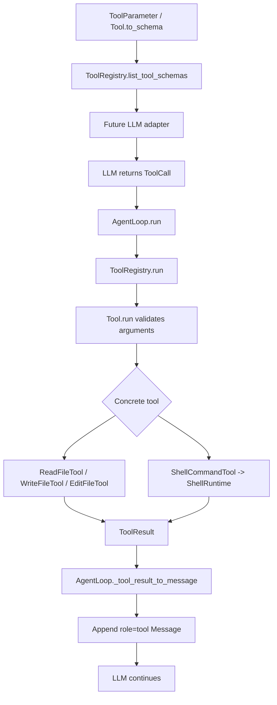

# 第 2 周 Tool System 面试讲解稿

> 状态：Day 6 文档和面试表达草稿。Day 5 已完成；本稿需要在 Day 6 正式复核后再作为完成版使用。

## 30 秒版本

第 2 周我把第 1 周的最小工具路由升级成了更接近真实 Coding Agent 的工具系统。现在工具有参数 schema，可以从 `ToolRegistry.list_tool_schemas()` 统一导出；默认 coding 工具包含 `read_file`、`write_file`、`edit_file` 和 `run_command`；工具执行结果会在 `ToolRegistry.run(...)` 边界包装成 `ToolResult`；`AgentLoop` 再通过 `_tool_result_to_message(...)` 把结果写回 message history。当前仍使用 mock LLM，不提前接真实 API，重点是把工具系统边界讲清楚、测稳定。

## 2 分钟版本

第 2 周的主线是把工具系统从“能调用函数”升级成“能被模型理解、能安全执行、能稳定回写结果”的结构。

第一步是工具 schema。`ToolParameter` 描述参数名、JSON 类型、说明和是否必填；`Tool.to_schema()` 导出接近 JSON Schema 的结构；`ToolRegistry.list_tool_schemas()` 统一导出所有已注册工具。这个设计让未来 OpenAI、Anthropic 或其他 adapter 从 registry 获取工具清单，而不是在 adapter 里手写一份容易漂移的工具列表。

第二步是默认工具和描述质量。`create_coding_tool_registry()` 现在注册 `read_file`、`write_file`、`edit_file` 和 `run_command`。工具描述不只是给人看的注释，它会影响模型选工具，所以描述里必须说明用途、副作用、workspace 边界、timeout 和返回值。

第三步是 `edit_file`。它只对已有文本文件做一次精确替换，要求 `old_text` 非空且在文件中唯一出现，路径必须位于 `workspace_root` 内。这样比整文件覆盖更适合 Coding Agent 的小范围修改，也更容易审计和测试。

第四步是 `ToolResult`。早期工具成功返回字符串，失败靠异常，长期会让 AgentLoop、测试和日志难以稳定判断结果。现在 `ToolRegistry.run(...)` 会返回 `ToolResult`，包含 `ok`、`result`、`error_type`、`error_message` 和 `duration_ms`。

第五步是 Day 5 的整合。`AgentLoop` 显式增加 `_tool_result_to_message(...)`，把内部结构化结果转换成 `role="tool"` 的消息。这样主循环不依赖散落的 `str(...)` 兼容逻辑，后续要改 JSON tool message、trace id、输出截断或真实 LLM adapter 时，有明确的修改入口。

## 总架构图

## 关键追问

### 1. 为什么 schema 不能替代具体工具校验？

schema 只解决参数形状，例如字段是否存在、类型是否大致正确。它不能判断路径是否越界，不能判断 `old_text` 是否唯一出现，也不能判断命令是否危险。因此当前设计是双层边界：`Tool.run(...)` 做基础参数校验，具体工具和 runtime 做业务安全校验。

### 2. 为什么 `ToolRegistry` 是 schema 事实源？

因为 registry 持有当前真正注册的工具。未来 adapter 如果自己手写工具列表，就会出现“程序能执行的工具”和“模型看到的工具”不一致。让 adapter 从 `list_tool_schemas()` 读取工具清单，可以减少漂移。

### 3. 为什么 `edit_file` 要求 `old_text` 唯一？

如果 `old_text` 出现多次，工具无法知道模型想改哪一个语义位置。静默替换第一处或全部替换都可能误改代码。唯一匹配策略牺牲了一些便利性，但换来了可解释、可测试、可审计。

### 4. 为什么工具失败要写回 tool message？

工具失败经常是可恢复的，比如文件上下文过期、路径错误或参数缺失。如果 AgentLoop 直接抛异常结束，LLM 看不到失败原因，也没有机会重新读取文件、换策略或向用户解释。写回 tool message 可以保留完整轨迹。

### 5. 当前距离工业级工具系统还差什么？

还缺权限系统、危险命令分类、写文件审批、审计日志、trace id、输出截断、checkpoint/rollback、sandbox、真实 LLM adapter 和更严格的 schema hardening。第 3 周会先进入 Permission System。

## 当前项目位置

当前代码处在 12 周路线的第 2 周 Day 5 完成状态：Tool System 已经具备 schema、默认工具导出、局部编辑、结构化结果和 AgentLoop 消费结果的最小闭环。它还不是完整 Coding Agent 产品，但已经有了后续权限、规划、上下文工程、MCP、Memory 和可观测性可以接入的稳定工具边界。下一步是正式复核本讲解稿和 README，完成 Day 6 文档与面试表达验收。
