# 已完成主线架构与工业级差异整理

## 文档说明

### 1. 范围

本文件只整理**已完成主线**，范围限定为：

- 第 1 周 Day 1 到 Day 7
- 第 2 周 Day 1 到 Day 7
- 第 3 周已完成的 Agent Core + Tool Runtime 加固切片
- 第 4 周 Day 1-Day 6 已完成的 Permission System 风险分类、策略判断、审批对象、shell gate、文件风险 gate 和最小审计事件切片
- 与上述主线直接相关的文档复核、规则治理和工业级边界补强

不纳入“已实现主链架构图”的目录：

- `src/pca/context`
- `src/pca/memory`
- `src/pca/mcp`
- `src/pca/observability`

这些目录虽然已经存在，但当前仍是占位或计划模块，本文只在后文“占位模块说明”中单列，不把它们画成当前已落地能力。
`src/pca/permissions` 已有 Day 1-Day 6 的风险分类、策略判断、审批对象、文件风险分类和审计事件；Day 4-Day 5 已把风险分类和策略判断分别接入 `ShellCommandTool` 和文件工具写盘前 gate，但审批交互、审批恢复、audit 自动接入主链、checkpoint 和 rollback 仍未完成。

### 2. 证据来源

本文只依赖当前仓库内可核对证据：

- `docs/02_DAILY_TASKS.md`
- `docs/07_IMPLEMENTATION_LOG.md`
- `docs/06_ARCHITECTURE_DECISIONS.md`
- `README.md`
- 已实现源码：`src/pca/core`、`src/pca/tools`、`src/pca/runtime`、`src/pca/permissions/risk.py`、`src/pca/permissions/policy.py`、`src/pca/permissions/approval.py`、`src/pca/permissions/file_risk.py`、`src/pca/permissions/audit.py`

### 3. 阅读方式

- 先看“工业级问题总表”，建立从 Day 1 到 Day 14/15 的问题地图。
- 再看“整体架构图”，确认当前真实主链只覆盖哪些模块。
- 最后看每个模块的“流程图 + 细节图 + 工业级差异”，理解当前代码处于什么阶段、差在什么地方。

## 工业级问题总表

> 说明：本表按“任务块”整理，不强制一行对应一个自然日期。规则维护类任务单列为“流程/治理问题”，不混入模块流程图。

| 时间 | 任务阶段 | 已完成内容 | 当前实现落点 | 工业级问题 | 当前已做边界 | 与工业级差异类别 | 后续应补能力 |
| --- | --- | --- | --- | --- | --- | --- | --- |
| 2026-05-26 | Week 1 Day 1 最小 Agent Loop | 建立 `Message`、`ToolCall`、`ScriptedLLM`、`AgentLoop` 和最小示例 | `src/pca/core/messages.py` `src/pca/core/mock_llm.py` `src/pca/core/agent_loop.py` | 只支持脚本化 mock LLM，没有真实模型适配、并发、多工具调度、恢复策略和成本控制 | 有 `message history`、`max_turns`、基础结构校验 | LLM adapter / 控制流成熟度 | 真实 LLM adapter、流式输出、重试、中断恢复、token/cost 统计 |
| 2026-06-01 | Week 1 Day 2 Tool / ToolRegistry | 建立 `Tool` 与 `ToolRegistry`，让 `AgentLoop` 通过注册表执行工具 | `src/pca/tools/base.py` `src/pca/tools/registry.py` | 注册表还是最小路由层，没有 schema、权限元数据、审计字段和调用策略 | 重复注册、未知工具、空名等基础校验 | 工具系统抽象成熟度 | 参数 schema、权限元数据、可观测字段、并发或批量工具策略 |
| 2026-06-04 | Week 1 Day 3 文件工具 | 实现 `read_file` / `write_file` 和 `workspace_root` 边界 | `src/pca/tools/file_tools.py` | 早期只支持文本文件读写，没有审批、diff 预览和回滚 | 路径必须位于 `workspace_root` 内，空路径/非法类型会失败 | 文件系统安全 / 变更可控性 | 写前审批、变更预览、checkpoint/rollback |
| 2026-06-06 | Week 1 Day 4 Shell Runtime | 实现 `ShellRuntime` 与 `run_command`，支持 `cwd`、timeout、stdout/stderr/returncode/timed_out | `src/pca/runtime/shell_runtime.py` `src/pca/tools/shell_tools.py` | 仍直接在本机同步执行命令，没有危险命令分类、审批、sandbox、进程树治理和审计 | `workspace_root`、`cwd`、timeout、环境变量基础校验 | 命令执行安全 / runtime 隔离 | 风险分类、审批流、sandbox/docker runtime、进程树清理、审计日志 |
| 2026-06-06 | 工业级代码审查与加固 | 清理硬编码 API key，补充输入校验、工具错误回写和运行边界 | `src/pca/response_test.py` `src/pca/mini_LLM_01.py` `src/pca/core/*` `src/pca/tools/*` `src/pca/runtime/*` | 这是“最小工业级补强”，不是完整产品级治理；仍缺 secrets 管理、策略系统、trace、审批和隔离执行 | 惰性创建 client、边界校验、工具失败写回 history、密钥扫描测试 | 安全治理 / 凭据管理 / 容错 | Secrets manager、统一配置层、审计链路、审批与策略、生产级日志 |
| 2026-06-08 | Week 1 Day 5 Loop + Tools 整合 | 新增 `create_coding_tool_registry()`，验证 `write_file -> read_file -> final answer` 闭环 | `src/pca/tools/__init__.py` `tests/test_loop_tools_integration.py` | 仍是脚本化 happy path 集成，没有多工具计划、失败恢复矩阵、上下文裁剪和观察压缩 | 统一默认工具注册表，最小多步链路验证 | 主链集成成熟度 | 规划层、上下文管理、失败恢复策略、更多真实任务回归 |
| 2026-06-08 | Week 1 Day 6 文档和架构表达 | README、面试稿、学习笔记开始描述主链架构 | `README.md` `docs/10_WEEK1_INTERVIEW_SCRIPT.md` | 文档能表达当前主链，但不能替代真实产品能力；文档容易与代码漂移 | 通过测试和示例复核文档表述 | 文档一致性 / 对外表达 | 文档自动校验、版本化架构说明、持续更新机制 |
| 2026-06-08 | Week 1 Day 7 周复盘和小重构 | 拒绝非字符串 `path`，避免 LLM 坏参数被静默转成文件名 | `src/pca/tools/file_tools.py` | 只是单点边界修补，还没有系统化参数策略、风险等级和统一错误分类 | 文件工具对 `path`、`workspace_root` 的边界更清晰 | 参数健壮性 / 错误语义统一 | 全局参数策略、统一错误码、风险标签、结构化异常 |
| 2026-06-09 | Week 2 Day 1 Tool schema | 引入 `ToolParameter`、`Tool.to_schema()`、`ToolRegistry.list_tool_schemas()` | `src/pca/tools/base.py` `src/pca/tools/registry.py` | schema 只覆盖基础类型和必填校验，不是完整 JSON Schema，也不包含权限和审计信息 | `Tool.run(...)` 先做基础参数校验，`additionalProperties=True` 与当前阶段保持一致 | 模型契约 / schema 成熟度 | 更完整 schema、枚举/嵌套结构、schema 版本、权限元数据 |
| 2026-06-10 | Week 2 Day 2 schema 展示与描述质量 | 用 `examples/02_tool_agent.py` 展示默认工具 schema，并优化工具描述 | `examples/02_tool_agent.py` `src/pca/tools/file_tools.py` `src/pca/tools/shell_tools.py` | 当前描述对 mock/教学足够，但仍缺真实模型选择数据、示例输入输出、供应商适配层 | 默认 registry 成为 schema 事实源，工具描述更接近模型可消费文本 | 模型可用性 / adapter 准备度 | OpenAI/Anthropic adapter、schema 示例、供应商映射层、工具选择评估 |
| 2026-06-11 | Week 2 Day 3 `edit_file` | 增加局部编辑工具，要求 `old_text` 唯一且非空 | `src/pca/tools/file_tools.py` | 只支持精确单次替换，不支持 patch/diff、模糊匹配、预览和冲突处理 | 继续受 `workspace_root` 约束，`old_text` 0 次或多次命中会失败 | 局部编辑能力 / 代码修改可靠性 | unified diff、patch parser、冲突提示、变更预览、checkpoint |
| 2026-06-12 | Week 2 Day 4 `ToolResult` | 在 `ToolRegistry.run(...)` 边界返回结构化 `ToolResult` | `src/pca/tools/base.py` `src/pca/tools/registry.py` | 结果结构还很轻，缺工具名、trace id、参数摘要、审批结果、输出截断标记等 | `ok/result/error_type/error_message/duration_ms` 已统一 | 结果表达 / 可观测性 | trace id、错误分类枚举、审计日志、权限结果字段、结构化序列化 |
| 2026-06-12 | Week 2 Day 5 schema + `edit_file` + result 整合 | 新增 `AgentLoop._tool_result_to_message(...)`，打通 `edit_file -> read_file -> final answer` | `src/pca/core/agent_loop.py` `tests/test_loop_tools_integration.py` | 结构化结果已接入消费边界，但 tool message 仍是纯文本，没有 JSON 观察、输出截断、敏感信息策略和厂商适配 | 失败不会直接中断 AgentLoop，统一写回 tool message | 结果消费 / 轨迹可恢复性 | JSON tool message、trace 透传、输出截断、敏感字段隐藏、供应商格式适配 |
| 2026-06-12 ~ 2026-06-13 | Week 2 Day 6 文档复核 | 复核 README、讲解稿、学习笔记与当前代码一致 | `README.md` `docs/11_WEEK2_INTERVIEW_SCRIPT.md` | 当前文档已经能忠实表达已实现主链，但仍未覆盖未来 Permission、Context、MCP、Memory 等成熟架构 | 通过测试、示例和源码复核文档 | 架构表达 / 状态治理 | 更系统的架构文档、实现状态矩阵、模块成熟度看板 |
| 2026-06-14 | Week 2 Day 7 `run_command.env` 输出脱敏 | 对显式传入的敏感 env 值做 stdout/stderr 脱敏 | `src/pca/runtime/shell_runtime.py` `src/pca/tools/shell_tools.py` | 这是事后清洗，不是执行前控制；不能阻止危险命令，也不处理更复杂泄漏路径 | 敏感 key 识别、stdout/stderr/timeout 输出脱敏 | 敏感信息治理 / 权限系统前置边界 | 执行前审批、风险分类、审计、更多 secret 模式识别、sandbox |
| 2026-06-20 | Week 3 Day 4 `ToolRegistry` 调用统计 | 新增 `ToolRegistry.get_stats()`，记录工具调用次数、成功数、失败数和累计耗时 | `src/pca/tools/registry.py` `tests/test_tools.py` | 统计仍是进程内内存快照，没有 logger hook、持久化 metrics、并发保护和可视化 | 成功、handler 失败、参数错误、未知工具都计入 stats；`get_stats()` 返回快照 | 可观测性 / metrics 成熟度 | logger hook、并发安全、指标导出、运行历史持久化、CLI/Web UI 展示 |
| 2026-06-20 | Week 3 Day 5 输出截断 | 新增 `truncate_output(...)`，在 `ToolRegistry` 结果边界截断 shell stdout/stderr 和字符串 payload | `src/pca/tools/base.py` `src/pca/tools/registry.py` `tests/test_tools.py` | 截断仍是固定字符上限，没有 token 预算、尾部保留、原始输出持久化和按工具配置 | 截断文本有可见标记，`ToolResult.output_truncated=True`，未截断输出保持兼容 | 输出控制 / 上下文预算 | 动态 token 预算、head/tail 策略、原始输出审计存储、按工具上限配置 |
| 2026-06-20 | Week 3 Day 6 文件资源限制 | `ReadFileTool` 读取前拒绝超过 1MiB 的文件和含 NUL 字节的明显二进制文件 | `src/pca/tools/file_tools.py` `tests/test_file_tools.py` | 资源限制仍是固定上限和最小二进制信号，没有动态配置、编码探测、分块读取或二进制专用工具 | 大文件和明显二进制文件会稳定拒绝，并通过 `ToolRegistry.run(...)` 回写失败 `ToolResult` | 文件资源安全 / 上下文预算 | 动态上限、head/tail 分块读取、编码探测、专门二进制工具、审计日志 |
| 2026-06-20 | Week 3 Day 7 加固验收示例 | 新增观察示例，展示成功读取、资源拒绝和 `ToolRegistry.get_stats()` | `examples/03_observed_tool_run.py` `tests/test_examples.py` | 示例能证明当前最小观测能力，但还没有结构化日志、trace 自动透传、持久化 metrics、权限审计或真实场景验证报告 | 通过示例和测试固定“真实已实现字段”，避免把未接入能力写成已完成 | 验收表达 / 文档真实性 | Week 4 接入权限策略后，再把审批结果、审计日志和 trace 串入主链 |
| 2026-06-21 | Week 4 Day 1 风险分类 | 新增 `RiskLevel`、`RiskAssessment` 和 `classify_command(...)` | `src/pca/permissions/risk.py` `tests/test_permissions_risk.py` | 只做分类，不做策略决策、人工审批、审计，也未接入 shell 执行链 | `SAFE/ASK/DENY` 最小分类，记录 `reason` 和 `matched_rule`，覆盖 destructive/network/inline-code 基础规则 | 权限系统前置建模 / 执行前控制 | `PermissionPolicy.decide(...)`、审批对象、audit JSONL、shell gate、文件风险分类、真实安全验证 |
| 2026-06-21 | Week 4 Day 2 策略判断 | 新增 `DecisionAction`、`PermissionDecision` 和 `PermissionPolicy.decide(...)` | `src/pca/permissions/policy.py` `tests/test_permissions_policy.py` | 只做风险到动作的策略映射，不做人类审批、审计，也未接入 shell 执行链 | `SAFE/ASK/DENY` 分别映射为 `ALLOW/ASK/DENY`，并拒绝非 `RiskAssessment` 输入 | 权限策略建模 / 执行前控制 | 审批对象、audit JSONL、shell gate、文件风险分类、真实安全验证 |
| 2026-06-22 | Week 4 Day 3 审批对象 | 新增 `ApprovalRequest` 和 `ApprovalDecision` | `src/pca/permissions/approval.py` `tests/test_permissions_approval.py` | 只建模审批请求和用户决策，不接入交互 UI、执行恢复或审计 | 请求 id、工具名、命令摘要、策略判断、创建/过期时间和用户理由都有结构化对象 | 人工审批建模 / 可审计上下文 | 审批 UI、审批通过后恢复执行、audit JSONL、持久化审批记录 |
| 2026-06-22 | Week 4 Day 4 shell gate | 在 `ShellCommandTool` 执行前接入风险分类和策略判断 | `src/pca/tools/shell_tools.py` `tests/test_permissions_shell_gate.py` | `ASK` 当前失败返回，不支持交互式批准后继续执行；没有 audit、文件风险和 sandbox | `DENY` 不进入 runtime，`ASK` 不静默执行，`ALLOW` 保持原 runtime 路径 | 执行前控制 / shell 安全边界 | 审批恢复、audit JSONL、文件风险分类、sandbox/docker runtime、真实安全验证 |
| 2026-06-22 | Week 4 Day 5 文件风险分类 | 新增 `classify_file_change(...)`，并在文件工具写盘前接入 permission gate | `src/pca/permissions/file_risk.py` `src/pca/tools/file_tools.py` `tests/test_permissions_file_risk.py` | 覆盖写入和删除式编辑当前返回待审批失败，不支持审批通过后恢复执行；没有 audit 自动记录、diff UI、checkpoint 或 rollback | 新文件写入和小范围替换可放行；覆盖已有文件和 delete-like 编辑会在写盘前阻断并保持文件不变 | 文件变更安全 / 执行前控制 | 审批恢复、audit 自动接入、diff 预览、checkpoint/rollback |
| 2026-06-22 | Week 4 Day 6 审计事件 | 新增 `PermissionAuditEvent` 和 `append_audit_event(...)` | `src/pca/permissions/audit.py` `tests/test_permissions_audit.py` | 只提供独立审计事件和 JSONL 追加写入，尚未自动接入 shell/file gate，也不记录 trace 或审批恢复 | 审计事件有稳定字段和 JSON 序列化；JSONL 一行一个事件，避免记录完整输出、文件内容和 secret | 审计证据 / 可回放基础 | audit 自动接入各 gate、trace 关联、audit 完整性矩阵、真实安全验证 |
| 2026-05-27 | 流程/治理问题：教学规则固化 | 固化教学顺序、中文注释、资料链接、流程图要求 | `AGENTS.md` `docs/CODEX_PROJECT_BRIEF.md` | 规则已明确，但仍依赖人工遵守，没有自动化检查 | 仓库规则入口清晰 | 流程治理 / 规范执行 | 文档 lint、模板化任务单、规则检查脚本 |
| 2026-06-03 | 流程/治理问题：面试题归档机制 | 新增每日面试题归档文件和格式规则 | `docs/Compilation-of-Interview-Questions.md` | 归档流程已固定，但仍依赖人工同步和门禁判断 | 只有已回答题才能归档，标题和内容格式固定 | 知识沉淀 / 流程门禁 | 自动化归档辅助、状态检查、面试题索引 |
| 2026-06-12 | 流程/治理问题：未回答题不得归档 | 明确未回答面试题不能占位归档，必须先推送用户回答 | `AGENTS.md` `docs/CODEX_PROJECT_BRIEF.md` `docs/09_NEXT_ACTIONS.md` | 流程更严谨，但仍是人工门禁，没有自动阻断错误推进 | 待答题保留在 `docs/09_NEXT_ACTIONS.md`，不写占位答案 | 流程门禁 / 状态一致性 | 自动状态检查、待办门禁、归档校验脚本 |

## 当前已实现主线整体架构

### 整体架构图

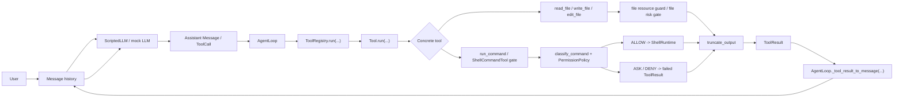

### 这张图表达的真实边界

- 当前真实闭环已经存在：`User -> Message history -> mock LLM -> ToolCall -> AgentLoop -> ToolRegistry -> Tool -> FileTool/ShellRuntime -> ToolResult -> tool Message -> LLM`
- 当前主链仍以 **mock LLM + 本地工具 + 文本 message history** 为中心，不包含真实模型 API、RAG、MCP、长期记忆或可观测平台
- Permission System 的风险分类和策略判断已接入 `ShellCommandTool` 与文件工具写盘前 gate，当前 `run_command`、覆盖写入和删除式编辑会在执行前拦截 `ASK` / `DENY`
- Permission audit 已有独立事件与 JSONL 写入 API，但尚未自动接入 shell/file gate
- `ToolRegistry` 是“工具事实源 + 执行入口”
- `ToolResult` 是“工具执行后的结构化结果信封”
- `truncate_output(...)` 是“工具输出进入 `ToolResult` 和 message history 前的最小截断边界”
- `ReadFileTool` 的文件资源检查是“文件内容进入文本读取前的最小拒绝边界”
- `AgentLoop._tool_result_to_message(...)` 是“内部结果到 LLM 可读观察”的序列化边界

### 与工业级项目相比的差异

- 真实工业级系统通常会把 LLM adapter、权限策略、上下文构建、审计日志、trace、checkpoint 和回滚纳入同一主链；当前项目只完成了 shell/file gate 的最小接入和独立 audit API，还没进入完整审批、审计自动接入和隔离执行
- 当前 message history 是纯内存 list，没有持久化会话、恢复点和长上下文压缩
- 工具执行仍在本机进行；shell/file gate 已能阻止 `ASK` / `DENY` 静默执行，但还没有隔离 runtime、审批恢复和审计自动链路
- 当前整体架构更像“教学型最小 Agent Harness”，不是“生产型 Agent Platform”

## 模块拆解

## 1. `Message / ToolCall / ScriptedLLM`

### 模块职责

- `Message`：统一保存 `role`、`content`、`name` 和 `tool_calls`
- `ToolCall`：表达 LLM 发出的结构化调用意图
- `ScriptedLLM`：在测试和早期示例中提供确定性 `complete(messages)` 行为

### 高层流程图

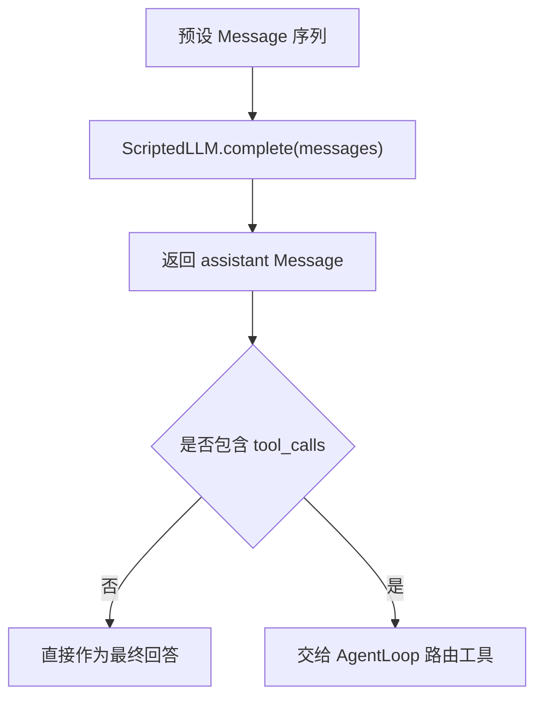

### 细节图

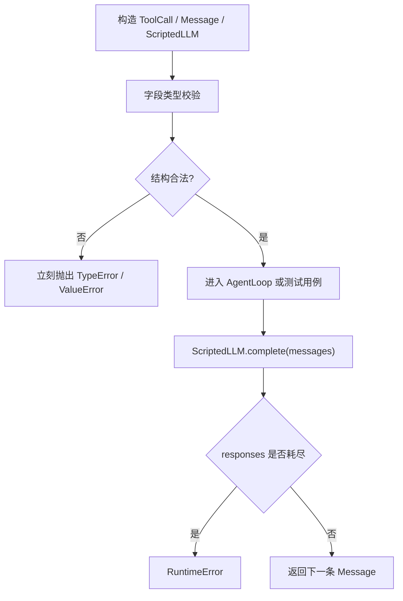

### 与工业级项目相比的差异

- 当前 `ScriptedLLM` 只是测试替身，没有真实模型供应商适配、重试、速率限制和成本统计
- `ToolCall` 只包含 `name + arguments`，没有 tool call id、模型原始响应、token 使用或供应商特有字段
- `Message` 是轻量 dataclass，没有统一 schema 版本和持久化协议
- 当前校验重点是“坏输入尽早失败”，不是“跨厂商消息协议兼容”

## 2. `AgentLoop`

### 模块职责

- 维护 `message history`
- 调用 `llm.complete(messages)`
- 处理 assistant 返回的 `tool_calls`
- 将工具结果写回 `role="tool"` 的消息
- 在 `max_turns` 内循环直到拿到最终回答

### 高层流程图

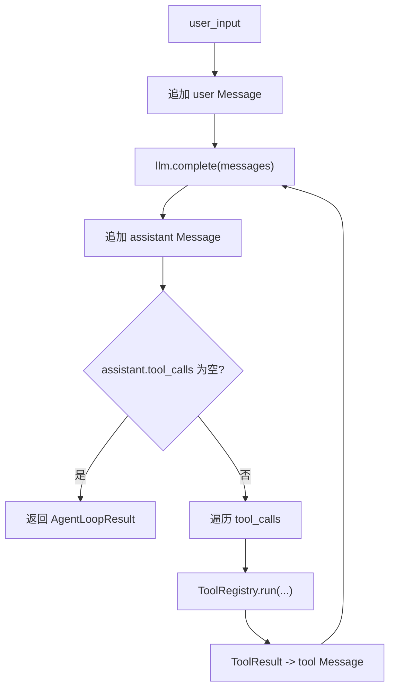

### 细节图

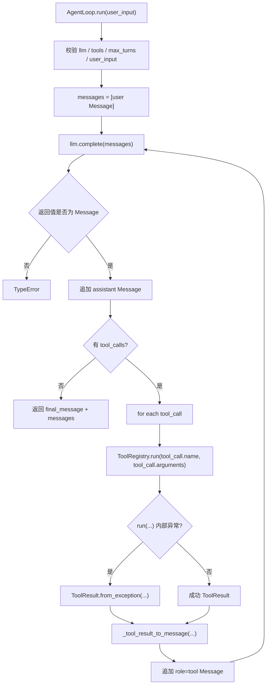

### 与工业级项目相比的差异

- 当前循环模型极简，没有 planning、todo、并发工具、观察压缩和中断恢复
- `max_turns` 只是最小兜底，没有基于成本、时间、权限或状态机的停止条件
- 工具异常虽然已回写，但没有错误分级、恢复策略矩阵和用户审批插入点
- 当前 `AgentLoopResult` 只返回最终消息和轨迹，没有 trace、统计和可回放元数据

## 3. `Tool / ToolParameter / ToolRegistry`

### 模块职责

- `ToolParameter`：定义参数名、JSON 类型、描述和 required
- `Tool`：包装工具元数据和统一执行入口
- `ToolRegistry`：负责注册、查找、执行、导出 schema 和查询调用统计

### 高层流程图

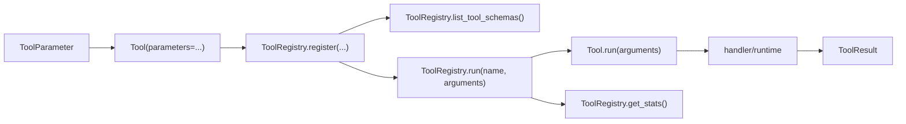

### 细节图

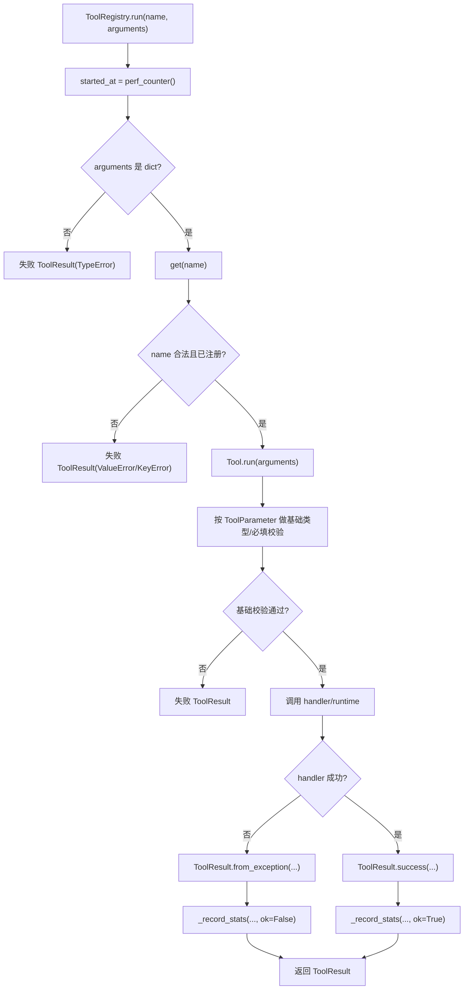

### 与工业级项目相比的差异

- 当前 schema 仍是接近 JSON Schema 的轻量实现，不是完整规范实现
- `ToolRegistry` 已有最小 stats 和输出截断边界，但还没有权限标签、危险级别、幂等性标记、审计钩子和供应商工具定义映射
- `ToolResult` 虽已统一返回，并支持 `trace_id`、`tool_call_id` 和 `output_truncated`，但 registry 还没有自动生成 trace id、工具调用 id、参数摘要脱敏等元数据
- 当前工具层重点是“最小结构契约 + 统一入口”，还不是“完整工具平台”

## 4. `read_file / write_file / edit_file`

### 模块职责

- `read_file`：读取 `workspace_root` 内文本文件
- `write_file`：写入或覆盖 `workspace_root` 内文本文件
- `edit_file`：对已有文本文件做一次精确局部替换

### 高层流程图

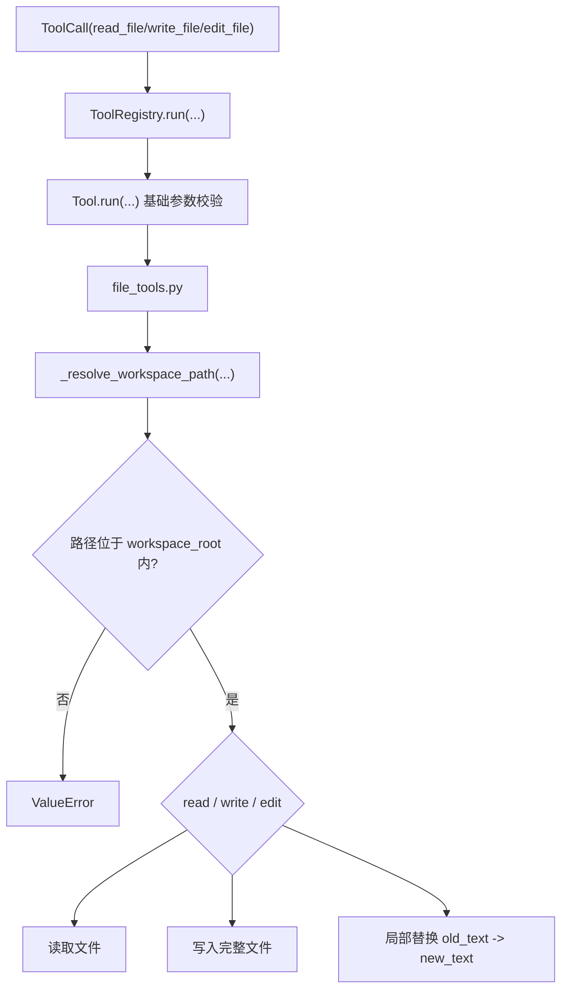

### 细节图

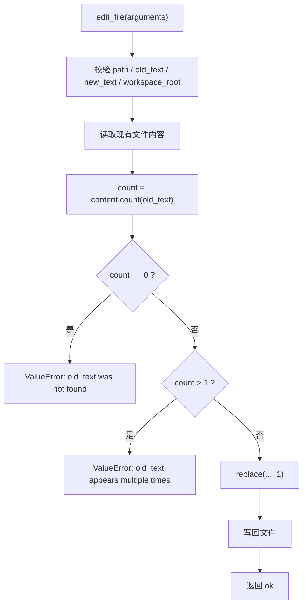

### 与工业级项目相比的差异

- `read_file` 只支持小型文本文件，读取前会拒绝超过 1MiB 的文件和含 NUL 字节的明显二进制文件
- 当前仍不处理完整编码探测、大文件分块、图片/压缩包等二进制资源和文件锁冲突治理
- `edit_file` 只支持精确单次替换，不支持 patch/diff、冲突合并、预览和撤销
- 文件变更已有最小写盘前风险 gate，覆盖写入和删除式编辑不会静默执行；仍没有审批恢复、审计自动接入、快照和自动 diff 展示
- `workspace_root` 已经建立基本边界，但还没有“不同目录不同权限”的精细策略

## 5. `run_command / ShellRuntime`

### 模块职责

- `ShellCommandTool`：暴露 `run_command` 工具名、schema 和描述
- `ShellRuntime`：负责实际执行命令、合并 env、限制工作目录和 timeout、收集输出

### 高层流程图

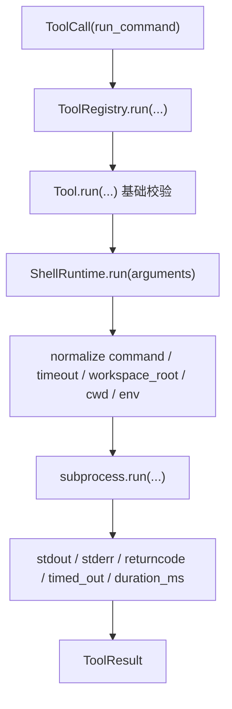

### 细节图

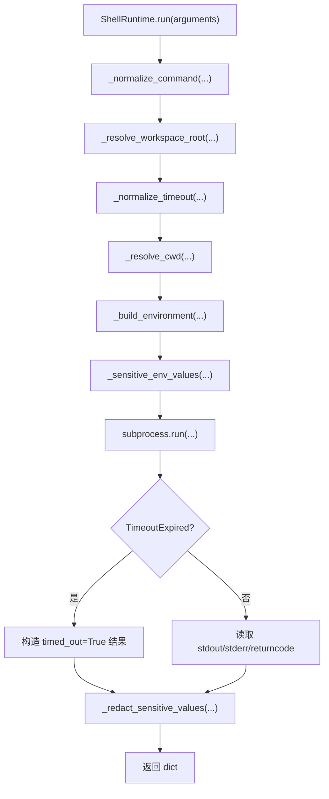

### 与工业级项目相比的差异

- 仍在宿主机同步执行命令，没有隔离沙箱、容器 runtime 和资源限制
- 已有最小危险命令分类和 shell gate；仍没有交互式审批恢复、命令 allowlist/denylist、audit 自动接入和进程树治理
- 输出脱敏只覆盖显式 `env` 中一部分敏感 key，不是完整 secret 防泄漏系统
- 通过 `ToolRegistry` 进入 `ToolResult` 时 stdout/stderr 会被截断，但底层 `ShellRuntime` 仍返回 raw 输出；当前还没有命令审计、trace、结构化日志和执行策略

## 6. `ToolResult -> tool Message` 序列化边界

### 模块职责

- `ToolResult`：在程序内部统一表达成功、失败、错误类型、错误消息和耗时
- `AgentLoop._tool_result_to_message(...)`：把内部结构化结果变成 LLM 可继续消费的 `role="tool"` 观察消息

### 高层流程图

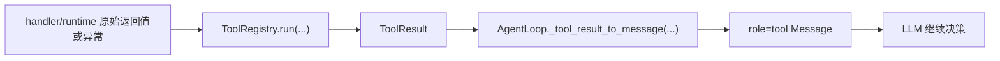

### 细节图

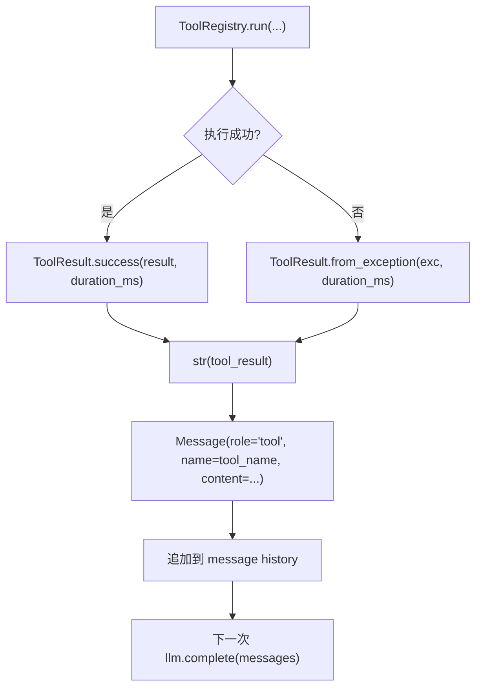

### 与工业级项目相比的差异

- 当前序列化目标仍是纯文本 `Message.content`，没有 JSON tool payload 和供应商专用适配
- `ToolResult` 已支持 trace id、工具调用 id 和输出截断信息，但缺少权限决策结果、参数摘要和结构化序列化协议
- 当前边界已经清楚，但还没有接入 observability、审计和回放体系
- 这一步解决了“内部结构化结果如何回到 LLM 轨迹”，但还没有解决“结果如何进入生产级监控平台”

## 已存在但当前仍是占位/计划模块

### 1. 部分实现但未接入主链

| 目录 | 当前状态 | 证据 | 计划周次 |
| --- | --- | --- | --- |
| `src/pca/permissions` | 部分实现并已接入 shell/file gate | `risk.py` 已实现 `RiskLevel`、`RiskAssessment`、`classify_command(...)`；`policy.py` 已实现 `DecisionAction`、`PermissionDecision`、`PermissionPolicy.decide(...)`；`approval.py` 已实现审批对象；`file_risk.py` 已实现文件风险分类；`audit.py` 已实现最小审计事件和 JSONL 写入；`ShellCommandTool` 与文件工具已在执行前调用分类和策略；交互式审批恢复和 audit 自动接入仍未实现 | Week 4 |

### 2. 目录现状

| 目录 | 当前状态 | 证据 | 计划周次 |
| --- | --- | --- | --- |
| `src/pca/context` | 占位 | `repo_map.py`、`retriever.py` 等文件当前只写明“计划在第 5/6 周实现” | Week 5 / Week 6 |
| `src/pca/mcp` | 占位 | `server.py`、`client.py` 当前是占位说明 | Week 8 |
| `src/pca/memory` | 占位 | `base.py` 等当前是占位说明 | Week 9 |
| `src/pca/observability` | 占位 | `logger.py`、`tracing.py` 当前是占位说明 | Week 11 |

### 3. 为什么不画进当前主链

- 这些目录已经存在，但还没有在当前测试主链、README 主链和实现日志中形成真实闭环
- `permissions/risk.py` 和 `permissions/policy.py` 已经挂到 `ShellCommandTool` 与文件工具写盘前 gate，但 `ApprovalRequest` / `ApprovalDecision` 还没有接入交互式审批恢复，audit 也尚未自动接入主链
- 如果把权限系统画成完整审批和审计链路，会把“计划结构”误说成“已实现结构”
- 当前更准确的表达方式是：
  - 主链可以画已完成的 `core + tools + ShellCommandTool gate + runtime`
  - `permissions/risk.py`、`permissions/policy.py` 和 `permissions/file_risk.py` 可以画成 shell/file 执行前 gate
  - `approval.py` 只能画成已实现对象，不能画成已接入交互式审批流程
  - `audit.py` 只能画成已实现独立事件和 JSONL 写入，不能画成已自动记录所有工具调用
  - 未来目录在附录中标记为“占位/计划中”

## 当前阶段总结

### 1. 当前项目处于什么阶段

当前项目处于：

- 12 周路线里的**第 2 周 Tool System 已收口**
- 第 3 周 Agent Core + Tool Runtime 工业级加固已完成
- Week 4 Day 6 Permission System 审计事件代码已完成，等待面试题回答和归档
- 当前代码本质上是一个**教学型、可验证、边界逐步清晰的最小 Personal Coding Assistant Harness**

### 2. 当前已经具备的稳定骨架

- 标准 `Message` / `ToolCall`
- 确定性 mock LLM：`ScriptedLLM`
- 最小 `AgentLoop`
- `Tool` / `ToolParameter` / `ToolRegistry`
- `ToolRegistry.get_stats()` 和最小工具调用统计
- `truncate_output(...)` 和 `ToolRegistry` 输出截断边界
- 带文件大小上限和明显二进制拒绝的 `read_file`
- `write_file` / `edit_file`
- `run_command` / `ShellRuntime`
- `RiskLevel` / `RiskAssessment` / `classify_command(...)`
- `DecisionAction` / `PermissionDecision` / `PermissionPolicy.decide(...)`
- `ApprovalRequest` / `ApprovalDecision`
- `ShellCommandTool` 执行前 shell gate
- `WriteFileTool` / `EditFileTool` 写盘前文件风险 gate
- `PermissionAuditEvent` / `append_audit_event(...)`
- `ToolResult`
- `AgentLoop._tool_result_to_message(...)`
- `workspace_root`、timeout、路径校验和部分敏感输出脱敏

### 3. 与工业级项目相比还差什么

核心缺口仍集中在以下方向：

- 真实 LLM adapter 与供应商协议适配
- Permission System：交互式审批流、audit 自动接入、审批通过后恢复执行
- sandbox / docker runtime / checkpoint / rollback
- 上下文工程、上下文压缩、RAG
- MCP client/server
- 长期记忆系统
- observability：trace、审计日志、replay、评估
- 更完整的工具 schema、结果元数据和生产级错误分类

### 4. 一句话结论

当前项目已经把“怎么调用工具”这条主链讲清楚、写出来、测出来了，并已把 Permission System 的风险分类和策略判断接入 shell/file gate，同时具备最小审计事件和 JSONL 写入；但距离“工业级 Agent 能不能安全执行、可审计执行、可恢复执行、可扩展执行”还差交互式审批、audit 自动接入、sandbox/checkpoint/rollback、Context、Memory 和 Observability 体系。
