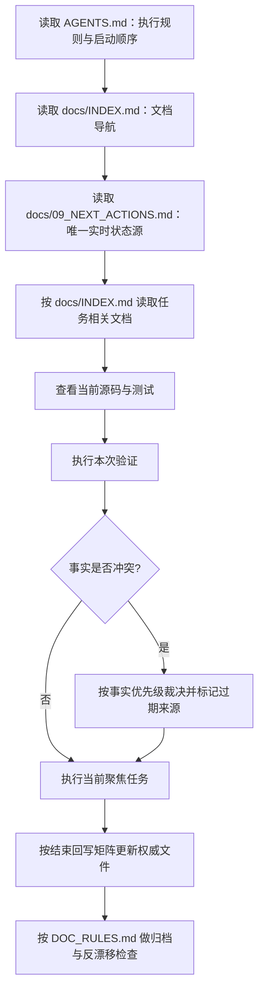

# Memory System

本文件只定义项目事实如何恢复、冲突如何解决、会话结束时写回哪里；它不保存实时状态。当前状态、测试基线、阻塞项、当前能力边界摘要和下一步只维护在 `docs/09_NEXT_ACTIONS.md`，该文件是唯一实时状态源。具体写入、归档和反漂移规则统一见 [`DOC_RULES.md`](../DOC_RULES.md)。

## 三套记忆

| 层级 | 当前载体 | 用途 | 当前状态 |
|---|---|---|---|
| 项目协作记忆 | `AGENTS.md`、`docs/09_NEXT_ACTIONS.md`、Daily/Sprint、Log/ADR/archive | 从仓库恢复规则、当前状态与可追溯证据 | 已使用；仓库内事实源 |
| Codex 外部记忆 | `C:\Users\南汉卿\.codex\memories\...` | 保存跨会话偏好、历史经验和 rollout 摘要 | 只读参考；不能替代仓库事实 |
| 产品运行时记忆 | `src/pca/memory/` | 未来让产品中的 Agent 保存用户偏好、任务状态与项目知识 | 占位；未接入主链 |

三者不能互相冒充：项目协作记忆服务于“开发这个仓库”，产品运行时记忆服务于“未来产品运行”，Codex 外部记忆只提供检索线索。

## 事实从哪里恢复

先遵循 `AGENTS.md` 规定的启动读取顺序，再按 `docs/INDEX.md` 选择任务相关材料。恢复事实时使用以下优先级，越靠前越权威：

1. **当前源码与本次验证**：回答“代码现在实际做什么、这次命令实际得到什么”。
2. **`docs/09_NEXT_ACTIONS.md`**：唯一实时状态源，回答“当前阶段、阻塞项、当前能力边界摘要、课程门禁和下一步是什么”。
3. **Daily / Sprint**：`docs/02_DAILY_TASKS.md` 与 `docs/03_WEEKLY_SPRINTS.md` 回答“当前任务如何拆解、当前阶段目标是什么”。
4. **Log / ADR / archive**：实现日志、架构决策和归档回答“过去做过什么、为什么这样设计、当时有哪些证据”。
5. **Codex 外部记忆**：只用于找偏好、失败模式和历史线索；所有易漂移事实都必须回到仓库或重新验证。

这里的优先级不表示低层文件没有价值，而是规定冲突时谁能覆盖谁。当前源码与本次验证可以纠正文档中的过期实现描述；课程实时位置仍只写回 `docs/09_NEXT_ACTIONS.md`，不能改由源码或历史日志承载。

### 实时摘要与详细证据边界

| 问题 | 读取位置 | 冲突处理 |
|---|---|---|
| 现在能做什么、课程是否可推进 | `docs/09_NEXT_ACTIONS.md` 的当前能力边界摘要与课程门禁 | 若与实现证据冲突，先以当前源码与本次验证裁决，再修正摘要；不得仅凭历史文档推进课程 |
| 模块为什么算已实现、调用链如何工作 | `docs/12_IMPLEMENTED_ARCHITECTURE_AND_INDUSTRIAL_GAPS.md`、`docs/18_IMPLEMENTED_MODULE_FLOWS.md` 的详细源码与测试证据 | 若两份详细文档互相冲突，以当前源码与本次验证为准，并把过期描述留在历史记录或修正到对应权威文件 |

`docs/09_NEXT_ACTIONS.md` 不展开复制模块证据图；`docs/12`、`docs/18` 不保存实时测试数字、课程位置或下一步。

## 会话恢复流程

- 本图不复制启动文件清单；准确顺序始终以 `AGENTS.md` 为准。
- 读取历史材料只用于补充上下文，不得据此自动改变当前 Week/Day。
- 若本次没有改变某类事实，不为了“同步”而重复写入其他文件。

## 冲突如何解决

| 冲突场景 | 正确裁决 | 原因 |
|---|---|---|
| Codex 外部记忆保存了旧测试结果，本次验证得到不同结果 | 采用本次验证；把新证据写入对应日志，必要时更新 `docs/09_NEXT_ACTIONS.md` | 外部记忆是历史线索，不能覆盖当前验证 |
| README 与 `docs/09_NEXT_ACTIONS.md` 的当前状态不一致 | 采用 `docs/09_NEXT_ACTIONS.md`；从 README 删除或改为链接 | README 是项目介绍，不是实时状态源 |
| 历史 rollout 写着另一个 Week/Day | 仅视为历史记录；不能据此推进当前课程 | rollout 不具备课程推进权，实时位置只来自 `docs/09_NEXT_ACTIONS.md` |
| Daily/Sprint 与当前源码能力描述不一致 | 用源码与本次验证确认能力事实，再分别修正任务描述和实时状态 | 计划不能覆盖已验证的实现事实 |
| 审计快照与之后的源码不一致 | 保留审计文件作为日期化证据，并以当前源码与本次验证回答“现在如何” | 日期化审计不是实时状态源 |

无法从更高优先级证据确定真相时，不猜测、不推进课程：在 `docs/09_NEXT_ACTIONS.md` 记录阻塞或待验证项，并明确需要的验证。

## 结束回写矩阵

| 事实类型 | 权威文件 | 更新时机 | 禁止复制位置 |
|---|---|---|---|
| 当前阶段、阻塞项、测试基线、能力边界摘要、课程门禁、下一步 | `docs/09_NEXT_ACTIONS.md` | 状态变化或会话收口时 | README、ARCHITECTURE、Roadmap、Context、`docs/15_MEMORY_SYSTEM.md` |
| 当前活跃日任务、复盘问题、待回答面试题 | `docs/02_DAILY_TASKS.md` | 任务拆分或门禁变化时 | Sprint 总表、实现日志、已回答题归档 |
| Sprint 阶段目标与日程 | `docs/03_WEEKLY_SPRINTS.md` | Sprint 计划或完成状态变化时 | README、Memory System |
| 已完成工作与验证证据 | `docs/07_IMPLEMENTATION_LOG.md` | 完成实现、文档或验证后 | Next Actions 的展开正文、README |
| 长期架构取舍 | `docs/06_ARCHITECTURE_DECISIONS.md` | 出现影响长期边界的决策时 | Daily Tasks、README 的详细模块图 |
| 当前模块学习结论 | `docs/05_LEARNING_NOTES.md` | 概念边界或学习结论形成时 | README、Next Actions |
| 已回答面试题 | `docs/Compilation-of-Interview-Questions.md` | 用户回答、评审并确认归档后 | 未回答题区域、Next Actions 的答案正文 |
| 已实现模块流程与工程作用 | `docs/18_IMPLEMENTED_MODULE_FLOWS.md` | 源码和测试证据支持流程变化时；接线不完整必须标“部分实现”或“未接入主链” | README、ARCHITECTURE 的详细模块图；纯占位模块的实现链路 |
| 日期化代码完成度审计 | `docs/19_CODE_COMPLETION_AUDIT_YYYY-MM-DD.md` | 完成一次带日期的审计时 | 实时状态文件、无日期的滚动审计文件 |

归档阈值、具体写入格式和反漂移命令不在本文件重复，统一执行 [`DOC_RULES.md`](../DOC_RULES.md)。

## 产品运行时 memory 占位边界

`src/pca/memory/` 未来只负责产品能力，不负责项目文档路由。当前文件均为占位或规划模块：

| 文件 | 目标职责 | 当前边界 |
|---|---|---|
| `src/pca/memory/base.py` | 定义记忆接口和数据模型 | 占位，未接入主链 |
| `src/pca/memory/sqlite_memory.py` | 本地结构化持久化 | 占位，未接入主链 |
| `src/pca/memory/task_memory.py` | 任务状态和执行历史 | 占位，未接入主链 |
| `src/pca/memory/vector_memory.py` | 向量检索记忆 | 占位，未接入主链 |
| `src/pca/memory/graph_memory.py` | 图谱/关系记忆 | 占位，未接入主链 |

未来实现前必须先补齐接口契约、数据模型、存储边界、测试策略、隐私与清理规则，以及与 Agent Loop 的接入点；在源码、接线和测试证据齐备前，不得把这些占位文件描述为已实现模块。
