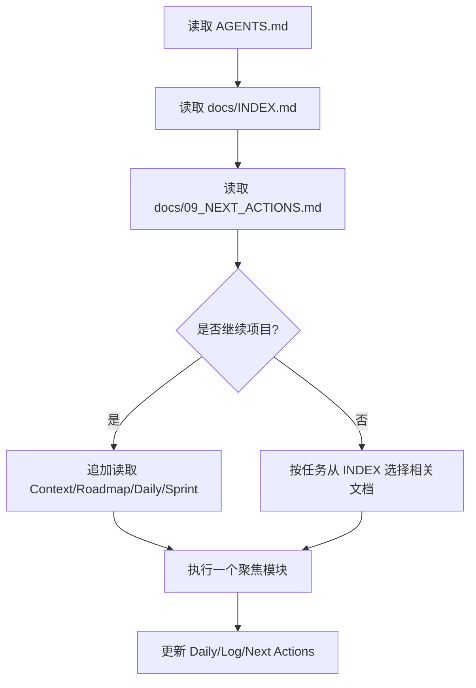

# Memory System

本文件定义本项目的记忆系统边界。它不保存实时状态；实时状态、阻塞项、测试基线和下一步只维护在 `docs/09_NEXT_ACTIONS.md`。

## 目标

- 让每次会话能从少量入口恢复上下文。
- 把当前状态、任务、历史、决策、学习笔记分层保存，避免同一事实复制到多个文件。
- 明确 `src/pca/memory/` 当前是长期记忆模块占位，不能宣传为已接入主链。
- 为后续 Week 15-18 的 Personal Assistant Memory 实现提供设计边界。

## 两套记忆

| 层级 | 当前载体 | 用途 | 当前状态 |
|---|---|---|---|
| 项目协作记忆 | `AGENTS.md`、`docs/09_NEXT_ACTIONS.md`、`docs/02_DAILY_TASKS.md`、`docs/07_IMPLEMENTATION_LOG.md` | 帮 AI 和用户恢复项目上下文 | 已使用 |
| 产品运行时记忆 | `src/pca/memory/` | 未来让 Agent 记住用户偏好、任务状态、项目知识和学习进度 | 占位，未接入主链 |

## 项目协作记忆分层

| 信息类型 | 权威位置 | 更新时机 | 不应重复到 |
|---|---|---|---|
| 实时状态、阻塞项、下一步 | `docs/09_NEXT_ACTIONS.md` | 每次会话结束或状态变化 | README、Roadmap、Context |
| 活跃日任务和待回答面试题 | `docs/02_DAILY_TASKS.md` | 当日任务变化、面试题生成 | 实现日志、路线总表 |
| 实现记录和验证证据 | `docs/07_IMPLEMENTATION_LOG.md` | 完成一次代码/文档/验证工作 | Next Actions |
| 架构取舍 | `docs/06_ARCHITECTURE_DECISIONS.md` | 出现长期影响的设计决策 | Daily Tasks |
| 当前模块学习笔记 | `docs/05_LEARNING_NOTES.md` | 当前模块学习或概念边界变化 | README |
| 已回答面试题 | `docs/Compilation-of-Interview-Questions.md` | 用户回答后 | Next Actions |

## 会话恢复流程

## 产品运行时记忆边界

`src/pca/memory/` 未来只负责产品能力，不负责当前项目文档路由。当前文件均为占位或规划模块：

| 文件 | 目标职责 | 当前边界 |
|---|---|---|
| `src/pca/memory/base.py` | 定义记忆接口和数据模型 | 占位 |
| `src/pca/memory/sqlite_memory.py` | 本地结构化持久化 | 占位 |
| `src/pca/memory/task_memory.py` | 任务状态和执行历史 | 占位 |
| `src/pca/memory/vector_memory.py` | 向量检索记忆 | 占位 |
| `src/pca/memory/graph_memory.py` | 图谱/关系记忆 | 占位 |

未来实现前必须先补齐：接口契约、数据模型、存储边界、测试策略、隐私/清理规则、与 Agent Loop 的接入点。

## 反漂移规则

- 不在 README、Roadmap、Context 中复制测试数字、当前阻塞项或完整能力清单。
- 不把 `src/pca/memory/` 写成已实现能力，除非有源码、测试和主链接入证据。
- 未回答面试题只放在 `docs/09_NEXT_ACTIONS.md` 和 `docs/02_DAILY_TASKS.md`。
- 历史内容超过活跃文档上限时，移入 `docs/archive/`，不要继续扩写活跃文件。
