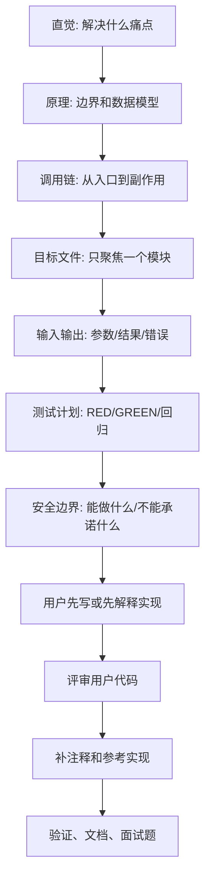

# Teaching Workflow

本文件定义本项目的教学协作流程。它不保存实时状态；当前周次、阻塞项和下一步只看 `docs/09_NEXT_ACTIONS.md`。

## 教学目标

用户目标不是复制代码，而是能独立实现并讲清楚工业级 Personal Coding Assistant Agent。因此每个教学单元都要同时回答：

- 这个模块解决什么真实问题？
- 它在当前架构哪一层？
- 输入、输出、副作用和安全边界是什么？
- 怎么用测试证明它真的工作？
- 面试时如何解释它和工业级系统的差距？

## 标准教学顺序



## 开始一次教学任务

1. 读取 `AGENTS.md`、`docs/INDEX.md`、`docs/09_NEXT_ACTIONS.md`。
2. 如果是继续项目，再读取 `docs/00_PROJECT_CONTEXT.md`、`docs/01_LEARNING_ROADMAP.md`、`docs/02_DAILY_TASKS.md`、`docs/03_WEEKLY_SPRINTS.md`。
3. 从 `docs/INDEX.md` 选择本次模块需要的少量补充文档，不一次性读取所有文档。
4. 先说明调用链、目标文件、输入输出、计划测试、验收标准和安全边界。
5. 如果用户要练习，先让用户写代码；如果用户要求直接推进，再按 TDD/验证流程实现。

## 用户先写代码时

- 先评审：指出 bug、边界遗漏、测试缺口和职责混乱。
- 再补注释：新解释性注释默认中文，外部 API 名称和错误字符串保持英文。
- 再给参考实现：只覆盖当前模块，不顺手实现未来周能力。
- 最后对比：说明用户版本和参考版本的差异，以及哪些差异属于工业级边界。

## 每日收口门禁

一天不能只靠代码绿色收口。必须同时检查：

- 代码或文档任务是否真的完成。
- 聚焦测试、必要示例、全量测试和编译验证是否有记录。
- `docs/02_DAILY_TASKS.md`、`docs/07_IMPLEMENTATION_LOG.md`、`docs/09_NEXT_ACTIONS.md` 是否同步。
- 面试题是否已经推送给用户。
- 只有用户回答后，才能写入 `docs/Compilation-of-Interview-Questions.md`。

## 加固周教学边界

加固周不新增大模块。教学重点从“实现新能力”切换为：

- 现状评估：按 9 个工业级维度列差距。
- 优先级排序：P0 安全性、健壮性、可观测性优先。
- 证据驱动：每个加固项都要有测试、示例、日志或报告证明。
- 真实验证：不能只说“更安全”，要用小型真实场景证明边界。

## 讲解模板

每次讲解优先使用这个结构：

```text
1. 直觉
2. 原理
3. 当前源码位置
4. 调用链
5. 输入输出
6. 测试和验收
7. 安全边界
8. 你需要先做什么
```

## 禁止事项

- 不把未来计划说成当前能力。
- 不跳过面试题归档门禁。
- 不在背景文档中复制当前测试数字或阻塞项。
- 不为了“看起来完整”扩展当天范围。
- 不把 `src/pca/memory/`、`context`、`mcp`、`observability` 占位目录说成已接入主链。
