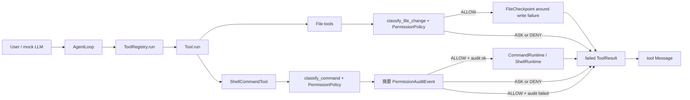

# Week 6 Tool Runtime 加固报告

## 文档范围

日期：2026-07-09
阶段：Week 6 Day 1
主题：Tool Runtime 加固周现状评估

本报告只评估 Week 4-5 已实现的 permission、workspace、checkpoint、runtime 和 rollback，不新增功能代码，不把未来计划写成当前能力。

## 当前调用链

## 基线验证

| 项目 | 命令 | 结果 |
|---|---|---|
| 全量测试 | `E:\python\Scripts\pytest.exe -q` | `168 passed, 1 skipped` |
| 示例 1 | `python examples\01_minimal_agent.py` | 通过 |
| 示例 2 | `python examples\02_tool_agent.py` | 通过，输出工具 schema |
| 示例 3 | `python examples\03_observed_tool_run.py` | 通过，展示读取、二进制拒绝和 stats |
| 示例 4 | `python examples\04_permission_agent.py` | 通过，展示 allow / ask / deny 与能力边界 |
| 示例 5 | `python examples\05_checkpoint_rollback.py` | 通过，`restored=true` |
| 编译验证 | `python -m compileall src examples -q` | 通过，无输出 |

## 9 维现状评估

| 维度 | 当前状态 | 证据 | 主要差距 | 优先级 |
|---|---|---|---|---|
| D1 可观测性 | 部分达标 | `ToolResult` 有 `trace_id` / `tool_call_id` 字段；shell/file gate 自动写摘要 audit | `AgentLoop` 尚未自动创建 trace；没有结构化日志、trace 查询或远程 audit 后端 | P0 |
| D2 健壮性 | 部分达标 | 参数校验、timeout、Docker graceful fallback、文件写盘失败 rollback 已存在 | 缺统一错误码；无 retry policy；GitCheckpoint restore 半恢复语义不够细；shell/Docker/Git rollback 未接主链 | P0 |
| D3 安全性 | 部分达标 | shell/file permission gate、allow fail-closed audit、敏感 env 输出脱敏、安全回归矩阵已存在 | `ASK` 不能审批后恢复；audit 无跨副作用原子事务；Docker 不是默认 sandbox；真实网络/删除和外部系统边界未验证 | P0 |
| D4 性能 | 未达标 | 文件读取有 1MiB 上限；工具输出有 4000 字符截断 | 无 benchmark / stress test；无 P99；无长时间运行内存观察 | P1 |
| D5 可测试性 | 部分达标 | 当前 `199 passed, 1 skipped`，新增 `tests/safety/` 覆盖 shell/file gate、workspace sentinel、audit 隐私和 secret redaction | 无覆盖率证据；真实小 repo e2e 仍缺；真实网络/删除副作用未执行验证 | P1 |
| D6 接口清晰性 | 部分达标 | `CommandRuntime` Protocol、工具 schema、示例能力边界已存在 | 错误信息没有统一错误码和建议操作；缺 API 文档目录；审批恢复接口未定 | P1 |
| D7 可扩展性 | 部分达标 | permission、runtime、tools 职责基本分层；runtime 可替换 | Workspace 尚未成为 shell/file 主链唯一事实源；audit/trace 扩展点未统一 | P2 |
| D8 代码质量 | 部分达标 | 关键类和复杂逻辑已有中文注释和“修改前旧代码”说明 | 还未做复杂度/重复度工具检查；部分公开函数 docstring 不完整 | P2 |
| D9 真实场景验证 | 未达标 | 示例可验证当前边界 | 尚未用真实小型 repo 执行安全修改任务；无真实验证报告 | P2 |

## P0 加固清单

1. 错误语义：定义 `ToolErrorCode` 或等价错误码，先覆盖 permission、runtime、checkpoint 和 rollback 失败。Day 2 已完成最小模型、focused tests 和面试题归档。
2. Audit 自动接入：Day 4 已完成 shell/file gate 摘要审计与 `ALLOW` fail-closed；不记录完整命令输出、文件内容或 secret。
3. Trace 透传：让 `AgentLoop -> ToolRegistry -> ToolResult` 至少共享一次 run 级 `trace_id`。
4. Safety regression matrix：新增安全回归用例，覆盖 destructive command、network command、inline code、outside workspace、overwrite、delete-like edit 和 secret redaction。

## Day 2 错误分类进展

- 新增 `ToolErrorCode`，并从 `pca.tools` 包入口导出。
- `ToolResult` 新增 `error_code` 字段；成功结果保持 `None`，失败结果使用稳定枚举。
- 当前映射覆盖参数错误、未知工具、permission denied、permission approval required、runtime failed、checkpoint failed 和 rollback failed。
- 旧 `error_type`、`error_message`、`ToolResult.__str__()` 和示例输出保持兼容。
- 本次不实现 retry、audit 自动接入、trace 透传或完整 sandbox。

## Day 3 Retry policy 进展

- 新增 `RetryDecision`、`RetryPolicy.decide(...)` 和 `should_retry(...)`。
- retry policy 基于 `ToolResult.error_code` 判断，不解析自然语言错误消息。
- `RUNTIME_FAILED` 只作为可重试候选，不自动重复执行工具。
- `INVALID_ARGUMENT`、`UNKNOWN_TOOL`、`PERMISSION_DENIED`、`PERMISSION_APPROVAL_REQUIRED`、`CHECKPOINT_FAILED` 和 `ROLLBACK_FAILED` 默认不可重试。
- 当前不实现 attempt loop、backoff、sleep、circuit breaker、audit 自动记录或危险副作用自动重试。
- 验证结果：`tests/test_retry_policy.py` 为 `6 passed`，全量测试为 `181 passed, 1 skipped`。

## Day 4 Audit 完整性进展

- 新增 `record_permission_decision(...)`，从策略决策生成固定字段的 JSONL 审计事件。
- shell、`write_file`、`edit_file` gate 都在副作用前自动审计；`ALLOW` 写入失败时不进入 runtime/checkpoint/写盘。
- `ASK`、`DENY` 记录 `executed=false`，继续保留原有 permission 错误且不执行。
- 默认 shell audit 写入进程工作目录 `.pca/permission-audit.jsonl`；显式 `audit_path` 支持测试隔离，`.pca/` 不纳入 Git。
- 测试覆盖 shell/file 的 allow / ask / deny、敏感 token 不入记录、audit 写入失败 fail-closed，以及原有 runtime workspace 边界。
- 验证结果：audit matrix `20 passed`，全量测试 `190 passed, 1 skipped`；Day 4 面试题已归档为第 40 天，当前进入 Day 5 Safety suite。

## Day 5 Safety suite 进展

- 新增 `tests/safety/`，覆盖 destructive command、network command、inline code、outside workspace、overwrite、delete-like edit 和 secret redaction。
- shell 拒绝场景使用 `RecordingRuntime`，通过 runtime 零调用证明 `ASK` / `DENY` 没有进入执行层；文件场景使用临时 sentinel 证明原文件没有变化。
- 安全测试只运行本地命令和临时文件，不访问真实网络，不执行真实删除命令；audit JSONL 和失败信息不包含 secret。
- 验证结果：`tests/safety` 为 `9 passed`，全量为 `199 passed, 1 skipped`；五个示例、compileall 和 diff check 均通过。
- 当前仍未覆盖：审批后恢复、完整 sandbox、shell/Docker/Git 自动 rollback、真实小 repo 安全修改任务；Day 5 面试题尚未回答和归档。

## P1 加固清单

1. 建立 retry/timeout 策略边界：Day 3 已完成最小 retry policy；timeout/backoff 执行循环仍未接入。
2. 建立 benchmark 入口：记录工具调用正常耗时、输出截断耗时和 checkpoint restore 耗时。
3. 补接口文档：把工具输入、输出、错误码和能力边界整理成最小 API 文档。

## P2 加固清单

1. 逐步把 `Workspace(root)` 迁移为 shell/file 主链唯一路径事实源。
2. 做代码质量工具检查，记录复杂度和重复度基线。
3. 构造真实小 repo 验证报告，记录成功、失败、边界和耗时。

## Day 1 结论

Week 4-5 当前不是完整工业级 Tool Runtime，但已经具备可继续加固的稳定骨架：执行前 permission gate、最小 runtime interface、Docker unavailable fallback、文件 checkpoint 和局部 rollback 都已通过测试。Week 6 后续应先修 P0：错误语义、audit 自动接入、trace 透传和 safety regression，再进入性能、接口和真实验证。

## Day 1 面试题

### 1. 概念理解

为什么 Week 6 Day 1 只做 9 维现状评估，而不是直接开始写 retry、audit 或 sandbox 代码？

### 2. 源码追查

请沿着 `run_command` 的执行路径说明：一次命令从 `ToolRegistry.run(...)` 到 `ShellRuntime.run(...)` 会经过哪些对象？`ASK` 和 `DENY` 为什么不会进入真实 shell？

### 3. 系统设计

如果要把 audit 自动接入 shell/file gate，你会把写 audit 的逻辑放在哪一层？请说明：

- 哪些字段必须记录？
- 哪些字段绝对不能记录？
- audit 写入失败时，工具调用应该继续、失败，还是降级？
- 你会如何写测试证明 allow / ask / deny 三种路径都被正确记录？
