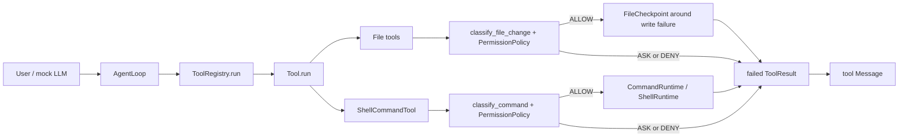

# Week 6 Tool Runtime 加固报告

## 文档范围

日期：2026-07-09
阶段：Week 6 Day 1
主题：Tool Runtime 加固周现状评估

本报告只评估 Week 4-5 已实现的 permission、workspace、checkpoint、runtime 和 rollback，不新增功能代码，不把未来计划写成当前能力。

## 当前调用链

## 基线验证

| 项目 | 命令 | 结果 |
|---|---|---|
| 全量测试 | `E:\python\Scripts\pytest.exe -q` | `168 passed, 1 skipped` |
| 示例 1 | `python examples\01_minimal_agent.py` | 通过 |
| 示例 2 | `python examples\02_tool_agent.py` | 通过，输出工具 schema |
| 示例 3 | `python examples\03_observed_tool_run.py` | 通过，展示读取、二进制拒绝和 stats |
| 示例 4 | `python examples\04_permission_agent.py` | 通过，展示 allow / ask / deny 与能力边界 |
| 示例 5 | `python examples\05_checkpoint_rollback.py` | 通过，`restored=true` |
| 编译验证 | `python -m compileall src examples -q` | 通过，无输出 |

## 9 维现状评估

| 维度 | 当前状态 | 证据 | 主要差距 | 优先级 |
|---|---|---|---|---|
| D1 可观测性 | 部分达标 | `ToolResult` 有 `trace_id` / `tool_call_id` 字段；`ToolRegistry.get_stats()` 有调用统计 | `AgentLoop` 尚未自动创建 trace；audit 未自动接入 shell/file gate；没有结构化日志和 trace 查询 | P0 |
| D2 健壮性 | 部分达标 | 参数校验、timeout、Docker graceful fallback、文件写盘失败 rollback 已存在 | 缺统一错误码；无 retry policy；GitCheckpoint restore 半恢复语义不够细；shell/Docker/Git rollback 未接主链 | P0 |
| D3 安全性 | 部分达标 | shell/file permission gate、风险分类、策略判断、敏感 env 输出脱敏已存在 | `ASK` 不能审批后恢复；audit 未自动记录；Docker 不是默认 sandbox；安全回归矩阵缺失 | P0 |
| D4 性能 | 未达标 | 文件读取有 1MiB 上限；工具输出有 4000 字符截断 | 无 benchmark / stress test；无 P99；无长时间运行内存观察 | P1 |
| D5 可测试性 | 部分达标 | 当前 `168 passed, 1 skipped`，覆盖 permission/runtime/checkpoint/rollback 单元与示例 | 缺 `tests/safety/`；无覆盖率证据；真实小 repo e2e 仍缺 | P1 |
| D6 接口清晰性 | 部分达标 | `CommandRuntime` Protocol、工具 schema、示例能力边界已存在 | 错误信息没有统一错误码和建议操作；缺 API 文档目录；审批恢复接口未定 | P1 |
| D7 可扩展性 | 部分达标 | permission、runtime、tools 职责基本分层；runtime 可替换 | Workspace 尚未成为 shell/file 主链唯一事实源；audit/trace 扩展点未统一 | P2 |
| D8 代码质量 | 部分达标 | 关键类和复杂逻辑已有中文注释和“修改前旧代码”说明 | 还未做复杂度/重复度工具检查；部分公开函数 docstring 不完整 | P2 |
| D9 真实场景验证 | 未达标 | 示例可验证当前边界 | 尚未用真实小型 repo 执行安全修改任务；无真实验证报告 | P2 |

## P0 加固清单

1. 错误语义：定义 `ToolErrorCode` 或等价错误码，先覆盖 permission、runtime、checkpoint 和 rollback 失败。
2. Audit 自动接入：shell/file gate 产生 `PermissionAuditEvent`，记录 allow / ask / deny、executed 和 matched_rule，但不记录完整命令输出、文件内容或 secret。
3. Trace 透传：让 `AgentLoop -> ToolRegistry -> ToolResult` 至少共享一次 run 级 `trace_id`。
4. Safety regression matrix：新增安全回归用例，覆盖 destructive command、network command、inline code、outside workspace、overwrite、delete-like edit 和 secret redaction。

## P1 加固清单

1. 建立 retry/timeout 策略边界：只对明确可重试的临时失败做 retry，不重试危险副作用。
2. 建立 benchmark 入口：记录工具调用正常耗时、输出截断耗时和 checkpoint restore 耗时。
3. 补接口文档：把工具输入、输出、错误码和能力边界整理成最小 API 文档。

## P2 加固清单

1. 逐步把 `Workspace(root)` 迁移为 shell/file 主链唯一路径事实源。
2. 做代码质量工具检查，记录复杂度和重复度基线。
3. 构造真实小 repo 验证报告，记录成功、失败、边界和耗时。

## Day 1 结论

Week 4-5 当前不是完整工业级 Tool Runtime，但已经具备可继续加固的稳定骨架：执行前 permission gate、最小 runtime interface、Docker unavailable fallback、文件 checkpoint 和局部 rollback 都已通过测试。Week 6 后续应先修 P0：错误语义、audit 自动接入、trace 透传和 safety regression，再进入性能、接口和真实验证。

## Day 1 面试题

### 1. 概念理解

为什么 Week 6 Day 1 只做 9 维现状评估，而不是直接开始写 retry、audit 或 sandbox 代码？

### 2. 源码追查

请沿着 `run_command` 的执行路径说明：一次命令从 `ToolRegistry.run(...)` 到 `ShellRuntime.run(...)` 会经过哪些对象？`ASK` 和 `DENY` 为什么不会进入真实 shell？

### 3. 系统设计

如果要把 audit 自动接入 shell/file gate，你会把写 audit 的逻辑放在哪一层？请说明：

- 哪些字段必须记录？
- 哪些字段绝对不能记录？
- audit 写入失败时，工具调用应该继续、失败，还是降级？
- 你会如何写测试证明 allow / ask / deny 三种路径都被正确记录？
