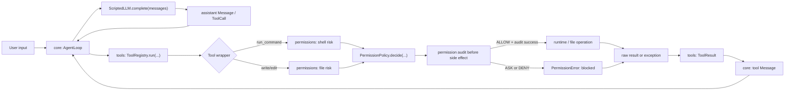
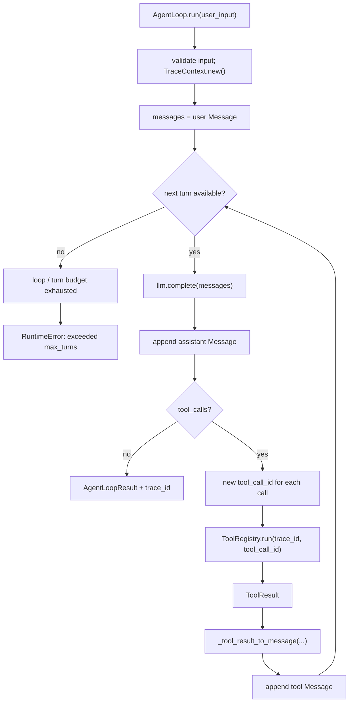
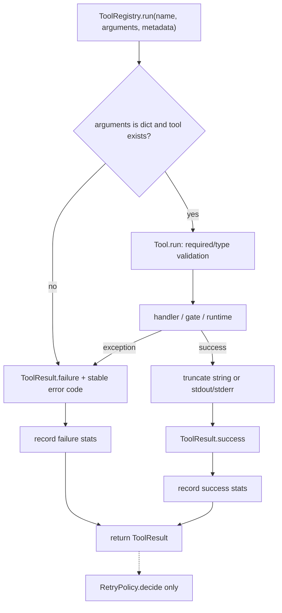
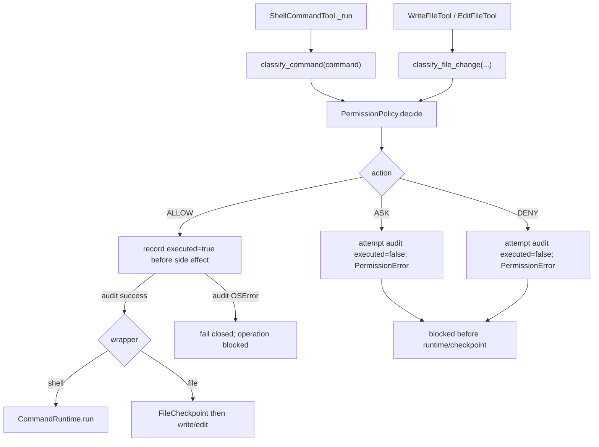
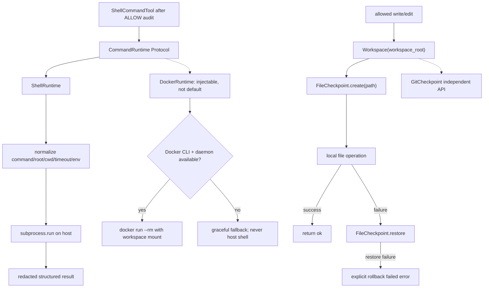
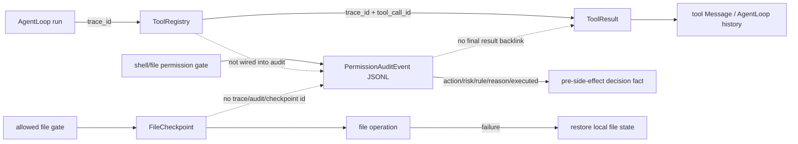

# 已实现模块流程与工程作用

> 本文只描述当前工作树中同时具有源码与测试证据的 `core`、`tools`、`permissions`、`runtime`。实时学习进度、阻塞项与下一步以 [`docs/09_NEXT_ACTIONS.md`](09_NEXT_ACTIONS.md) 为唯一权威源；本文不复制易漂移的测试数量，也不推进 Week 7 Day 1。

## 图例与阅读边界

- **已实现**：源码存在，且有直接单元测试或集成测试证据。
- **部分实现**：已有可运行对象或局部链路，但尚未接入完整产品主链，或仍缺关键工程能力。
- 实线表示当前调用或数据流；虚线表示已实现但尚未自动接入的关系。
- 所有“缺口”都表示当前工作树没有对应闭环，不代表未来设计承诺。

## 跨模块真实主链

这条主链的真实含义是：`AgentLoop` 负责循环与 trace 透传，`ToolRegistry` 负责统一执行结果，具体 shell/file wrapper 在副作用前完成风险判断、策略与摘要审计；允许的 shell 调用进入 `CommandRuntime`，允许的文件写入进入 checkpoint 包裹的本地写盘。任何成功值或异常最终都在 registry 边界成为 `ToolResult`，再以文本 `tool Message` 回到 core。

稳定错误边界：`ToolRegistry.run(...)` 遇到非法工具名时仍返回 `INVALID_ARGUMENT` 的 `ToolResult`，不可哈希或空白名称统一进入 `<invalid-tool-name>` 统计桶；合法未知名称返回 `UNKNOWN_TOOL`。Approval 数据对象在构造阶段严格区分字段类型、空白值、bool 与带时区时间。

## Core

**状态：已实现最小 Agent 循环；真实 LLM、事件持久化、trace 查询与 planner 未实现。**

### 项目作用与工程作用

- 项目作用：把用户输入、LLM 响应、工具调用和工具观察组织成可继续迭代的 message history。
- 工程作用：用 `LLM` Protocol 隔离模型依赖，以 `max_turns` 限制循环；为每次 `run(...)` 创建一个 `trace_id`，为每个工具调用创建独立 `tool_call_id`；把工具失败也写回轨迹，让 LLM 有恢复机会。

### 输入与输出

| 入口 | 输入 | 输出 |
| --- | --- | --- |
| `AgentLoop.run(...)` | 非空 `user_input: str` | `AgentLoopResult(final_message, messages, trace_id)` |
| `LLM.complete(...)` | `list[Message]` | 一条 `Message` |
| `_tool_result_to_message(...)` | `tool_name`、`ToolResult` | `role="tool"` 的文本 `Message` |
| `TraceContext.new()` | 无 | 非空 `trace_id` |

### 真实 AgentLoop / trace 流程

当前 trace 是 run 级关联字段，不是完整观测系统：`trace_id` 从 `AgentLoop` 传入 registry 并保存在 `ToolResult`，`tool_call_id` 区分同一 run 内的调用；`AgentEvent` 只是轻量数据模型，没有自动产生、持久化或查询链路。

### 源码与测试证据

- 源码：[`agent_loop.py`](../src/pca/core/agent_loop.py)、[`messages.py`](../src/pca/core/messages.py)、[`events.py`](../src/pca/core/events.py)、[`mock_llm.py`](../src/pca/core/mock_llm.py)
- 测试：[`test_agent_loop.py`](../tests/test_agent_loop.py)、[`test_events.py`](../tests/test_events.py)、[`test_loop_tools_integration.py`](../tests/test_loop_tools_integration.py)

### 当前缺口

- `ScriptedLLM` 是确定性测试替身，没有真实 LLM adapter、流式响应、供应商错误治理或 token/cost 控制。
- message history 仅在内存中；没有会话持久化、恢复、压缩或事件回放。
- 没有 planner、todo/state machine、并行工具调度或基于风险与成本的停止策略。
- `AgentEvent` 没有接入 `AgentLoop`；没有 trace 查询、跨进程传播、span、日志/指标导出。
- `ToolResult` 回到 LLM 时被转换成纯文本，结构化 trace/error 字段不会作为结构化 payload 暴露给模型。

## Tools

**状态：已实现 schema、registry、统一结果、稳定错误码、进程内统计与输出截断；RetryPolicy 仅独立给出判断。**

### 项目作用与工程作用

- 项目作用：把文件、shell 等具体能力统一包装为模型可发现、可调用的工具。
- 工程作用：`ToolParameter` 提供轻量 schema 与参数校验；`ToolRegistry` 是注册、查找、执行与统计入口；`ToolResult` 统一成功/失败信封；`ToolErrorCode` 稳定分类失败；registry 在结果边界截断长字符串及 shell `stdout`/`stderr`。

### 输入与输出

| 入口 | 输入 | 输出 |
| --- | --- | --- |
| `Tool.to_schema()` | 工具元数据与 `ToolParameter` | 轻量 JSON-schema 形状的字典 |
| `ToolRegistry.run(...)` | 工具名、参数字典、可选 trace metadata | `ToolResult` |
| `ToolRegistry.get_stats()` | 无 | 每工具 calls/successes/failures/total duration 快照 |
| `RetryPolicy.decide(...)` | `ToolResult` | `RetryDecision(retryable, reason)` |

### 工具执行流程

`RetryPolicy` **不会自动重新执行工具**。它只把 `RUNTIME_FAILED` 标为可重试候选，并把参数、未知工具、permission、checkpoint、rollback 等错误判为不可重试；当前 `AgentLoop` 和 `ToolRegistry` 都没有调用它形成自动 retry 循环。

### 源码与测试证据

- 源码：[`base.py`](../src/pca/tools/base.py)、[`registry.py`](../src/pca/tools/registry.py)、[`retry.py`](../src/pca/tools/retry.py)、[`file_tools.py`](../src/pca/tools/file_tools.py)、[`shell_tools.py`](../src/pca/tools/shell_tools.py)
- 测试：[`test_tools.py`](../tests/test_tools.py)、[`test_retry_policy.py`](../tests/test_retry_policy.py)、[`test_file_tools.py`](../tests/test_file_tools.py)、[`test_shell_runtime.py`](../tests/test_shell_runtime.py)、[`test_loop_tools_integration.py`](../tests/test_loop_tools_integration.py)

### 当前缺口

- schema 是轻量子集，没有嵌套约束、枚举、版本治理、permission/幂等性元数据或供应商映射。
- stats 仅为进程内累计快照，没有并发保护、持久化、分位数、时间窗口、导出与查询。
- 截断采用固定字符上限，没有 token 预算、head/tail 策略或原始输出安全存储。
- 错误码由异常类型和消息标记分类，尚无跨 runtime 的强类型错误协议。
- 没有自动 retry、退避、幂等键、重试预算或副作用去重。

## Permissions

**状态：shell/file gate 与摘要 JSONL 审计已接入；审批对象存在，但批准后恢复执行未接入。**

### 项目作用与工程作用

- 项目作用：在命令执行或文件写盘之前，把风险转成 `ALLOW`、`ASK`、`DENY`，防止危险副作用静默发生。
- 工程作用：分类与策略分层；shell/file wrapper 在副作用前统一 gate；审计只保存摘要事实，不保存完整命令参数、文件内容或工具输出。

### shell 与 file 两条 gate

两条 gate 的共同事实：

- `ALLOW` 必须先成功写入 `executed=true` 的摘要审计，之后才能进入执行路径；审计写入出现 `OSError` 时阻断 `ALLOW`，即 fail closed。
- `ASK` / `DENY` 在审计可写时记录 `executed=false`，随后抛出 `PermissionError`，不会进入 runtime 或创建文件 checkpoint。若其审计写入失败，wrapper 仍保留原 `ASK` / `DENY` 阻断语义。
- wrapper 抛出的 `PermissionError` 由 `ToolRegistry` 捕获，并分类为 `PERMISSION_APPROVAL_REQUIRED` 或 `PERMISSION_DENIED` 的失败 `ToolResult`；permission 层本身不构造最终 `ToolResult`。
- `ApprovalRequest` / `ApprovalDecision` 已能表达请求、过期时间和用户理由，但 gate 不消费审批结果，也没有“批准后从原调用恢复”的状态机。

### 输入与输出

| 入口 | 输入 | 输出 |
| --- | --- | --- |
| `classify_command(...)` | 字符串或字符串序列命令 | `RiskAssessment` |
| `classify_file_change(...)` | tool name、路径、可选 old/new text | `RiskAssessment` |
| `PermissionPolicy.decide(...)` | `RiskAssessment` | `PermissionDecision` |
| `record_permission_decision(...)` | tool name、decision、executed | 一行摘要 JSONL；无业务返回值 |
| gate wrapper | 工具参数 | ALLOW 时进入执行；ASK/DENY 时抛 `PermissionError` |

### 源码与测试证据

- 源码：[`risk.py`](../src/pca/permissions/risk.py)、[`file_risk.py`](../src/pca/permissions/file_risk.py)、[`policy.py`](../src/pca/permissions/policy.py)、[`audit.py`](../src/pca/permissions/audit.py)、[`approval.py`](../src/pca/permissions/approval.py)、[`shell_tools.py`](../src/pca/tools/shell_tools.py)、[`file_tools.py`](../src/pca/tools/file_tools.py)
- 测试：[`test_permissions_risk.py`](../tests/test_permissions_risk.py)、[`test_permissions_file_risk.py`](../tests/test_permissions_file_risk.py)、[`test_permissions_policy.py`](../tests/test_permissions_policy.py)、[`test_permissions_audit.py`](../tests/test_permissions_audit.py)、[`test_permissions_approval.py`](../tests/test_permissions_approval.py)、[`test_permissions_shell_gate.py`](../tests/test_permissions_shell_gate.py)、[`test_rollback_integration.py`](../tests/test_rollback_integration.py)、[`test_safe_edit_workflow.py`](../tests/e2e/test_safe_edit_workflow.py)

### 当前缺口

- 已知 `cmd` / `powershell` / `pwsh` wrapper（含 `.exe`、大小写和完整路径形式）统一返回 `ASK/shell_wrapper`，阻止默认 `SAFE` 后进入 runtime。
- 分类规则仍是最小启发式，不解析 wrapper 内部、嵌套、编码或动态构造的命令，也不是 shell AST、系统调用或语义级策略；file gate 只覆盖当前 `write_file` / `edit_file` 风险。
- 没有 approval UI、请求持久化、身份/权限主体、批准签名、过期后的统一处理或 approval resume。
- 审计事件没有 `trace_id`、`tool_call_id`、审批引用、checkpoint id 或最终 `ToolResult`；`executed=true` 表示允许进入执行路径，不等于执行最终成功。
- 审计追加不是与副作用绑定的原子事务，没有远程不可篡改后端、完整性校验、轮转、查询 API 或 trace/audit 联合检索。
- audit 与最终结果之间没有自动回填关系，因此不能仅靠一条 ALLOW 事件判断命令或文件操作是否成功。

## Runtime

**状态：本地 shell、可替换命令接口、Workspace、Docker graceful fallback、FileCheckpoint 与 GitCheckpoint 均有实现；自动恢复覆盖范围仍有限。**

### 项目作用与工程作用

- 项目作用：以授权工作区作为 `cwd` / 路径参数边界启动宿主机命令，并为本地文件变更提供路径边界与最小恢复能力。
- 工程作用：`CommandRuntime` 将工具层与具体执行器解耦；`ShellRuntime` 规范化命令/cwd/timeout/env 并采集结构化输出；`DockerRuntime` 在 Docker 不可用时返回稳定且不降级到宿主机的结果；checkpoint 保存并恢复局部状态。
- 边界说明：`ShellRuntime` 的 `workspace_root` / `cwd` 校验是进程启动前的参数边界，**不是**文件系统 sandbox 或系统调用 sandbox；命令启动后仍是宿主机进程。

### 输入与输出

| 组件 | 输入 | 输出 |
| --- | --- | --- |
| `Workspace(root)` | 已存在目录；相对或绝对路径 | 规范化 root、workspace 内解析路径或越界错误 |
| `CommandRuntime.run(...)` | 参数字典 | `stdout/stderr/returncode/timed_out` 等结构化字典 |
| `ShellRuntime.run(...)` | command、workspace_root、timeout，可选 cwd/env | 本机执行结果及 duration；敏感显式 env 值经输出脱敏 |
| `DockerRuntime.run(...)` | 同类命令参数 | sandbox 结果，或 `fallback="docker_unavailable"` 的稳定结果 |
| `FileCheckpoint` | `Workspace` 与显式文件路径 | bytes 快照；`restore()` 恢复/重建/删除被跟踪文件 |
| `GitCheckpoint` | git `Workspace` | tracked working-tree binary diff；`restore()` 回到该 dirty 状态 |

### Runtime 与 checkpoint 子流程

`Workspace` 当前由 `FileCheckpoint` 使用，但还不是 shell/file 两条路径解析的唯一事实源：`ShellRuntime` 和 file tools 仍保留各自的 `workspace_root` 解析。`DockerRuntime` 满足 `CommandRuntime`，但默认 `ShellCommandTool` 仍使用 `ShellRuntime`；Docker 的 graceful fallback 表示“明确不可用”，不是回退宿主机继续执行。

### 源码与测试证据

- 源码：[`workspace.py`](../src/pca/runtime/workspace.py)、[`interface.py`](../src/pca/runtime/interface.py)、[`shell_runtime.py`](../src/pca/runtime/shell_runtime.py)、[`docker_runtime.py`](../src/pca/runtime/docker_runtime.py)、[`checkpoints.py`](../src/pca/runtime/checkpoints.py)、[`file_tools.py`](../src/pca/tools/file_tools.py)
- 测试：[`test_workspace.py`](../tests/test_workspace.py)、[`test_runtime_interface.py`](../tests/test_runtime_interface.py)、[`test_shell_runtime.py`](../tests/test_shell_runtime.py)、[`test_docker_runtime.py`](../tests/test_docker_runtime.py)、[`test_checkpoints.py`](../tests/test_checkpoints.py)、[`test_git_checkpoints.py`](../tests/test_git_checkpoints.py)、[`test_rollback_integration.py`](../tests/test_rollback_integration.py)、[`test_safe_edit_workflow.py`](../tests/e2e/test_safe_edit_workflow.py)

### 当前缺口

- `ShellRuntime` 在宿主机同步执行，没有进程树治理、CPU/内存/磁盘配额、系统调用隔离或网络策略。
- `DockerRuntime` 不是默认执行器；当前 adapter 没有完整的镜像信任、资源限制、网络隔离、只读根文件系统或生命周期治理。
- 文件 rollback 只自动覆盖 `WriteFileTool` / `EditFileTool` 的单文件写盘失败；shell、Docker、Git、网络、包安装、后台进程和多文件事务未自动恢复。
- `GitCheckpoint` 只保存 tracked working tree 相对 index 的 diff，不覆盖 untracked、staged、commit 或远端状态。
- checkpoint 没有持久化 id、过期策略、审计关联、并发控制或崩溃后恢复。

## Trace、audit 与 checkpoint 的跨模块关系

三条机制目前各自解决不同问题：trace metadata 关联 Agent run 与工具结果；audit 记录副作用前的 permission 决策；checkpoint 尝试恢复允许执行后失败的局部文件状态。它们尚未共享统一事件模型或查询索引，因此不能把任意 `trace_id` 自动还原为“决策—执行—结果—回滚”的完整时间线。

## 明确不绘制实现流程的占位模块

以下目录/领域在当前工作树中仍是占位或未形成产品运行主链，因此本文**不为它们绘制已实现流程图**：

- `context`
- 产品运行时 `memory`（不要与协作文档记忆混淆）
- `mcp`
- 完整 `observability`
- `cli`

这些名称可以作为未来路线边界被提及，但在有对应源码、接线和测试证据前，不应被描述为当前产品能力。
