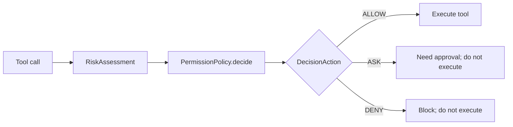
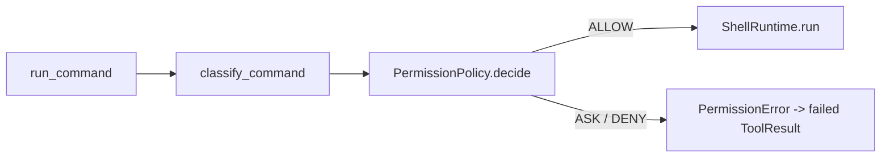

# Week 4 Permission System 学习笔记归档

Permission System 的核心是工具执行前控制：先判断风险，再由策略决定 `ALLOW / ASK / DENY`。它不同于 workspace 路径边界、输出截断、错误包装、密钥脱敏或 audit。

## Day 1：风险分类

`RiskLevel` 描述危险程度，`RiskAssessment` 保存 `level`、`reason` 和 `matched_rule`。`classify_command(...)` 当前支持 `str` 和 `list[str]`，规则顺序是先 `DENY`，再 `ASK`，最后默认 `SAFE`。

| 等级 | 含义 | 当前例子 |
|---|---|---|
| `SAFE` | 默认可直接执行的低风险操作 | `git status`、`pytest -q` |
| `ASK` | 需要用户确认 | `curl`、`python -c`、管道/重定向 |
| `DENY` | 默认直接拒绝 | `rm -rf`、`del /s /q`、`format` |

## Day 2：策略判断

风险分类只回答“看起来多危险”，策略判断回答“本次怎么办”。`PermissionPolicy.decide(...)` 把 `RiskAssessment` 映射成 `PermissionDecision(action, reason, assessment)`。

| 输入 | 默认策略输出 |
|---|---|
| `RiskLevel.SAFE` | `DecisionAction.ALLOW` |
| `RiskLevel.ASK` | `DecisionAction.ASK` |
| `RiskLevel.DENY` | `DecisionAction.DENY` |

## Day 3：审批对象

`PermissionDecision(action=ASK)` 不是用户已经同意，而是系统要求询问。`ApprovalRequest` 保存请求 id、工具名、摘要、策略判断、创建时间和过期时间；`ApprovalDecision` 保存用户批准/拒绝、理由和决策时间。

## Day 4：Shell Gate

关键点：`ASK` 在没有审批 UI 时必须失败返回，不能静默执行；`DENY` 也必须在 runtime 前阻断。

## Day 5：文件风险分类

workspace 边界回答“这个路径是否在授权目录内”，permission gate 回答“这个修改是否需要用户确认”。工作区内的覆盖写入或删除式编辑仍可能破坏用户代码，所以需要文件风险分类。

| 操作 | 当前分类 | 原因 |
|---|---|---|
| `write_file` 新文件 | `SAFE` | 新增文件风险较低 |
| `write_file` 覆盖已有文件 | `ASK` | 可能覆盖用户已有代码 |
| `edit_file` 小范围替换 | `SAFE` | 仍保留唯一匹配和精确替换边界 |
| `edit_file` 空字符串替换或大范围缩减 | `ASK` | 属于 delete-like 编辑 |

## Day 6：审计事件

audit 记录的是权限系统事实，不负责改变执行行为。当前 `PermissionAuditEvent` 记录时间、工具名、策略动作、风险等级、命中规则、原因和是否真正执行，并通过 `append_audit_event(...)` 追加写入 JSONL。

| 概念 | 回答的问题 | 当前项目例子 |
|---|---|---|
| audit | 这次权限判断发生了什么 | `PermissionAuditEvent` |
| log | 运行时发生了什么文本事件 | 未来 logger |
| metrics | 总共发生了多少次、耗时多少 | `ToolRegistry.get_stats()` |
| trace | 一次请求链路如何串起来 | `TraceContext` / `AgentEvent` |

## Day 7：验收示例

验收示例不是新增权限规则，而是把当前链路放到一个可运行场景里证明：`ALLOW` 会保留原执行路径，`DENY` 会在真实 runtime 前失败，`ASK` 在没有审批 UI 时必须失败返回。文件写盘同理：新文件写入可放行，覆盖已有文件必须要求审批并保持原内容不变。

`examples/04_permission_agent.py` 还需要显式写出能力边界，避免把当前 gate 误说成完整 sandbox、checkpoint、rollback 或交互式审批系统。

