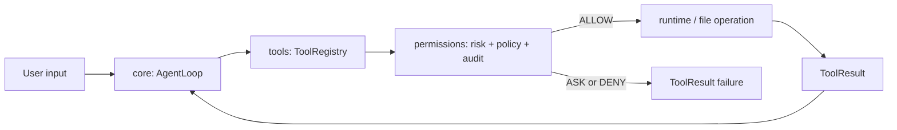

# Project Documentation, Memory, and Module Audit Implementation Plan

> **For agentic workers:** REQUIRED SUB-SKILL: Use superpowers:subagent-driven-development (recommended) or superpowers:executing-plans to implement this plan task-by-task. Steps use checkbox (`- [ ]`) syntax for tracking.

**Goal:** 建立与当前源码一致的文档体系、协作记忆规则、已实现模块流程图和代码完成度审计，同时不修改任何 Python 源码、测试行为或 Week 7 Day 1 实现状态。

**Architecture:** README 只承担稳定公开入口，ARCHITECTURE 维护当前/目标架构边界，`docs/18_IMPLEMENTED_MODULE_FLOWS.md` 集中保存真实模块流程，`docs/19_CODE_COMPLETION_AUDIT_2026-07-10.md` 保存带日期的只读审计快照。`docs/15_MEMORY_SYSTEM.md` 负责事实恢复、冲突和回写，`DOC_RULES.md` 负责写入与反漂移规则，实时状态继续只由 `docs/09_NEXT_ACTIONS.md` 维护。

**Tech Stack:** Markdown、Mermaid、PowerShell、Git、pytest/compileall 既有验证证据

## Global Constraints

- 默认语言为中文，代码标识、文件路径和协议名保留英文。
- 只覆盖 `core`、`tools`、`permissions`、`runtime` 四个已实现或部分实现模块。
- `context`、产品运行时 `memory`、`mcp`、`observability`、`cli` 只可标注为占位或计划，不绘制实现流程图。
- 不修改 `src/**/*.py`、`tests/**/*.py` 和 `docs/Compilation-of-Interview-Questions.md`。
- 不推进 Week 7 Day 1，不改变面试题归档状态。
- 保留工作区原有未提交改动；每次补丁前重新读取目标文件，只修改本计划负责的块。
- 当前测试数字、当前 Week/Day、阻塞项和下一步只维护在 `docs/09_NEXT_ACTIONS.md`；带日期的历史审计报告可以保存当日验证证据。
- `docs/07_IMPLEMENTATION_LOG.md` 最终不超过 100 行，`docs/09_NEXT_ACTIONS.md` 最终不超过 50 行。
- Windows 下 `git diff --check` 的 CRLF 提示必须与真实空白错误分开判断。

---

## File Responsibility Map

| 文件 | 责任 |
|---|---|
| `docs/18_IMPLEMENTED_MODULE_FLOWS.md` | 四个真实模块的项目作用、工程作用、输入输出、流程图、证据和缺口 |
| `docs/19_CODE_COMPLETION_AUDIT_2026-07-10.md` | 带日期、只读、需用户批准后才可整改的代码完成度审计 |
| `docs/15_MEMORY_SYSTEM.md` | 项目事实恢复、冲突优先级、会话回写和协作记忆边界 |
| `DOC_RULES.md` | 文档写入职责、归档阈值和反漂移检查 |
| `docs/INDEX.md` | 新文档的唯一导航入口 |
| `README.md` | 稳定公开入口和一张真实主链总览图 |
| `ARCHITECTURE.md` | 当前架构、目标架构、依赖方向和禁止承担的职责 |
| `docs/12_IMPLEMENTED_ARCHITECTURE_AND_INDUSTRIAL_GAPS.md` | 当前能力/差距事实表；历史时间线保持原样 |
| `docs/07_IMPLEMENTATION_LOG.md` | 当前活跃实现/维护记录，历史 Week 6 内容由 archive 承担 |
| `docs/09_NEXT_ACTIONS.md` | 唯一实时状态源；只增加文档维护事实，不推进课程 |
| `docs/02_DAILY_TASKS.md` | 仅检查一致性；没有活跃任务变化时不修改 |

---

### Task 1: 建立变更基线并确认归档复用边界

**Files:**
- Read: `docs/07_IMPLEMENTATION_LOG.md`
- Read: `docs/archive/implementation_log/2026-07-10-week6-day7-closeout.md`
- Read: `README.md`
- Read: `ARCHITECTURE.md`
- Read: `docs/12_IMPLEMENTED_ARCHITECTURE_AND_INDUSTRIAL_GAPS.md`
- Read: `docs/15_MEMORY_SYSTEM.md`

**Interfaces:**
- Consumes: 当前 dirty worktree 和已批准设计说明。
- Produces: 一份执行期间使用的文件基线清单；不创建仓库文件。

- [ ] **Step 1: 保存当前变更文件列表用于最终对比**

Run:

```powershell
git status --short
git diff --name-only
git ls-files --others --exclude-standard
```

Expected: 输出包含现有 Week 6 文档、trace 代码与 E2E 测试改动；不得把这些改动归因于本计划。

- [ ] **Step 2: 比较活跃日志与现有 Week 6 归档**

Run:

```powershell
Get-Content -Raw -Encoding UTF8 docs\07_IMPLEMENTATION_LOG.md
Get-Content -Raw -Encoding UTF8 docs\archive\implementation_log\2026-07-10-week6-day7-closeout.md
```

Expected: 明确哪些 Week 6 条目已经存在于归档；后续只移除已被归档覆盖的活跃副本，不新建第二份重复归档。

- [ ] **Step 3: 记录实施前文档行数**

Run:

```powershell
$files = @('README.md','ARCHITECTURE.md','DOC_RULES.md','docs\07_IMPLEMENTATION_LOG.md','docs\09_NEXT_ACTIONS.md','docs\15_MEMORY_SYSTEM.md'); foreach ($file in $files) { "$file`t$(@(Get-Content -Encoding UTF8 $file).Count)" }
```

Expected: `docs/07_IMPLEMENTATION_LOG.md` 当前超过 100 行，形成需要归档的直接证据。

---

### Task 2: 创建已实现模块流程图谱

**Files:**
- Create: `docs/18_IMPLEMENTED_MODULE_FLOWS.md`
- Read: `src/pca/core/*.py`
- Read: `src/pca/tools/*.py`
- Read: `src/pca/permissions/*.py`
- Read: `src/pca/runtime/*.py`
- Read: `tests/test_agent_loop.py`
- Read: `tests/test_tools.py`
- Read: `tests/test_permissions_*.py`
- Read: `tests/test_*runtime*.py`
- Read: `tests/test_*checkpoint*.py`

**Interfaces:**
- Consumes: 当前源码公开类/函数与测试证据。
- Produces: `docs/18_IMPLEMENTED_MODULE_FLOWS.md`，供 README、ARCHITECTURE 和 INDEX 链接。

- [ ] **Step 1: 创建文档标题、状态图例与跨模块主链**

文档必须以以下结构开头：

```markdown
# 已实现模块流程与工程作用

本文件只描述当前已有源码和测试证据的模块。实时进度与测试基线见 `docs/09_NEXT_ACTIONS.md`。

## 状态图例

| 状态 | 定义 |
|---|---|
| 已实现 | 具备源码、测试并进入当前主链 |
| 部分实现 | 有真实源码和测试，但仍有明确主链或工业级缺口 |

## 跨模块真实主链
```

主链 Mermaid 必须表达：



- [ ] **Step 2: 写入 `core` 章节**

章节必须包含：

- 状态：已实现。
- 项目作用：维护 message history，驱动 LLM—工具—LLM 循环。
- 工程作用：通过 `LLM` Protocol 和 `ToolRegistry` 解耦模型与工具，通过稳定消息结构实现可测试轨迹。
- 输入：非空 `user_input`、LLM adapter、ToolRegistry。
- 输出：`AgentLoopResult(final_message, messages, trace_id)`。
- 流程：输入校验 → 创建 TraceContext → LLM complete → 有无 ToolCall → registry → ToolResult 转 tool Message → 下一轮或结束。
- 证据：`src/pca/core/messages.py`、`mock_llm.py`、`events.py`、`agent_loop.py`；`tests/test_agent_loop.py`、`tests/test_events.py`、`tests/test_loop_tools_integration.py`。
- 缺口：真实 LLM adapter、事件持久化、结构化 trace 查询、planner/state machine 尚未实现。

- [ ] **Step 3: 写入 `tools` 章节**

章节必须包含：

- 状态：已实现基础平台，retry orchestration 部分实现。
- 项目作用：把 LLM ToolCall 转换成受校验的本地能力调用。
- 工程作用：统一 schema、错误信封、错误码、统计和截断，避免 AgentLoop 依赖具体工具。
- 输入：工具名、`dict` 参数、可选 trace/tool-call metadata。
- 输出：成功或失败 `ToolResult`。
- 流程：registry lookup → parameter validation → handler → exception mapping → output truncation → stats → ToolResult。
- 独立支线：RetryPolicy 只产生 `RetryDecision`，不自动重试。
- 证据：`src/pca/tools/base.py`、`registry.py`、`retry.py`、`file_tools.py`、`shell_tools.py`；对应 tools/file/retry 测试。
- 缺口：无自动 retry、无幂等性声明、无参数摘要脱敏、search/git tools 仍占位。

- [ ] **Step 4: 写入 `permissions` 章节**

章节必须包含：

- 状态：部分实现。
- 项目作用：在 shell 和文件副作用前执行风险判断与 fail-closed gate。
- 工程作用：把风险识别、策略、审计和执行分层，保证测试可注入且危险路径可阻断。
- 两条流程：shell command 与 file change。
- ALLOW：audit 先写入，随后进入 runtime/文件操作；audit 写入失败阻断 ALLOW。
- ASK/DENY：记录 `executed=false` 后返回 PermissionError，不进入副作用路径。
- 证据：`risk.py`、`file_risk.py`、`policy.py`、`approval.py`、`audit.py` 与 permission/safety tests。
- 缺口：包装命令解析不完整、审批对象未接入恢复、audit 没有 trace/tool_call_id/最终结果和查询接口。

- [ ] **Step 5: 写入 `runtime` 章节**

章节必须包含：

- 状态：部分实现。
- 项目作用：提供 workspace 内执行、timeout、输出、checkpoint 和 runtime adapter。
- 工程作用：隔离业务权限与执行机制，通过 Protocol 支持 fake/local/Docker 替换，并限定路径和恢复边界。
- 子流程：Workspace path resolution、ShellRuntime、FileCheckpoint rollback、GitCheckpoint、Docker graceful fallback。
- 证据：`workspace.py`、`interface.py`、`shell_runtime.py`、`docker_runtime.py`、`checkpoints.py` 与 runtime/checkpoint/rollback tests。
- 缺口：Workspace 尚未成为所有路径解析唯一事实源；Docker 不是完整 sandbox；Git/Docker/network/shell 副作用无自动 rollback。

- [ ] **Step 6: 写入跨模块 trace/audit/checkpoint 关系和占位声明**

末尾必须明确：

```markdown
## 不在本图谱中的占位模块

`context`、产品运行时 `memory`、`mcp`、`observability` 和 `cli` 当前没有真实主链闭环，因此不绘制实现流程图。它们的目标职责见 `ARCHITECTURE.md`，当前状态见 `docs/12_IMPLEMENTED_ARCHITECTURE_AND_INDUSTRIAL_GAPS.md`。
```

- [ ] **Step 7: 验证图谱没有虚构模块**

Run:

```powershell
Select-String -Path docs\18_IMPLEMENTED_MODULE_FLOWS.md -Pattern '^## (Core|Tools|Permissions|Runtime)|占位模块|```mermaid'
Select-String -Path docs\18_IMPLEMENTED_MODULE_FLOWS.md -Pattern 'context.*已实现|memory.*已实现|mcp.*已实现|observability.*已实现|cli.*已实现'
```

Expected: 第一条能找到四个模块和 Mermaid；第二条无输出。

---

### Task 3: 创建代码完成度审计报告

**Files:**
- Create: `docs/19_CODE_COMPLETION_AUDIT_2026-07-10.md`
- Read: `PROJECT_REQUIREMENTS.md`
- Read: `docs/INDUSTRIAL_STANDARDS.md`
- Read: `docs/17_WEEK6_HARDENING_REPORT.md`
- Read: 当前源码和测试

**Interfaces:**
- Consumes: 2026-07-10 已验证基线与只读行为探针。
- Produces: 不改变实时状态的日期化审计报告。

- [ ] **Step 1: 写入审计口径和总体结论**

报告开头必须明确：

- `206 passed, 1 skipped`、5 个示例和 compileall 是 2026-07-10 当日证据。
- 当前项目符合 Week 6 带边界放行、进入 Week 7 学习切片的预期。
- 当前项目不符合最终工业级产品验收。
- 报告只建议、不修改代码；所有源码整改都需要用户批准。

- [ ] **Step 2: 写入 P0 发现**

至少包含以下条目：

1. 包装命令绕过分类：`cmd /c ...`、`powershell -Command ...` 的首 token 不是危险命令，当前默认落入 SAFE。
2. 影响：permission gate 可能允许包装后的破坏性命令进入 ShellRuntime。
3. 建议：对 Windows shell wrapper 进行结构化展开或默认将 wrapper/未知复合命令设为 ASK；加入无副作用分类测试与 safety regression。
4. 批准状态：未获用户代码修改批准。

- [ ] **Step 3: 写入 P1 发现**

分别记录：

- `ToolRegistry.run([], {})` 在失败统计阶段产生 `TypeError: unhashable type: 'list'`，未保持 ToolResult 失败信封。
- `ApprovalDecision(request_id=1, ...)` 产生 `AttributeError`，需要稳定的边界校验。
- audit `executed` 只表达 permission ALLOW，不表达最终执行成功；需要区分 `authorized`、`started`、`succeeded` 或增加结果事件。
- 无 lint/type-check/CI 配置，最终工业级验收证据不足。
- Workspace 路径逻辑重复、自动 retry/approval resume/跨副作用 rollback 未实现。

- [ ] **Step 4: 写入模块完成度矩阵**

矩阵列固定为：模块、当前状态、主链证据、测试证据、符合当前阶段、距离最终目标。

状态固定为：

- `core`：已实现当前阶段。
- `tools`：已实现基础，编排能力部分实现。
- `permissions`：部分实现。
- `runtime`：部分实现。
- 纯占位模块：不纳入本次模块流程验收，只列为路线缺口。

- [ ] **Step 5: 写入建议整改顺序和审批门禁**

顺序固定为：

1. P0 wrapper 分类与 safety tests。
2. ToolRegistry/approval 稳定错误语义。
3. audit 生命周期语义。
4. lint/type-check/CI。
5. 按课程路线实现 retry orchestration、approval resume 和更完整 runtime 隔离。

每项必须标注“等待用户批准后修改代码”。

- [ ] **Step 6: 验证报告没有把建议写成已实现**

Run:

```powershell
Select-String -Path docs\19_CODE_COMPLETION_AUDIT_2026-07-10.md -Pattern '等待用户批准|不修改代码|P0|P1|206 passed, 1 skipped'
```

Expected: 所有关键词均有匹配。

---

### Task 4: 优化协作记忆和文档治理

**Files:**
- Modify: `docs/15_MEMORY_SYSTEM.md`
- Modify: `DOC_RULES.md`
- Modify: `docs/INDEX.md`

**Interfaces:**
- Consumes: Task 2 模块图谱、Task 3 审计报告。
- Produces: 唯一导航、清晰事实优先级和反漂移规则。

- [ ] **Step 1: 重构 `docs/15_MEMORY_SYSTEM.md` 为恢复/冲突/回写文档**

保留三套记忆表和产品运行时 memory 占位表，新增：

- 事实优先级：当前源码与本次验证 → Next Actions → Daily/Sprint → Log/ADR/archive → Codex 外部记忆。
- 会话恢复 Mermaid。
- 结束回写矩阵：事实类型、写入文件、何时更新、禁止复制位置。
- 冲突示例：外部记忆的旧测试结果不得覆盖当前验证；README 不得成为实时状态源。

删除与 `DOC_RULES.md` 完全重复的逐条归档阈值，只保留链接。

- [ ] **Step 2: 更新 `DOC_RULES.md` 的文档职责表**

新增两行：

```markdown
| 已实现模块流程与工程作用 | `docs/18_IMPLEMENTED_MODULE_FLOWS.md` | 只描述有源码和测试证据的模块，不保存实时测试数字 |
| 日期化代码完成度审计 | `docs/19_CODE_COMPLETION_AUDIT_YYYY-MM-DD.md` | 保存审计当日证据和整改建议，不作为实时状态源 |
```

反漂移规则增加：README/ARCHITECTURE 不复制详细模块图；模块图谱不得为纯占位模块绘制实现链路。

- [ ] **Step 3: 更新 `docs/INDEX.md`**

在“按需读取”中加入：

```markdown
| `docs/18_IMPLEMENTED_MODULE_FLOWS.md` | 已实现/部分实现模块的真实流程、项目作用和工程作用 |
| `docs/19_CODE_COMPLETION_AUDIT_2026-07-10.md` | 2026-07-10 代码完成度、风险和待批准整改建议 |
```

- [ ] **Step 4: 验证职责没有冲突**

Run:

```powershell
Select-String -Path DOC_RULES.md,docs\INDEX.md,docs\15_MEMORY_SYSTEM.md -Pattern '18_IMPLEMENTED_MODULE_FLOWS|19_CODE_COMPLETION_AUDIT|唯一实时状态源|外部记忆'
```

Expected: 三个文件均能找到职责相关内容；只有 `docs/09_NEXT_ACTIONS.md` 被称为唯一实时状态源。

---

### Task 5: 同步公开入口、架构与能力差距

**Files:**
- Modify: `README.md`
- Modify: `ARCHITECTURE.md`
- Modify: `docs/12_IMPLEMENTED_ARCHITECTURE_AND_INDUSTRIAL_GAPS.md`

**Interfaces:**
- Consumes: Task 2 模块图谱和 Task 3 审计报告。
- Produces: 无实时状态重复、无 audit/trace 漂移的公开与架构文档。

- [ ] **Step 1: 精简 README**

README 必须：

- 删除 `截至 2026-07-10...206 passed...` 的实时状态副本，改为链接 `docs/09_NEXT_ACTIONS.md`。
- 保留一张真实跨模块主链图。
- 删除四套详细模块图副本，改为链接 `docs/18_IMPLEMENTED_MODULE_FLOWS.md`。
- 用简表标注 core/tools 已实现，permissions/runtime 部分实现，其他为计划/占位。
- 增加代码审计报告链接。
- 保留运行测试与示例命令，但不宣称当前结果。

- [ ] **Step 2: 修正 ARCHITECTURE 当前事实**

必须修正：

- audit 已自动接入 shell/file gate；仍缺 trace 关联、最终结果和查询。
- AgentLoop 已创建 run 级 trace，并经 ToolRegistry 进入 ToolResult；仍缺结构化日志/查询/统计。
- 最终作品集表述改为“当前已实现 core/tools 及部分 permissions/runtime；context、长期记忆、MCP 和完整 observability 仍按路线实现”。
- 增加详细模块图谱链接。

- [ ] **Step 3: 更新 gap ledger 的当前摘要，不改历史时间线**

只修改 `docs/12_IMPLEMENTED_ARCHITECTURE_AND_INDUSTRIAL_GAPS.md` 的当前摘要、当前差距和占位说明：

- audit 自动接入状态改为已接入 gate。
- trace 状态改为 AgentLoop 生成、registry/result 透传。
- 保留历史表格中“当时尚未接入”的文字，因为它是日期化历史事实。
- 增加指向模块图谱和代码审计报告的链接。

- [ ] **Step 4: 搜索过时表述**

Run:

```powershell
Select-String -Path README.md,ARCHITECTURE.md -Pattern 'audit.*未自动接入|TraceContext.*未自动透传|206 passed, 1 skipped'
Select-String -Path ARCHITECTURE.md -Pattern '实现了 coding workflow、权限边界、上下文检索、长期记忆、评估和可观测性'
```

Expected: 两条命令均无输出。

---

### Task 6: 归档活跃日志并同步实时维护事实

**Files:**
- Modify: `docs/07_IMPLEMENTATION_LOG.md`
- Modify if needed: `docs/archive/implementation_log/2026-07-10-week6-day7-closeout.md`
- Modify: `docs/09_NEXT_ACTIONS.md`
- Inspect only: `docs/02_DAILY_TASKS.md`

**Interfaces:**
- Consumes: Task 1 的归档覆盖比较和 Tasks 2-5 的完成事实。
- Produces: 小于等于 100 行的活跃日志和不推进课程的实时维护记录。

- [ ] **Step 1: 去除活跃日志中已归档的 Week 6 重复内容**

保留以下活跃结构：

```markdown
# Implementation Log

本文件只保留当前活跃阶段和最近一次维护记录。历史实现证据见 `docs/archive/implementation_log/`。

## Week 7

### Week 7 Day 1：Repo Scanner 准备状态

- 状态：尚未开始实现。
- 当前入口：`docs/02_DAILY_TASKS.md` 与 `docs/09_NEXT_ACTIONS.md`。

### 2026-07-11：文档、协作记忆与模块审计
```

维护记录列出新增/更新文档、验证命令、代码未修改边界和待用户批准的代码整改。

- [ ] **Step 2: 只在归档缺少独有证据时补充现有归档**

如果 Task 1 证明 `docs/archive/implementation_log/2026-07-10-week6-day7-closeout.md` 已覆盖 Week 6 记录，则不修改该文件。只有发现活跃日志存在归档中没有的唯一验证证据时，才把该事实追加到同一个归档文件，禁止新建第二份 Week 6 完整归档。

- [ ] **Step 3: 更新 Next Actions 的“最新文档维护”**

保持以下事实不变：

- 当前仍为 Week 7 Day 1。
- RepoScanner 尚未开始实现。
- 下一条用户指令仍是“开始 Week 7 Day 1”。

只把“最新文档维护”更新为：已完成协作记忆治理、真实模块图谱和代码完成度审计；代码整改等待用户批准。

- [ ] **Step 4: 检查 Daily Tasks 无需修改**

Run:

```powershell
Select-String -Path docs\02_DAILY_TASKS.md -Pattern 'Week 7 Day 1|尚未开始|RepoScanner'
```

Expected: 当前任务仍正确，因此不修改 `docs/02_DAILY_TASKS.md`。

- [ ] **Step 5: 验证行数**

Run:

```powershell
"docs/07_IMPLEMENTATION_LOG.md`t$(@(Get-Content -Encoding UTF8 docs\07_IMPLEMENTATION_LOG.md).Count)"
"docs/09_NEXT_ACTIONS.md`t$(@(Get-Content -Encoding UTF8 docs\09_NEXT_ACTIONS.md).Count)"
```

Expected: Log 不超过 100 行；Next Actions 不超过 50 行。

---

### Task 7: 完整文档验证与交付审计

**Files:**
- Verify: all files modified by Tasks 2-6
- Do not modify: `src/**/*.py`, `tests/**/*.py`

**Interfaces:**
- Consumes: 所有文档交付物。
- Produces: 可复核的验证结果与最终用户报告。

- [ ] **Step 1: 验证新增路径和 Markdown 链接目标**

Run:

```powershell
$required = @('docs\18_IMPLEMENTED_MODULE_FLOWS.md','docs\19_CODE_COMPLETION_AUDIT_2026-07-10.md','docs\15_MEMORY_SYSTEM.md','ARCHITECTURE.md'); foreach ($path in $required) { if (-not (Test-Path $path)) { throw "Missing required document: $path" } }
```

Expected: 无输出，退出码 0。

- [ ] **Step 2: 验证 Mermaid 围栏成对**

Run:

```powershell
$files = @('README.md','ARCHITECTURE.md','docs\15_MEMORY_SYSTEM.md','docs\18_IMPLEMENTED_MODULE_FLOWS.md'); foreach ($file in $files) { $count = @(Select-String -Path $file -Pattern '^```' -Encoding UTF8).Count; if ($count % 2 -ne 0) { throw "Unbalanced code fences: $file" } }
```

Expected: 无输出，退出码 0。

- [ ] **Step 3: 运行反漂移检查**

Run:

```powershell
Select-String -Path README.md,docs\00_PROJECT_CONTEXT.md,docs\01_LEARNING_ROADMAP.md -Pattern '当前阶段：|当前主题：|阻塞项：|passed|skipped'
Select-String -Path README.md,ARCHITECTURE.md,docs\12_IMPLEMENTED_ARCHITECTURE_AND_INDUSTRIAL_GAPS.md -Pattern 'audit.*未自动接入|TraceContext.*未自动透传'
```

Expected: README/Context/Roadmap 不保存实时测试数字或阻塞项；第二条只允许命中带日期的历史时间线，不能命中当前摘要。

- [ ] **Step 4: 验证本计划没有新增 Python/测试改动**

实施前后对比 `git status --short`。本计划允许新增/修改的路径只能是：

```text
README.md
ARCHITECTURE.md
DOC_RULES.md
docs/INDEX.md
docs/07_IMPLEMENTATION_LOG.md
docs/09_NEXT_ACTIONS.md
docs/12_IMPLEMENTED_ARCHITECTURE_AND_INDUSTRIAL_GAPS.md
docs/15_MEMORY_SYSTEM.md
docs/18_IMPLEMENTED_MODULE_FLOWS.md
docs/19_CODE_COMPLETION_AUDIT_2026-07-10.md
docs/archive/implementation_log/2026-07-10-week6-day7-closeout.md
```

任何已有 `src/`、`tests/` 改动都必须保持内容不变，并在交付说明中标为工作区原有改动。

- [ ] **Step 5: 检查 whitespace**

Run:

```powershell
git diff --check
```

Expected: 没有真实 trailing-whitespace 或 conflict-marker 错误；Windows CRLF 转换提示单独记录。

- [ ] **Step 6: 形成最终交付说明**

最终说明必须包含：

- 修改和新增的文档。
- 四个模块图谱入口。
- 代码完成度结论和 P0/P1 摘要。
- 明确“未修改 Python 代码”。
- 当前仍为 Week 7 Day 1、RepoScanner 尚未开始。
- 下一步需要用户选择批准哪些代码整改，或发送“开始 Week 7 Day 1”。

