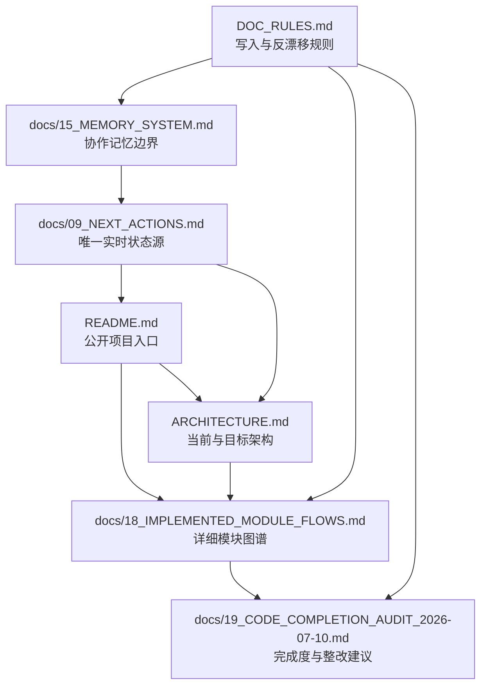
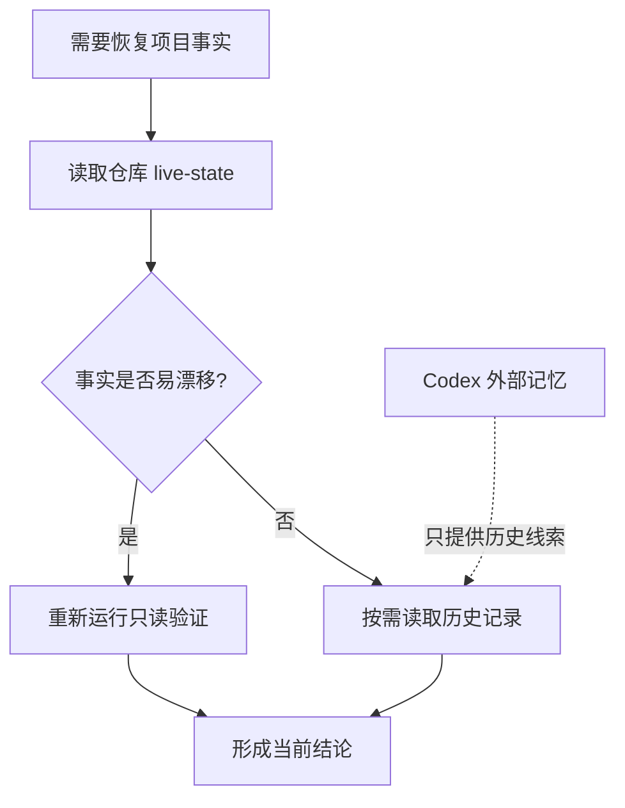

# 项目文档、协作记忆与模块审计设计

日期：2026-07-10  
状态：已获用户批准，等待设计文档复核

## 1. 目标

本次工作只优化项目 Markdown 文档并形成代码完成度审计，不修改 Python 源码、测试代码或运行行为。

交付目标：

1. 让项目协作记忆具备明确的事实源、冲突处理和会话回写规则。
2. 让 README、架构文档、能力差距文档与当前源码保持一致。
3. 为已实现和部分实现模块提供真实流程图、项目作用和工程作用。
4. 形成可长期保留的代码完成度审计，说明问题、影响、证据和建议，但不直接修复代码。
5. 恢复活跃文档的长度约束和归档纪律，减少后续状态漂移。

## 2. 范围

### 2.1 包含的模块

模块图只覆盖当前已有源码与测试证据的模块：

- `core`：已实现最小消息模型、mock LLM、AgentLoop 和 run 级 trace 透传。
- `tools`：已实现工具抽象、参数 schema、注册表、结果信封、错误码、统计、输出截断和独立 retry policy。
- `permissions`：已实现风险分类、策略、审批对象、文件/命令 gate 和摘要 audit；交互式审批恢复仍未实现。
- `runtime`：已实现 Workspace、ShellRuntime、CommandRuntime、Docker adapter、FileCheckpoint 和 GitCheckpoint；完整 sandbox 与跨副作用 rollback 仍未实现。

trace 与 audit 会作为跨模块链路说明，但不会把一行占位的 `src/pca/observability/` 宣称为已实现模块。

### 2.2 明确排除

下列内容不绘制实现流程图：

- `src/pca/context/`
- `src/pca/memory/`
- `src/pca/mcp/`
- `src/pca/observability/`
- `src/pca/cli.py`
- 尚未创建的 `coding`、`retrieval`、`graph`、`evaluation` 生产模块

这些能力可以在目标架构或差距表中出现，但必须标注为占位、计划或尚未创建。

本次不进行：

- Python 源码修改
- 测试修改
- 权限分类、audit、trace、retry 或 runtime 行为修复
- Week 7 Day 1 实现或课程状态推进
- 未经用户批准的代码整改

## 3. 文档架构

采用“一个公开入口、一个真实架构入口、一个详细模块图谱、一个代码审计快照”的结构。

### 3.1 README

README 只保留：

- 稳定项目定位
- 一张当前主链总览图
- 已实现、部分实现、占位的简短状态表
- 运行入口
- 指向实时状态、架构、模块图谱和代码审计的链接

README 不再复制当前测试数字、当前 Week/Day、阻塞项或多套详细模块图。这些实时信息只引用 `docs/09_NEXT_ACTIONS.md`。

### 3.2 ARCHITECTURE

`ARCHITECTURE.md` 负责：

- 当前真实主链
- 当前与目标架构的严格区分
- 模块依赖方向和禁止承担的职责
- 当前已接入、部分接入和未接入边界
- 指向详细模块图谱的链接

需要修正的已知漂移：

- audit 已自动接入 shell/file gate，不能再写成“仅独立 API”。
- run 级 trace 已从 AgentLoop 透传到 ToolRegistry/ToolResult，不能再写成“未自动透传”。
- 作品集表述不能宣称上下文检索、长期记忆和完整可观测性已经实现。

### 3.3 模块图谱

新增 `docs/18_IMPLEMENTED_MODULE_FLOWS.md`，采用统一章节模板：

1. 当前状态：已实现或部分实现。
2. 项目作用：它在 Personal Coding Assistant 产品链路中解决什么问题。
3. 工程作用：它如何提升解耦、安全、可测试性、可观测性或可维护性。
4. 入口、输出和依赖。
5. 基于当前源码的 Mermaid 流程图。
6. 已实现证据：源码文件与测试文件。
7. 当前缺口：不得把后续计划写成现有能力。

文档先给一张跨模块总链路，再分别描述 `core`、`tools`、`permissions`、`runtime`，最后给 trace/audit/checkpoint 的跨模块关系图。

### 3.4 代码完成度审计

新增 `docs/19_CODE_COMPLETION_AUDIT_2026-07-10.md`，它是带日期的审计快照，不是实时状态源。

每条发现包含：

- 优先级：P0、P1 或 P2
- 所属模块
- 当前证据
- 与预期的差距
- 工程影响
- 建议修改方向
- 是否需要用户批准后才能修改

优先级定义：

| 级别 | 含义 |
|---|---|
| P0 | 可能破坏安全边界、事实可信度或核心流程，进入相关后续能力前应优先处理 |
| P1 | 不阻断当前学习切片，但会影响健壮性、可维护性或工业级验收 |
| P2 | 质量改进、开发体验或后续产品化准备 |

已确认需要写入审计的事实包括：

- 包装命令可能绕过当前 shell 风险分类，例如 `cmd /c ...` 和 `powershell -Command ...`。
- `ToolRegistry.run(...)` 在非字符串且不可哈希的工具名输入下，统计记录可能再次抛出异常，破坏稳定失败信封。
- 审批数据对象对部分非字符串输入产生 `AttributeError`，错误语义不稳定。
- audit 的 `executed` 当前代表 ALLOW 已获准进入路径，不足以表达 runtime/文件操作最终是否真正成功。
- pytest、示例和 compileall 通过，但项目尚未配置 lint、type check 和 CI，不能据此宣称完成工业级工程验收。
- context、产品运行时 memory、MCP、observability 和 CLI 仍是占位，符合路线阶段，但不属于当前完成能力。

审计只提出建议；任何代码修改都需要用户另行批准。

## 4. 协作记忆优化

`docs/15_MEMORY_SYSTEM.md` 保留稳定边界，重点加强四个部分：

### 4.1 事实优先级

事实冲突时的顺序：

1. 当前源码与本次验证输出。
2. `docs/09_NEXT_ACTIONS.md` 的实时状态。
3. 当前活跃任务和 Sprint 文档。
4. 实现日志、ADR 和归档证据。
5. Codex 外部记忆与历史 rollout 摘要。

### 4.2 会话恢复

继续项目时仍遵循 `AGENTS.md`：

`AGENTS.md -> docs/INDEX.md -> docs/09_NEXT_ACTIONS.md -> Context/Roadmap/Daily/Sprint`

其他任务从 `docs/INDEX.md` 选择相关文档，不一次性加载所有历史资料。

### 4.3 结束回写

结束时按事实类型更新：

- 活跃任务变化：更新 Daily。
- 完成与验证证据：更新 Log。
- 当前状态、阻塞项或下一步变化：更新 Next Actions。
- 长期架构取舍：新增 ADR。
- 历史超限：先归档，再保持活跃文件短小。

### 4.4 去重边界

- `DOC_RULES.md` 保存“文件应该怎么写”。
- `docs/15_MEMORY_SYSTEM.md` 保存“事实如何恢复、冲突和回写”。
- 两者互相链接，不再复制完整规则清单。

## 5. 活跃文档归档

`docs/07_IMPLEMENTATION_LOG.md` 当前超过 100 行上限。实施时：

1. 先核对现有未跟踪 Week 6 归档文件，避免重复归档。
2. 将已经结束的 Week 6 记录保留在对应 archive 文件。
3. 活跃日志只保留 Week 7 入口和本次文档审计记录。
4. 不删除历史证据，不改变面试题归档状态。

## 6. 变更文件

计划创建：

- `docs/18_IMPLEMENTED_MODULE_FLOWS.md`
- `docs/19_CODE_COMPLETION_AUDIT_2026-07-10.md`

计划修改：

- `README.md`
- `ARCHITECTURE.md`
- `DOC_RULES.md`
- `docs/INDEX.md`
- `docs/12_IMPLEMENTED_ARCHITECTURE_AND_INDUSTRIAL_GAPS.md`
- `docs/15_MEMORY_SYSTEM.md`
- `docs/07_IMPLEMENTATION_LOG.md`
- `docs/09_NEXT_ACTIONS.md`

按项目工作结束规则检查、仅在确有状态变化时修改：

- `docs/02_DAILY_TASKS.md`

明确不修改：

- `src/**/*.py`
- `tests/**/*.py`
- `docs/Compilation-of-Interview-Questions.md`
- 当前 Week 7 Day 1 的实现状态

## 7. 验证策略

文档实施完成后执行：

1. 检查所有新增链接和文件路径存在。
2. 检查 Mermaid 围栏成对闭合，图中只描述当前真实调用链。
3. 运行 `DOC_RULES.md` 中的反漂移查询。
4. 确认 `docs/07_IMPLEMENTATION_LOG.md` 不超过 100 行，`docs/09_NEXT_ACTIONS.md` 不超过 50 行。
5. 搜索 README、ARCHITECTURE 和 gap ledger 中已知的过时 audit/trace 表述。
6. 运行 `git diff --check`，将 CRLF 提示与真实空白错误分开判断。
7. 确认 `git diff --name-only` 不包含任何 Python 源码或测试文件的新增修改；工作区原有改动必须与本次文档改动区分。
8. 复用本次已取得的 `206 passed, 1 skipped`、5 个示例通过和 compileall 通过结果作为代码审计的当日证据；文档修改本身不改变该代码基线。

## 8. 验收标准

- 详细模块图只包含 `core`、`tools`、`permissions`、`runtime` 及其真实跨模块链路。
- 每个模块都有项目作用、工程作用、输入输出、Mermaid 图、源码/测试证据和未实现边界。
- README 不再保存实时测试数字、当前阻塞项或详细模块图副本。
- ARCHITECTURE 对 audit、trace、memory、context 和 observability 的描述与当前源码一致。
- `docs/15_MEMORY_SYSTEM.md` 能回答事实从哪里读取、冲突如何处理、结束时写回哪里。
- 代码审计明确区分测试通过、课程阶段完成和工业级完成。
- 代码审计不触发任何 Python 修改。
- 活跃日志恢复到文档规定的长度范围，历史记录仍可从 archive 查到。
- Week 7 Day 1 仍保持“尚未开始实现”，不因本次文档维护被错误推进。

