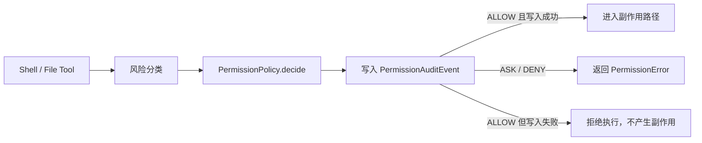

# Week 6 Day 4：权限审计完整性设计

## 目标与范围

本切片为 shell 与文件 permission gate 补齐自动审计证据。它只记录策略判断的摘要事实，不实现审批通过后的恢复执行、完整 trace 查询、集中式可观测性平台或新的文件风险规则。

## 既有调用链

## 选择的方案

复用 `pca.permissions.audit` 中的 `PermissionAuditEvent` 与 `append_audit_event(...)`，在 `shell_tools.py` 和 `file_tools.py` 的 gate 决策之后调用一个最小的审计辅助函数。该辅助函数统一从 `PermissionDecision` 与 `RiskAssessment` 构造事件；具体工具不自行拼装 JSONL。调用方可注入 `audit_path`；未注入的 shell 使用进程工作目录 `.pca/permission-audit.jsonl`，避免未验证的 `workspace_root` 改变 runtime 校验语义。

相较于在两个 gate 中重复写入逻辑，这一方案保留现有 JSONL 事件格式并降低分支漂移。相比新增 `AuditSink` 协议，它不引入新的可观测性抽象，符合 Day 4 的范围。

## 事件契约与隐私边界

每个事件严格使用现有稳定字段：

- `timestamp`
- `tool_name`
- `action`
- `risk_level`
- `matched_rule`
- `reason`
- `executed`

`executed=True` 表示该调用已经通过 permission gate，允许进入副作用路径；它不表示 shell 命令或文件写盘必然成功。该定义避免把执行结果与 gate 决策混为一谈，且可在进入副作用前完成 fail-closed 检查。

事件不得包含完整命令、文件路径或内容、完整环境变量、secret、token、stdout 或 stderr。`reason` 只使用 policy/risk 的固定摘要文本。

## fail-closed 语义

1. `ALLOW`：先写入 `executed=True` 事件。写入成功后才调用 shell runtime 或文件 checkpoint/写盘；写入失败立即抛出错误，执行器不得被调用。
2. `ASK`：尽力写入 `executed=False` 事件，再保留现有“需要审批”的 `PermissionError`。若审计写入失败，仍不得执行，且保持原有审批语义。
3. `DENY`：尽力写入 `executed=False` 事件，再保留现有“已拒绝”的 `PermissionError`。若审计写入失败，仍不得执行，且保持原有拒绝语义。

这不是跨 shell、文件系统与 JSONL 的原子事务；它只保证允许路径在副作用前已有可写入的审计证据。运行时或写盘开始后的失败仍由现有 `ToolResult`、checkpoint 与 rollback 边界处理。

## 测试矩阵

| Gate | Action | 审计断言 | 副作用断言 |
|---|---|---|---|
| Shell | ALLOW | 一条摘要事件，`executed=true` | recording runtime 被调用 |
| Shell | ASK | 一条摘要事件，`executed=false` | runtime 未被调用 |
| Shell | DENY | 一条摘要事件，`executed=false` | runtime 未被调用 |
| File | ALLOW | 一条摘要事件，`executed=true` | 新文件写入成功 |
| File | ASK | 一条摘要事件，`executed=false` | 原文件保持不变 |
| File | DENY | 一条摘要事件，`executed=false` | 原文件保持不变 |
| Shell/File | ALLOW + audit failure | 不产生成功审计 | runtime/写盘均不得发生 |

默认文件分类当前只产生 `ALLOW` 与 `ASK`。文件 `DENY` 测试通过注入会返回 `DENY` 的策略对象覆盖 gate 分支；不为本切片新增风险分类规则。测试还要断言 JSON 字段集合固定，且带有模拟 token 的命令参数不出现在审计记录中。

## 影响文件

- `src/pca/permissions/audit.py`：放置最小审计辅助逻辑，保持 JSONL 格式。
- `src/pca/tools/shell_tools.py`：在进入 runtime 前接入审计。
- `src/pca/tools/file_tools.py`：在进入 checkpoint/写盘前接入审计。
- `tests/test_permissions_audit.py`：增加矩阵与隐私断言。
- `tests/test_permissions_shell_gate.py`、`tests/test_permissions_file_risk.py`：补 gate 集成断言。

## 非目标

- 不记录真实命令、文件内容、环境变量或执行输出。
- 不实现批准后恢复执行。
- 不实现审计查询 API、远程审计后端或 trace 关联。
- 不改变现有风险分类和 `ToolErrorCode` 枚举。
