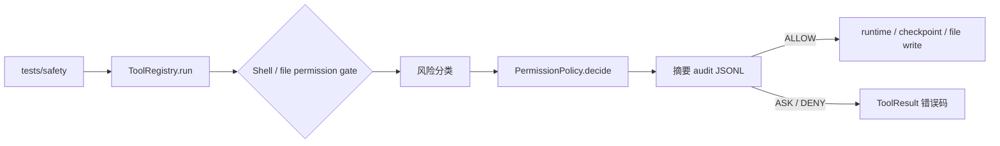

# Week 6 Day 5：Safety suite 设计

## 目标与范围

本切片把 Week 4-6 已有的 permission、workspace、audit 和输出脱敏边界组织为可重复运行的安全回归测试。目标是证明拒绝或待审批的操作没有进入副作用路径，且审计和返回结果不泄漏敏感值。

本切片只新增 `tests/safety/` 下的测试组织与必要的测试辅助代码；不改变风险分类规则、`ToolErrorCode`、审批恢复流程、shell 主链 workspace 边界或 audit 存储模型。若测试发现实现缺口，只记录该缺口，不在 Day 5 扩展生产功能。

## 调用链与测试隔离



shell 拒绝测试注入 `RecordingRuntime`，通过其调用记录证明真实 runtime 没有被调用。文件测试使用 `tmp_path` 中的真实文件和外部 sentinel 文件，证明数据没有被修改。secret redaction 测试直接调用本地 `ShellRuntime`，通过当前 Python 解释器打印临时环境变量值；它不经 gate、不访问网络，也不依赖平台 shell 语法。

## 测试结构

- `tests/safety/conftest.py`：临时工作区、审计读取辅助函数与 `RecordingRuntime` fixture。
- `tests/safety/test_shell_safety.py`：递归删除、网络命令、inline code、shell audit 隐私。
- `tests/safety/test_file_safety.py`：工作区外路径、覆盖已有文件、删除式编辑。
- `tests/safety/test_secret_redaction.py`：`ShellRuntime` 对敏感环境变量输出的脱敏。

测试不调用真实网络，也不运行真实删除命令。命令分类的安全结论来自 gate；`RecordingRuntime.calls == []` 是“未进入执行层”的直接证据。

## 回归矩阵

| 场景 | 入口 | 稳定语义 | 副作用与审计断言 |
|---|---|---|---|
| `rm -rf .` | `ToolRegistry -> ShellCommandTool` | `PERMISSION_DENIED`，规则 `recursive_delete` | runtime 零调用；audit 为 `deny` / `executed=false` |
| `curl ...` | 同上 | `PERMISSION_APPROVAL_REQUIRED`，规则 `network_access` | runtime 零调用；audit 为 `ask` / `executed=false` |
| `python -c ...` | 同上 | `PERMISSION_APPROVAL_REQUIRED`，规则 `inline_code` | runtime 零调用；audit 为 `ask` / `executed=false` |
| 工作区外 write/edit | `ToolRegistry -> FileTool` | `INVALID_ARGUMENT` | 外部 sentinel 不变；路径在 gate 前拒绝，因此不写 audit |
| 覆盖已有文件 | `WriteFileTool` | `PERMISSION_APPROVAL_REQUIRED`，规则 `overwrite_existing_file` | 原文件不变；audit 为 `ask` / `executed=false` |
| 删除式编辑 | `EditFileTool` | `PERMISSION_APPROVAL_REQUIRED`，规则 `delete_like_edit` | 原文件不变；audit 为 `ask` / `executed=false` |
| secret redaction | 本地 `ShellRuntime` | 成功输出中为 `[REDACTED]` | 生成临时 secret；失败信息不回显该值 |
| audit secret boundary | 安全 shell gate 调用 | 无额外错误语义 | audit JSONL 不包含传入的敏感环境变量值 |

异常断言以 `ToolResult.error_code` 为主，只额外检查固定的规则名；不依赖完整异常文案。secret redaction 断言使用固定错误说明，避免 pytest 在脱敏回归时把实际 secret 放入失败输出。

## 验收与文档收口

实现后按以下顺序验证：

```powershell
E:\python\Scripts\pytest.exe tests\safety -q
E:\python\Scripts\pytest.exe -q
python examples\01_minimal_agent.py
python examples\02_tool_agent.py
python examples\03_observed_tool_run.py
python examples\04_permission_agent.py
python examples\05_checkpoint_rollback.py
python -m compileall src examples -q
git diff --check
```

完成后更新 `docs/07_IMPLEMENTATION_LOG.md`、`docs/09_NEXT_ACTIONS.md`、`docs/17_WEEK6_HARDENING_REPORT.md`，并在 `EVALUATION.md` 记录 Safety suite 的运行与隔离约定。Day 5 完成后只生成并推送面试题；在用户回答和归档前不推进到 Day 6。

## 非目标

- 不新增或扩大 destructive、network、inline code 的风险分类规则。
- 不执行真实网络请求、真实删除命令或外部系统操作。
- 不实现批准后恢复、自动重试、完整 sandbox、trace 关联或远程 audit 后端。
- 不把环境变量、完整命令、文件内容、stdout、stderr 或 secret 写入 audit。
