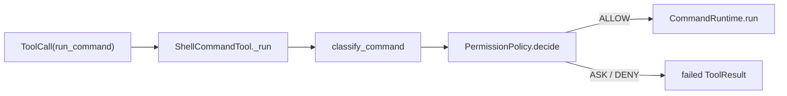
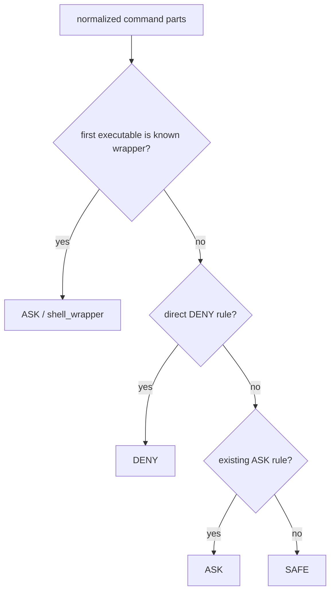

# Shell Wrapper Fail-Closed Design

日期：2026-07-11  
状态：用户已批准最小 ASK 方案，并授权设计/计划完成后直接实施

## 1. 问题与根因

当前调用链：



`classify_command(...)` 只检查规范化命令的首 token。对以下输入，首 token 是包装器而不是真实子命令：

- `cmd /c del /s /q harmless-target`
- `powershell -Command Remove-Item harmless-target -Recurse -Force`
- `['cmd', '/c', 'del', '/s', '/q', 'harmless-target']`
- `['powershell.exe', '-Command', 'Remove-Item', 'harmless-target', '-Recurse', '-Force']`

2026-07-11 的纯分类探针证明四种形式均返回 `SAFE/default_safe`。`PermissionPolicy` 会把 SAFE 映射成 ALLOW，因此 wrapper 可以隐藏真实高风险子命令并进入 runtime。

## 2. 设计目标

- 已知 shell wrapper 默认进入 `ASK`，不得落入 `SAFE/default_safe`。
- ASK 必须沿现有 gate 返回 `PERMISSION_APPROVAL_REQUIRED`，真实 runtime 不得被调用。
- permission audit 记录 `action=ask`、`matched_rule=shell_wrapper`、`executed=false`。
- 现有直接命令语义保持不变：明显删除命令仍为 DENY，普通本地只读命令仍可 SAFE。
- 不执行任何 wrapper 或破坏性命令；测试只调用分类器或 fake runtime。

## 3. 方案

### 3.1 wrapper 集合

新增稳定常量：

```python
SHELL_WRAPPER_EXECUTABLES = {
    "cmd",
    "cmd.exe",
    "powershell",
    "powershell.exe",
    "pwsh",
    "pwsh.exe",
}
```

只根据首 token 的可执行文件 basename 判断。规范化方式同时接受 `/` 和 `\` 路径分隔符，支持：

- `cmd` / `cmd.exe`
- `powershell` / `powershell.exe`
- `pwsh` / `pwsh.exe`
- 大小写变体
- 完整 Windows/Unix 风格路径
- 字符串命令和 `list[str]` 命令

### 3.2 策略语义

在 `_match_ask_rules(...)` 的最前面识别 wrapper：

```python
if _is_shell_wrapper(first):
    return RiskAssessment(
        level=RiskLevel.ASK,
        reason="Shell wrapper commands can hide nested command behavior.",
        matched_rule="shell_wrapper",
    )
```

不解析 wrapper 内部命令，也不把 wrapper 一律 DENY。



wrapper 最终为 ASK 而不是 DENY，原因是当前分类器没有可靠的 Windows shell quoting/parser。ASK 是最小 fail-closed 修复，既阻断静默执行，又不伪装成已经理解内部命令。

## 4. 输入输出

输入仍为 `Command = str | Sequence[str]`。

wrapper 输出固定为：

```text
RiskAssessment(
    level=RiskLevel.ASK,
    matched_rule="shell_wrapper",
    reason=<非空解释>,
)
```

通过 `PermissionPolicy` 和 `ShellCommandTool` 后：

- `ToolResult.ok == False`
- `ToolResult.error_code == PERMISSION_APPROVAL_REQUIRED`
- fake runtime calls 为空
- audit action 为 `ask`
- audit executed 为 `false`

## 5. TDD 验证矩阵

### Unit

- 字符串：`cmd /c ...`、`powershell -Command ...`、`pwsh -Command ...`
- 数组：`['cmd', '/c', ...]`、`['powershell.exe', '-Command', ...]`
- 大小写：`PoWeRsHeLl.ExE`
- 完整路径：`C:\Windows\System32\cmd.exe`、`C:\Windows\System32\WindowsPowerShell\v1.0\powershell.exe`
- 回归：`rm -rf /` 仍 DENY；`git status` 仍 SAFE；`curl ...` 仍 ASK/network_access。

### Integration

- ShellCommandTool + RecordingRuntime：wrapper 返回 approval-required，runtime 未调用。
- audit：`matched_rule=shell_wrapper`、`action=ask`、`executed=false`。

### Safety

- safety suite 使用 fake runtime 覆盖 cmd 与 PowerShell wrapper。
- 测试数据中的内部命令只作为字符串，从不交给 subprocess。

## 6. 修改范围

代码和测试：

- `src/pca/permissions/risk.py`
- `tests/test_permissions_risk.py`
- `tests/test_permissions_shell_gate.py`
- `tests/safety/test_shell_safety.py`

实施后同步：

- `docs/06_ARCHITECTURE_DECISIONS.md`
- `docs/07_IMPLEMENTATION_LOG.md`
- `docs/09_NEXT_ACTIONS.md`
- `docs/18_IMPLEMENTED_MODULE_FLOWS.md`
- `docs/19_CODE_COMPLETION_AUDIT_2026-07-10.md`
- `docs/02_DAILY_TASKS.md`（只记录本次 P0 维护，不推进 Week 7 Day 1）

## 7. 明确不做

- 不递归解析 wrapper 内部命令。
- 不实现 Windows shell quoting/parser。
- 不处理 P1 ToolRegistry、approval、audit 生命周期、CI 或 Workspace 整改。
- 不实现交互式 approval resume。
- 不执行真实 cmd、PowerShell 或破坏性命令。
- 不推进 RepoScanner 或 Week 7 Day 1。

## 8. 验收标准

- 新测试在实现前稳定失败，失败原因是 wrapper 仍为 SAFE 或 runtime 被错误调用。
- 最小实现后 wrapper unit、gate、safety 测试通过。
- permission 与 shell 聚焦回归通过。
- 全量 pytest、5 个示例、compileall 和 `git diff --check` 通过。
- 文档把 F-01 标记为已修复，并明确修复边界是“已知 wrapper 默认 ASK”，不是内部命令完整解析。
- 工作区原有其他代码和测试改动不被覆盖、回退或误提交。

