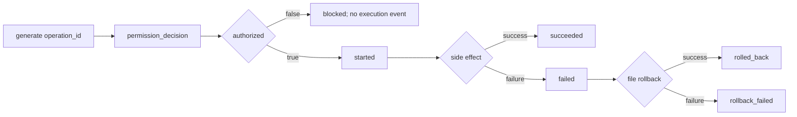

# F-04a Audit Lifecycle Design

日期：2026-07-12

## 目标

修复 permission audit 中 `executed=true` 被误读为执行成功的问题，并为 shell/file 副作用建立可回放的本地生命周期。F-04b 的 `trace_id` / `tool_call_id` 执行上下文透传不在本切片。

## 事件模型

### PermissionAuditEvent

- `event_type="permission_decision"`
- `operation_id`
- `timestamp`
- `tool_name`
- `action`
- `risk_level`
- `matched_rule`
- `reason`
- `authorized`

移除 `executed`，不保留兼容别名，避免两个含义不同的事实源长期共存。`authorized=True` 只表示 permission gate 允许进入副作用路径。

### ToolExecutionAuditEvent

- `event_type="tool_execution"`
- `operation_id`
- `timestamp`
- `tool_name`
- `phase`

`ToolExecutionPhase` 固定为 `started`、`succeeded`、`failed`、`rolled_back`、`rollback_failed`。事件不记录命令、路径、文件内容、stdout/stderr、异常消息或 secret。

## 调用链

## 持久化失败语义

- `permission_decision` 或 `started` 写入失败发生在副作用前，继续 fail-closed，副作用不得执行。
- `succeeded` 写入失败发生在副作用后，抛出 `AuditPersistenceError`，明确 `side_effect_state="completed"`。
- shell runtime 失败后若 `failed` 写入也失败，抛出 `AuditPersistenceError(side_effect_state="unknown")` 并以原 runtime 异常为 cause。
- 文件操作失败时，无论 `failed` 审计能否写入，都必须继续 rollback。
- rollback 成功但 outcome 审计不完整时，抛出 `AuditPersistenceError(side_effect_state="rolled_back")`；rollback 本身失败仍优先返回现有 rollback failure。
- `AuditPersistenceError` 映射到新增 `ToolErrorCode.AUDIT_FAILED`，RetryPolicy 默认不可重试，避免重复副作用。

## 文件边界

- `src/pca/permissions/audit.py`：事件、phase、operation id、审计异常和写入函数。
- `src/pca/tools/shell_tools.py`：shell decision/start/outcome 顺序。
- `src/pca/tools/file_tools.py`：file decision/start/outcome/rollback 顺序。
- `src/pca/tools/base.py`、`src/pca/tools/retry.py`：`AUDIT_FAILED` 稳定错误码与不可重试策略。
- 对应 permission、safety、rollback、tools/retry 测试和文档。

## 验收

- ASK/DENY：一条 `permission_decision`，`authorized=false`，无 execution event。
- ALLOW success：decision → started → succeeded，同一 `operation_id`。
- shell failure：decision → started → failed。
- file failure + rollback：decision → started → failed → rolled_back。
- rollback failure：最后为 `rollback_failed`。
- 审计写入失败遵循上述副作用前后边界，且 `AUDIT_FAILED` 不可重试。
- 全量测试、5 个示例、compileall、`git diff --check` 通过；Week 7 Day 1 保持未开始。

## 明确不做

- 不实现远程审计、签名、防篡改、轮转、查询 API。
- 不把 `trace_id` / `tool_call_id` 塞入工具 arguments 或隐式全局状态。
- 不实现 approval resume、自动 retry 或跨 shell 副作用回滚。
