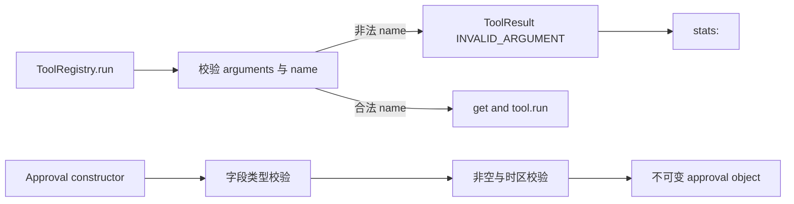

# P1 稳定非法输入错误设计

日期：2026-07-12

## 目标

关闭代码完成度审计 F-02 与 F-03：保证 `ToolRegistry.run(...)` 面对任何非法工具名仍返回稳定 `ToolResult`，并让 approval 公开对象对错误类型、空值和时间语义给出可预测异常。

## 范围

- 修改 `src/pca/tools/registry.py` 与 `tests/test_tools.py`。
- 修改 `src/pca/permissions/approval.py` 与 `tests/test_permissions_approval.py`。
- 同步 ADR、实施日志、活跃任务、下一步与审计快照。
- 不修改 audit 生命周期，不实现 approval resume，不推进 Week 7 Day 1。

## ToolRegistry 契约

`run(name, arguments, trace_id=..., tool_call_id=...)` 必须始终通过结果信封报告调用失败：

- `name` 不是非空字符串时，返回 `ok=False`、`error_type` 对应输入校验异常、`error_code=INVALID_ARGUMENT`。
- 合法但未注册的字符串继续返回 `UNKNOWN_TOOL`。
- 非法名称失败统一记录在固定统计键 `<invalid-tool-name>`，不得用原始 list/dict 作为字典键，也不得把原始值序列化到统计键。
- trace metadata 必须保留；handler 不得被调用。
- `get(...)`、`exists(...)`、`unregister(...)` 的既有直接调用契约不在本切片改变。

## Approval 契约

- `ApprovalRequest.request_id`、`tool_name`、`command_summary`，以及 `ApprovalDecision.request_id`、`user_reason`：非字符串抛 `TypeError`，空白字符串抛 `ValueError`。
- `ApprovalDecision.approved` 必须是严格 `bool`；`0`、`1` 和其他 truthy/falsy 值抛 `TypeError`。
- `created_at`、`expires_at`、`decided_at` 和 `is_expired(now)` 的显式时间必须是带时区的 `datetime`：错误类型抛 `TypeError`，naive datetime 抛 `ValueError`。
- `expires_at` 必须晚于 `created_at`；现有 `approve(...)` / `reject(...)` 行为与有效输入保持兼容。

## 调用链

## 测试与安全边界

- RED 先覆盖 list、dict、`None`、空字符串、空白字符串和未知合法名称。
- Approval 测试覆盖构造器、`approve(...)`、`reject(...)`、时区与 `is_expired(...)`。
- 不执行 shell、网络或文件副作用；只构造内存对象和本地统计快照。
- 完成后运行聚焦测试、相关 permission/tools 回归、全量测试、5 个示例、compileall 和 `git diff --check`。

## 不采用方案

- 不以 `repr(name)` 作为统计键，避免敏感输入泄漏和高基数。
- 不跳过非法名称统计，避免丢失调用失败证据。
- 不自动强制转换 approval 字段，避免掩盖上游调用错误。
